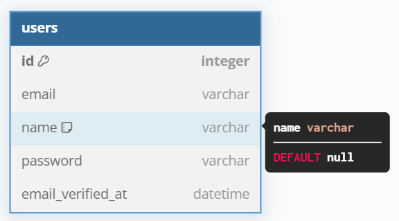

import { Aside } from "@astrojs/starlight/components";
import { FileTree } from "@astrojs/starlight/components";
import { Steps } from "@astrojs/starlight/components";
import { Tabs, TabItem } from "@astrojs/starlight/components";
import CollapseComponent from "@components/collapse.astro";

<ul class="steps steps-vertical">
  <li class="step step-primary">**⭐Register & Login UI**</li>
  <li class="step">Magic Link</li>
  <li class="step">Browser session management </li>
  <li class="step">Two-factor authentication</li>
  <li class="step">Role-base authorization with Teams</li>
</ul>

The UI and Authn-Authz process for simple login is a lot to be explained! Therefore, we will have to break down this feature piece by piece. For this article, we will focus solely on the implementation of **Login** part, including the server code and the client-code that involve login and protect route from un-authenticatated request.

It is quite trivial for authenticating the user, without any user! But trust me, most of the code we wrote is for authenticating login user, the other code just build as extra for this feature. Understand every aspect about this feature is the most important task!

## 1. Server-side login and authentication

<Steps>

1. [Create user database](#create-user-database)
2. [Create server-side code for login logic](#server-side-login-flow)
3. [Create middleware to authenticate session](#create-middleware)
4. [Create protected route (server-side)](#server-side-protected-route)

</Steps>

### Create user database

In the previous example, we check a user against a JS object. Now let's migrate to a real database. Conventionaly, we will use a highly ACID-compliance database for user database. Hence, I will implement MySQL!

Password field will be hashed with `bcrypt` before storing.

### Server-side login flow

<FileTree>
  - lib/ 
    - hashes/ 
      - jwt-token.ts 
      - pwd-hash.ts 
  - router/ 
    - auth/ 
      - dto/
        - loginDTO.ts 
      - auth.controllers.ts 
      - auth.service.ts 
      - auth.exceptions.ts 
      - router.ts 
      - types.ts
</FileTree>

<Steps>

1. Define Login DTO
2. Define password hash function
3. Define JWT function to serialize and deserialize session
4. Create `auth.service.ts`
5. Create `auth.controller.ts`

</Steps>

<CollapseComponent title="Login DTO">
  <iframe
    src="https://carbon.now.sh/embed?bg=rgba%28171%2C+184%2C+195%2C+1%29&t=seti&wt=none&l=application%2Ftypescript&width=625.5&ds=false&dsyoff=20px&dsblur=68px&wc=true&wa=true&pv=8px&ph=16px&ln=true&fl=1&fm=Hack&fs=14px&lh=133%25&si=false&es=2x&wm=false&code=%252F%252F%2520loginDTO.ts%250A%250Aimport%2520%257B%2520z%2520%257D%2520from%2520%2522zod%2522%253B%250A%250Aexport%2520const%2520loginDTO%2520%253D%2520z.object%28%257B%250A%2520%2520email%253A%2520z.string%28%29.email%28%29%252C%250A%2520%2520password%253A%2520z.string%28%29%252C%250A%257D%29%253B%250A"
    style="width: 368px; height: 241px; border:0; transform: scale(1); overflow:hidden;"
    sandbox="allow-scripts allow-same-origin"
  ></iframe>
</CollapseComponent>

<CollapseComponent title="Password hash">
  <iframe
    src="https://carbon.now.sh/embed?bg=rgba%28171%2C+184%2C+195%2C+1%29&t=seti&wt=none&l=application%2Ftypescript&width=625.5&ds=false&dsyoff=20px&dsblur=68px&wc=true&wa=true&pv=8px&ph=16px&ln=true&fl=1&fm=Hack&fs=14px&lh=133%25&si=false&es=2x&wm=false&code=%252F%252F%2520pwd-hash.ts%250A%250Aimport%2520bcrypt%2520from%2520%2522bcrypt%2522%253B%250A%250Aconst%2520saltRounds%2520%253D%252010%253B%250A%250Aexport%2520const%2520hashPwd%2520%253D%2520async%2520%28pwd%253A%2520string%29%2520%253D%253E%2520%257B%250A%2520%2520const%2520hash%2520%253D%2520await%2520bcrypt.hash%28pwd%252C%2520saltRounds%29%253B%250A%2520%2520return%2520hash%253B%250A%257D%253B%250A%250Aexport%2520const%2520comparePwd%2520%253D%2520async%2520%28plainPwd%253A%2520string%252C%2520storedPwd%253A%2520string%29%2520%253D%253E%2520%257B%250A%2520%2520const%2520result%2520%253D%2520await%2520bcrypt.compare%28plainPwd%252C%2520storedPwd%29%253B%250A%2520%2520return%2520result%253B%250A%257D%253B"
    style="width: 706px; height: 352px; border:0; transform: scale(1); overflow:hidden;"
    sandbox="allow-scripts allow-same-origin"
  ></iframe>
</CollapseComponent>
<CollapseComponent title="JWT function">
  <iframe
    src="https://carbon.now.sh/embed?bg=rgba%28171%2C+184%2C+195%2C+1%29&t=seti&wt=none&l=application%2Ftypescript&width=625.5&ds=false&dsyoff=20px&dsblur=68px&wc=true&wa=true&pv=8px&ph=16px&ln=true&fl=1&fm=Hack&fs=14px&lh=133%25&si=false&es=2x&wm=false&code=import%2520jwt%2520from%2520%2522jsonwebtoken%2522%253B%250A%250Aexport%2520const%2520signToken%2520%253D%2520%253CT%2520extends%2520Record%253Cstring%252C%2520any%253E%253E%28payload%253A%2520T%29%2520%253D%253E%2520%257B%250A%2520%2520const%2520ttl%2520%253D%2520%252Bprocess.env.DEFAULT_TTL%21%2520as%2520number%253B%250A%2520%2520const%2520token%2520%253D%2520jwt.sign%28payload%252C%2520process.env.JWT_SECRET_KEY%21%252C%2520%257B%250A%2520%2520%2520%2520expiresIn%253A%2520%2560%2524%257Bttl%257Dh%2560%252C%250A%2520%2520%257D%29%253B%250A%2520%2520return%2520token%253B%250A%257D%253B%250A%250Aexport%2520const%2520verifyToken%2520%253D%2520%253CT%2520extends%2520Record%253Cany%252C%2520any%253E%253E%28%250A%2520%2520token%253A%2520string%250A%29%253A%2520T%2520%257C%2520null%2520%253D%253E%2520%257B%250A%2520%2520try%2520%257B%250A%2520%2520%2520%2520const%2520payload%2520%253D%2520jwt.verify%28token%252C%2520process.env.JWT_SECRET_KEY%21%29%2520as%2520T%253B%250A%2520%2520%2520%2520return%2520payload%253B%250A%2520%2520%257D%2520catch%2520%28error%29%2520%257B%250A%2520%2520%2520%2520return%2520null%253B%250A%2520%2520%257D%250A%257D%253B%250A"
    style="width: 715px; height: 481px; border:0; transform: scale(1); overflow:hidden;"
    sandbox="allow-scripts allow-same-origin"
  ></iframe>
</CollapseComponent>

<CollapseComponent title="auth.service.ts">
  

    Here we check for the existence of email, then check the hashed password,
    then serialize the `userId` to JWT token
  

  <iframe
    src="https://carbon.now.sh/embed?bg=rgba%28171%2C+184%2C+195%2C+1%29&t=seti&wt=none&l=application%2Ftypescript&width=625.5&ds=false&dsyoff=20px&dsblur=68px&wc=true&wa=true&pv=8px&ph=16px&ln=true&fl=1&fm=Hack&fs=14px&lh=133%25&si=false&es=2x&wm=false&code=const%2520service%2520%253D%2520%257B%250A%2520%2520login%253A%2520async%2520%28email%253A%2520string%252C%2520password%253A%2520string%29%2520%253D%253E%2520%257B%250A%2520%2520%2520%2520const%2520existedEmail%2520%253D%2520await%2520prisma.user.findFirst%28%257B%250A%2520%2520%2520%2520%2520%2520where%253A%2520%257B%2520email%253A%2520email%2520%257D%252C%250A%2520%2520%2520%2520%2520%2520select%253A%2520%257B%2520password%253A%2520true%252C%2520id%253A%2520true%2520%257D%252C%250A%2520%2520%2520%2520%257D%29%253B%250A%2520%2520%2520%2520if%2520%28%21existedEmail%29%2520%257B%250A%2520%2520%2520%2520%2520%2520throw%2520new%2520EmailNotFoundException%28%29%253B%250A%2520%2520%2520%2520%257D%250A%2520%2520%2520%2520const%2520isPwdMatched%2520%253D%2520await%2520comparePwd%28password%252C%2520existedEmail.password%29%253B%250A%2520%2520%2520%2520if%2520%28%21isPwdMatched%29%2520%257B%250A%2520%2520%2520%2520%2520%2520throw%2520new%2520PasswordNotMatchException%28%29%253B%250A%2520%2520%2520%2520%257D%250A%2520%2520%2520%2520const%2520secureToken%2520%253D%2520signToken%253C%257B%2520userId%253A%2520number%2520%257D%253E%28%257B%250A%2520%2520%2520%2520%2520%2520userId%253A%2520existedEmail.id%252C%250A%2520%2520%2520%2520%257D%29%253B%250A%2520%2520%2520%2520return%2520secureToken%253B%250A%2520%2520%257D%252C%250A%257D%253B%250A"
    style="width: 731px; height: 462px; border:0; transform: scale(1); overflow:hidden;"
    sandbox="allow-scripts allow-same-origin"
  ></iframe>
</CollapseComponent>

<CollapseComponent title="auth.controller.ts">
  

    The secure token contains the most important aspect: the `userId`. This
    userId is going to be used for authorization, so they will have to be
    securely store in HTTP-only cookie to prevent XSS.
  

  <iframe
    src="https://carbon.now.sh/embed?bg=rgba%28171%2C+184%2C+195%2C+1%29&t=seti&wt=none&l=application%2Ftypescript&width=625.5&ds=false&dsyoff=20px&dsblur=68px&wc=true&wa=true&pv=8px&ph=16px&ln=true&fl=1&fm=Hack&fs=14px&lh=133%25&si=false&es=2x&wm=false&code=const%2520authController%2520%253D%2520%257B%250A%2520%2520login%253A%2520async%2520%28req%253A%2520Request%252C%2520res%253A%2520Response%29%2520%253D%253E%2520%257B%250A%2520%2520%2520%2520try%2520%257B%250A%2520%2520%2520%2520%2520%2520const%2520%257B%2520email%252C%2520password%2520%257D%2520%253D%2520await%2520loginDTO.parseAsync%28req.body%29%253B%250A%2520%2520%2520%2520%2520%2520const%2520secureToken%2520%253D%2520await%2520authService.login%28%250A%2520%2520%2520%2520%2520%2520%2520%2520email%252C%250A%2520%2520%2520%2520%2520%2520%2520%2520password%250A%2520%2520%2520%2520%2520%2520%29%253B%250A%250A%2520%2520%2520%2520%2520%2520res.cookie%28%2522user-session%2522%252C%2520secureToken%252C%2520%257B%250A%2520%2520%2520%2520%2520%2520%2520%2520maxAge%253A%2520%252Bprocess.env.DEFAULT_TTL%21%2520*%25201000%2520*%252060%2520*%252060%252C%250A%2520%2520%2520%2520%2520%2520%2520%2520httpOnly%253A%2520true%252C%250A%2520%2520%2520%2520%2520%2520%257D%29%253B%250A%250A%2520%2520%2520%2520%257D%2520catch%2520%28error%29%2520%257B%250A%2520%2520%2520%2520%2520%2520if%2520%28error%2520instanceof%2520ZodError%29%2520%257B%250A%2520%2520%2520%2520%2520%2520%2520%2520return%2520res.status%28400%29.json%28%257B%2520message%253A%2520%2522Payload%2520Error%2522%2520%257D%29%253B%250A%2520%2520%2520%2520%2520%2520%257D%2520else%2520if%2520%28error%2520instanceof%2520AuthExceptions.EmailNotFoundException%29%2520%257B%250A%2520%2520%2520%2520%2520%2520%2520%2520return%2520res.status%28400%29.json%28%257B%2520message%253A%2520%2522Email%2520Not%2520Found%2522%2520%257D%29%253B%250A%2520%2520%2520%2520%2520%2520%257D%2520else%2520if%2520%28error%2520instanceof%2520AuthExceptions.PasswordNotMatchException%29%2520%257B%250A%2520%2520%2520%2520%2520%2520%2520%2520return%2520res.status%28400%29.json%28%257B%2520message%253A%2520%2522Password%2520Incorrect%2522%2520%257D%29%253B%250A%2520%2520%2520%2520%2520%2520%257D%2520else%2520%257B%250A%2520%2520%2520%2520%2520%2520%2520%2520return%2520res.status%28500%29.json%28%257B%2520message%253A%2520%2522Unknown%2520Error%2522%2520%257D%29%253B%250A%2520%2520%2520%2520%2520%2520%257D%250A%2520%2520%2520%2520%257D%250A%2520%2520%257D%252C%250A%257D%253B"
    style="width: 748px; height: 593px; border:0; transform: scale(1); overflow:hidden;"
    sandbox="allow-scripts allow-same-origin"
  ></iframe>
</CollapseComponent>

### Create Middleware

<FileTree>

- router/
  - user/ Three tier module
    - ...
  
- middleware/
  - user-session-guard.ts

</FileTree>

<Aside type="caution">
  Make sure to install `cookie-parser` to use `req.cookies` 
</Aside>

<iframe
  src="https://carbon.now.sh/embed?bg=rgba%28171%2C+184%2C+195%2C+1%29&t=seti&wt=none&l=application%2Ftypescript&width=625.5&ds=false&dsyoff=20px&dsblur=68px&wc=true&wa=true&pv=8px&ph=16px&ln=true&fl=1&fm=Hack&fs=14px&lh=133%25&si=false&es=2x&wm=false&code=export%2520const%2520userSessionGuard%2520%253D%2520%28%250A%2520%2520req%253A%2520Request%252C%250A%2520%2520res%253A%2520Response%252C%250A%2520%2520next%253A%2520NextFunction%250A%29%2520%253D%253E%2520%257B%250A%2520%2520const%2520cookies%2520%253D%2520req.cookies%253B%250A%2520%2520const%2520userSession%2520%253D%2520cookies%255B%2522user-session%2522%255D%253B%250A%2520%2520console.log%28cookies%29%253B%250A%2520%2520if%2520%28%21userSession%29%2520%257B%250A%2520%2520%2520%2520return%2520res.status%28403%29.json%28%257B%2520message%253A%2520%2522Unauthorized%2522%2520%257D%29%253B%250A%2520%2520%257D%250A%2520%2520const%2520payload%2520%253D%2520verifyToken%253CLoginSignedToken%253E%28userSession%29%253B%250A%2520%2520if%2520%28%21payload%29%2520%257B%250A%2520%2520%2520%2520return%2520res.status%28401%29.json%28%257B%2520message%253A%2520%2522Unauthorized%2522%2520%257D%29%253B%250A%2520%2520%257D%250A%2520%2520req.context%2520%253D%2520%257B%2520userId%253A%2520payload.userId%2520%257D%253B%250A%2520%2520next%28%29%253B%250A%257D%253B%250A"
  style="width: 613px; height: 444px; border:0; transform: scale(1); overflow:hidden;"
  sandbox="allow-scripts allow-same-origin">
</iframe>

### Server-side protected route

Create the `user` module with the same three-tier architecture as `auth` module. To apply the route guard to the whole router, use `userRouter.use(userSessionGuard)`. In our application, the middleware pass down the information to child middleware or controller as `req.context`. The `userSessionGuard` guarentee to pass the `userId` to the controller, so we can use this to authorize our application.

## 2. Client-side login and authentication

<Steps>

1. Create protected route `Dashboard page` (front-end)
2. Add logic to deflect page to `/login`
3. Implement `Login page`

</Steps>

<FileTree>
  - router.tsx 
  - store/ 
    - user.ts 
  - pages/ 
    - root/ **Authentication guard** via `rootLoader` 
    - auth/ 
      - components/form.tsx Localize form components 
      - router.tsx
      - login.tsx 
      - query/fetch.ts Submit the login request 
    - user/ - query/fetch.ts
    - dashboard/ Contains main view
</FileTree>

### Protected page

<FileTree>
  - router.tsx 
  - store/ 
    - user.ts 
  - pages/ 
    - root/ 
      - root-layout.tsx **rootLoader**, calls `/user/info` on mount 
    - user/ 
      - query/fetch.ts **Axios Client for `/user/info`**
    - dashboard/ Render the Index UI
</FileTree>

Our example entire main application is to encapsulate within the `<RootLayout/>`. As you can see here in the main `router.tsx`

<iframe
  src="https://carbon.now.sh/embed?bg=rgba%28171%2C+184%2C+195%2C+1%29&t=seti&wt=none&l=application%2Ftypescript&width=625.5&ds=false&dsyoff=20px&dsblur=68px&wc=true&wa=true&pv=8px&ph=16px&ln=true&fl=1&fm=Hack&fs=14px&lh=133%25&si=false&es=2x&wm=false&code=%252F%252F%2520src%252Frouter.tsx%250A%250A%250Aconst%2520createRouter%2520%253D%2520%28%29%253A%2520any%2520%253D%253E%2520%257B%250A%2520%2520return%2520createBrowserRouter%28%255B%250A%2520%2520%2520%2520%257B%250A%2520%2520%2520%2520%2520%2520path%253A%2520%2522%252F%2522%252C%250A%2520%2520%2520%2520%2520%2520errorElement%253A%2520%253CErrorPage%2520%252F%253E%252C%250A%2520%2520%2520%2520%2520%2520element%253A%2520%253CRootLayout%252F%253E%252C%250A%2520%2520%2520%2520%2520%2520children%253A%2520%255BdashboardRouter%252C%2520userRouter%255D%252C%250A%2520%2520%2520%2520%257D%252C%250A%2520%2520%2520%2520...loginRouter%250A%2520%2520%255D%29%253B%250A%257D%253B"
  style="width: 487px; height: 351px; border:0; transform: scale(1); overflow:hidden;"
  sandbox="allow-scripts allow-same-origin"
></iframe>

The `<RootLayout/>` has the responsible of deflecting un-authn request. Inside of the `RootLayout`, we have the `rootLoader` function that make API calls to the `/user/profile` endpoints. As recall, all `user` resources are guarded with `user-session-guard`, so any unauthicated request will be thrown and captured at this `rootLoader`. But what if the component has its own loader?

The React Router loader works with hierarchical relationship. While trying to parallelize as much as possible, the loader API ensures that the data that being loaded outside `<Outlet/>` is being success before proceeding to inner loader API.

The login page does not need to access to rootLoader API, so that need to be registered at the same level as the root component

**First, let's look at the rootLoader**

<iframe
  src="https://carbon.now.sh/embed?bg=rgba%28171%2C+184%2C+195%2C+1%29&t=seti&wt=none&l=application%2Ftypescript&width=625.5&ds=false&dsyoff=20px&dsblur=68px&wc=true&wa=true&pv=8px&ph=16px&ln=true&fl=1&fm=Hack&fs=14px&lh=133%25&si=false&es=2x&wm=false&code=export%2520const%2520loader%2520%253D%2520async%2520%28%257B%2520request%2520%257D%29%253A%2520Promise%253Cany%253E%2520%253D%253E%2520%257B%250A%2520%2520const%2520%257B%2520user%2520%257D%2520%253D%2520userStore%253B%250A%2520%2520const%2520url%2520%253D%2520new%2520URL%28request.url%29%253B%250A%2520%2520if%2520%28%21user%29%2520%257B%250A%2520%2520%2520%2520const%2520userInfo%2520%253D%2520await%2520fetchUserInfo%28%29%253B%250A%2520%2520%2520%2520if%2520%28%21userInfo%29%2520%257B%250A%2520%2520%2520%2520%2520%2520return%2520redirect%28%2560%252Flogin%253FcallbackURL%253D%2524%257Burl.pathname%257D%2560%29%253B%250A%2520%2520%2520%2520%257D%250A%2520%2520%2520%2520addUser%28userInfo%29%253B%250A%2520%2520%257D%250A%250A%2520%2520return%2520user%253B%250A%257D%253B"
  style="width: 605px; height: 332px; border:0; transform: scale(1); overflow:hidden;"
  sandbox="allow-scripts allow-same-origin">
</iframe>

Here in the `rootLoader` we will check for the existing of the `user` object from Valtio state. If the user object is not available (due to exiting the tab), the `rootLoader` will attempt to fetch new `userInfo` from endpoint `/user/info`. When calling axios, HTTP-only cookie automatically gets attached to each and every request. The backend authn against this cookie, and sends the `user` payload back or raise error. The rootLoader capture the status state, and response accordingly. If successfully fetch, the `rootLoader` saves the user state to Valtio, then return the user object for the layout component. Else if fails, the `rootLoader` will redirect the user to the login page, with the current URL as `callbackURL` search params, so that after the login, the user can pick up where they left.  

<Aside type="danger">

You need to add the `withCredential: true` to axios to set the cookie when login, and include the cookie when sending request. This feature is disabled by default! Stupid motherfucks 🤬

</Aside>

<Aside type="tip">

`Valtio` is State management library using `Proxy`. This is inspired by Vue Composition API. The Valtio library is easy to use, and helps us to escape the traditional "react-way" of doing state management (Redux and shit). Using Valtio, you define a global object, and it is automatically becomes available and reactive. No special code needed!

</Aside>

### Login page

Unauthenticated request after hitting the rootLoader will be redirect to this login page. We are going to use `React Hook Form` (`RHForm`) for live data validation and form UI, and React Router Form for server-side form submission via `action` API.

`Remember me` is an interesting feature, but we will learn this feature later. For now, let's skip it.

<Aside type="danger">

react-hook-form must has an inner div after `<form>`: `<form>

</form>`. It tooks me hours to debug this shit !!!

</Aside>

The `action` API mimic the real POST request. After the fetch happends, if the request is success, the `action` API redirect to the route from the `callbackURL` parameter (or to the default route). However, if the request is not success, we need to navigates the user back to the `<Login/>` component, with the appropriate message. Therefore we see the duplicated Component renders on both `element` and `errorElement` on the `router.tsx`.

The offsides of this approach is that when page transition happens, the form data is lost. If you want a smoother UI, you can actually don't throw the error, but implement conditional rendering based on the data return by the action API (using `useActionData` hook).

<iframe
  src="https://carbon.now.sh/embed?bg=rgba%28171%2C+184%2C+195%2C+1%29&t=seti&wt=none&l=application%2Ftypescript&width=625.5&ds=false&dsyoff=20px&dsblur=68px&wc=true&wa=true&pv=8px&ph=16px&ln=true&fl=1&fm=Hack&fs=14px&lh=133%25&si=false&es=2x&wm=false&code=const%2520router%2520%253D%2520%255B%250A%2520%2520%257B%250A%2520%2520%2520%2520path%253A%2520%2522%252Flogin%2522%252C%250A%2520%2520%2520%2520element%253A%2520%253CLogin%2520%252F%253E%252C%250A%2520%2520%2520%2520errorElement%253A%2520%253CLogin%2520%252F%253E%252C%250A%2520%2520%2520%2520action%253A%2520loginAction%252C%250A%2520%2520%257D%252C%250A%2520%2520%257B%2520path%253A%2520%2522%252Fverify-email%2522%252C%2520action%253A%2520verifyEmailAction%2520%257D%252C%250A%255D%253B"
  style="width: 562px; height: 258px; border:0; transform: scale(1); overflow:hidden;"
  sandbox="allow-scripts allow-same-origin">
</iframe>

<iframe
  src="https://carbon.now.sh/embed?bg=rgba%28171%2C+184%2C+195%2C+1%29&t=seti&wt=none&l=application%2Ftypescript&width=625.5&ds=false&dsyoff=20px&dsblur=68px&wc=true&wa=true&pv=8px&ph=16px&ln=true&fl=1&fm=Hack&fs=14px&lh=133%25&si=false&es=2x&wm=false&code=const%2520errors%2520%253D%2520useRouteError%28%29%2520as%2520null%2520%257C%2520AxiosError%253C%257B%2520message%253A%2520string%2520%257D%253E%253B%250A%250Areturn%2520%28%250A%2520%2520%253Cdiv%250A%2520%2520%2520%2520%2520%2520className%253D%257Bcn%28%21errors%2520%253F%2520%2522hidden%2522%2520%253A%2520%2522block%2522%252C%2520%250A%2520%2520%2520%2520%2520%2520%2520%2520%2520%2520%2520%2520%2520%2520%2520%2520%2520%2520%2520%2520%2522error-section%2520mb-4%2522%29%250A%2520%2520%2520%2520%2520%2520%2520%2520%2520%2520%2520%2520%2520%2520%2520%2520%257D%250A%2520%2520%2520%253E%250A%2520%2520%2520%2520%253Cp%2520className%253D%2522big-error%2520font-medium%2520text-red-600%2522%253E%250A%2520%2520%2520%2520%2520%2520Whoops%21%2520Something%2520went%2520wrong.%250A%2520%2520%2520%2520%253C%252Fp%253E%250A%2520%2520%2520%2520%253Cul%2520className%253D%2522mt-3%2520list-disc%2520list-inside%2520text-sm%2520text-red-600%2522%253E%250A%2520%2520%2520%2520%2520%2520%253Cli%253E%257Berrors%2520%2526%2526%2520errors.message%257D%253C%252Fli%253E%250A%2520%2520%2520%2520%253C%252Ful%253E%250A%2520%2520%253C%252Fdiv%253E%250A%29"
  style="width: 714px; height: 388px; border:0; transform: scale(1); overflow:hidden;"
  sandbox="allow-scripts allow-same-origin">
</iframe>

## 3. Logout

The `logout` feature is very simple. We just create a router, and overwrite the `user-session` token `max-age` to 0. Refresh the page by calling `location.replace()`, and we are log out!

## 4. Updates

<Aside type="danger">

There's a major bug in our application design. React Router navigates through routes in a non-page-refresh fashion. But when the server response with a cookie, the page needs to be refreshed for axios to accepts the new cookies. So, in the `action` API, we must change the method from `/navigate` to `location.replace`.

The source code change is available at the **magic-link** branch

</Aside> 

<Aside type="danger">

This branch use `<errorElement/>` to redirects the error, making the email being refresh when user first type wrong. In the **magic-link** branch, we have fix this issues by using `useActionData` hook with conditional rendering.

</Aside> 

<Aside type="danger">

Another major bug that was introduces is the implement of `formSerialize`. When sending the form request, the HTML default behaviour is to send all fields as string. To combat that problem (sending null, boolean), we wrap the sender in Json string, then in the `formSerialize` function, decode them back to object

</Aside> 