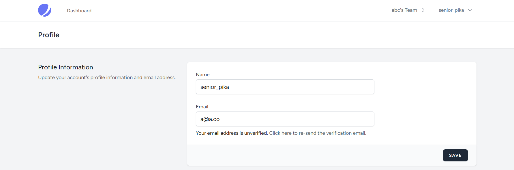

import { Aside } from "@astrojs/starlight/components";
import { FileTree } from "@astrojs/starlight/components";
import { Steps } from "@astrojs/starlight/components";
import { Tabs, TabItem } from "@astrojs/starlight/components";
import CollapseComponent from "@components/collapse.astro";

<ul class="steps steps-vertical">
  <li class="step step-primary">**⭐Register & Login UI**</li>
  <li class="step">Magic Link</li>
  <li class="step">Browser session management </li>
  <li class="step">Two-factor authentication</li>
  <li class="step">Role-base authorization with Teams</li>
</ul>

Now we have a login flow, and have a solid foundation of designing an application with authentication, let's build more feature that comes with login features.

## 1. User Register

### a. Server-side code

The follow files is implemented:

<CollapseComponent title="registerDTO.ts">
  <iframe
    src="https://carbon.now.sh/embed?bg=rgba%28171%2C+184%2C+195%2C+1%29&t=seti&wt=none&l=application%2Ftypescript&width=625.5&ds=false&dsyoff=20px&dsblur=68px&wc=true&wa=true&pv=8px&ph=16px&ln=true&fl=1&fm=Hack&fs=14px&lh=133%25&si=false&es=2x&wm=false&code=import%2520%257B%2520z%2520%257D%2520from%2520%2522zod%2522%253B%250A%250Aexport%2520const%2520registerDTO%2520%253D%2520z.object%28%257B%250A%2520%2520email%253A%2520z.string%28%29.email%28%29%252C%250A%2520%2520password%253A%2520z.string%28%29.min%288%29%252C%250A%2520%2520name%253A%2520z.string%28%29.optional%28%29%250A%257D%29%253B%250A"
    style="width: 411px; height: 239px; border:0; transform: scale(1); overflow:hidden;"
    sandbox="allow-scripts allow-same-origin"
  ></iframe>
</CollapseComponent>

<CollapseComponent title="auth.service.ts">
  <iframe
    src="https://carbon.now.sh/embed?bg=rgba%28171%2C+184%2C+195%2C+1%29&t=seti&wt=none&l=application%2Ftypescript&width=625.5&ds=false&dsyoff=20px&dsblur=68px&wc=true&wa=true&pv=8px&ph=16px&ln=true&fl=1&fm=Hack&fs=14px&lh=133%25&si=false&es=2x&wm=false&code=register%253A%2520async%2520%28%250A%2520%2520%2520%2520email%253A%2520string%252C%250A%2520%2520%2520%2520password%253A%2520string%252C%250A%2520%2520%2520%2520username%253F%253A%2520string%250A%2520%2520%29%2520%253D%253E%2520%257B%250A%2520%2520%2520%2520const%2520existedEmail%2520%253D%2520await%2520prisma.user.findFirst%28%257B%250A%2520%2520%2520%2520%2520%2520where%253A%2520%257B%2520email%253A%2520email%2520%257D%252C%250A%2520%2520%2520%2520%2520%2520select%253A%2520%257B%2520id%253A%2520true%2520%257D%252C%250A%2520%2520%2520%2520%257D%29%253B%250A%2520%2520%2520%2520if%2520%28existedEmail%29%2520%257B%250A%2520%2520%2520%2520%2520%2520throw%2520new%2520AuthExceptions.DuplicateRegisterEmailException%28%29%253B%250A%2520%2520%2520%2520%257D%250A%2520%2520%2520%2520await%2520prisma.user.create%28%257B%2520data%253A%2520%257B%2520email%252C%2520password%252C%2520name%253A%2520username%2520%257D%2520%257D%29%253B%250A%2520%2520%257D%252C"
    style="width: 739px; height: 351px; border:0; transform: scale(1); overflow:hidden;"
    sandbox="allow-scripts allow-same-origin"
  ></iframe>
</CollapseComponent>

<CollapseComponent title="auth.controllers.ts">
  <iframe
    src="https://carbon.now.sh/embed?bg=rgba%28171%2C+184%2C+195%2C+1%29&t=seti&wt=none&l=application%2Ftypescript&width=625.5&ds=false&dsyoff=20px&dsblur=68px&wc=true&wa=true&pv=8px&ph=16px&ln=true&fl=1&fm=Hack&fs=14px&lh=133%25&si=false&es=2x&wm=false&code=register%253A%2520async%2520%28req%253A%2520Request%252C%2520res%253A%2520Response%29%2520%253D%253E%2520%257B%250A%2520%2520%2520%2520try%2520%257B%250A%2520%2520%2520%2520%2520%2520const%2520%257B%2520email%252C%2520password%252C%2520name%2520%257D%2520%253D%2520await%2520registerDTO.parseAsync%28req.body%29%253B%250A%2520%2520%2520%2520%2520%2520await%2520authService.register%28email%252C%2520password%252C%2520name%29%253B%250A%2520%2520%2520%2520%2520%2520return%2520res.status%28200%29.json%28%257B%2520message%253A%2520%2522OK%2522%2520%257D%29%253B%250A%2520%2520%2520%2520%257D%2520catch%2520%28error%29%2520%257B%250A%2520%2520%2520%2520%2520%2520if%2520%28error%2520instanceof%2520ZodError%29%2520%257B%250A%2520%2520%2520%2520%2520%2520%2520%2520return%2520res.status%28400%29.json%28%257B%2520message%253A%2520%2522Payload%2520Error%2522%2520%257D%29%253B%250A%2520%2520%2520%2520%2520%2520%257D%2520else%2520if%2520%28%250A%2520%2520%2520%2520%2520%2520%2520%2520error%2520instanceof%2520AuthExceptions.DuplicateRegisterEmailException%250A%2520%2520%2520%2520%2520%2520%29%2520%257B%250A%2520%2520%2520%2520%2520%2520%2520%2520return%2520res.status%28400%29.json%28%257B%2520message%253A%2520%2522Email%2520has%2520been%2520registered%2522%2520%257D%29%253B%250A%2520%2520%2520%2520%2520%2520%257D%2520else%2520%257B%250A%2520%2520%2520%2520%2520%2520%2520%2520return%2520res.status%28500%29.json%28%257B%2520message%253A%2520%2522Unknown%2520Error%2522%2520%257D%29%253B%250A%2520%2520%2520%2520%2520%2520%257D%250A%2520%2520%2520%2520%257D%250A%2520%2520%257D%252C"
    style="width: 765px; height: 406px; border:0; transform: scale(1); overflow:hidden;"
    sandbox="allow-scripts allow-same-origin"
  ></iframe>
</CollapseComponent>


### b. Client-side code

The client side code for register is almost copy-paste of the login UI, so we will not include them here. Check the branch and git diff to see the full  details implementation


## 2. Change User Detail UI

This part mostly contains the UI code,so please refer to the File tree and the github branch for the src-code.




### 2.1 Crafting the UI Layout

In the previous example, we just have a blank Layout UI use just for the demo of the route defecting purpose. Before reaching to the later part (Change User Detail UI), we will craft a beautiful Layout wrapper based on `Laravel JetStream`

<Steps>

1. [Create the dropdown menu for the profile page](#a-dropdown-menu)
2. [Create the responsive mobile drawer](#b-mobile-drawer) 
3. [Create Page indicator](#c-page-indicator)
4. [Navbar component and assemble everything](#d-assemble-the-layout)

</Steps>

Navbar component (which is the core component of the `RootLayout`) is a complex UI. It requires a a lot of components and states to make an accessible, smooth and predictable UX. Also, usually navbar is dynamic based on view-width. In this example, I'll make the navbar with framework dependent (Shadcn for mobile drawer, dropdown navigation). If you have other framework, please migrate by hand.

Both the Dropdown menu will utilize the user info from the `userStore`. Since the component is loaded after the `loader API` ran, we can guarentee that the `userStore` always not null, so no null-check needed (just put the `!` when typescript throw errors) 

#### a. Dropdown menu

Dropdown menu is not a good UX-UI design for off-context component (A.K.A page transition) because the `Link` component prevent the natural open-close state of the dropdown-menu UI. Shadcn provides with the `Navigation Menu component` which solve that problem (it just automatically close the button on click, nothing too fancy). The file tree for the component is here 

<FileTree>
- components/
  - ui/
    - navigation-menu.tsx
- pages/
  - root/
    - components/
      - dropdown-profile.tsx
</FileTree>

One major point of the code we need to fix is the anchor point. Shadcn defaultly style the menu to be open aligned to the right, making the menu overflow the screen. We will anchor the ` component` from `absolute left-0` to `absolute inset-x-0`, to make sure the component is align at the middle of the anchor point (which is between the two navigation buttons)

#### b. Mobile Drawer

In mobile UI, the dropdown menu is hidden. Therefore, we need to make `hamburger` UI, later adding to the navbar to make the navbar responsive. The hamburger UI is using the `Drawer` component from Shadcn. We prefer using `Drawer` instead of `Sheet`, because this component is Mobile-first, and `Drawer` component is build for that purpose (more predictable behaviour om mobile device)

<Aside type="tip">

  The `cn()` className extender cannot override the css class and tailwind class. example: `cn("text-red-500", "btn")` will returns `text-white` eventhough the "text-red-500" class is overriding the `btn` class. To fix with this problem we must decorate all of our classes with important class `"!text-red-500 hover:!text-red-600"`. 

  Remember, tailwind compiler is a text-based compiler, meaning we cannot programmatically compose these important class. They must be show up somewhere in our code!

</Aside>


The component tree looks like this:

<FileTree>
- components/
  - ui/
    - drawer.tsx
- pages/
  - root/
    - components/
      - dropdown-profile-mobile.tsx
</FileTree>


**After all the components has been composes, we can put them in the `navbar.tsx`**


#### c. Page indicator


Usually in an medium application, you will meet a logic that requires path matching. In JS, you can use regex. However, there's a new native feature called `URLPattern` that does all the heavy lifting for us. For now, you must install the package using the `urlpattern-polyfill` package.

<Aside type="caution">

The URLPattern must checks against a true URL, so you must put **"HTTP://localhost/some_path"** as the URL to check. 

Also, the match criteria must has a `"/"` at the start of the string, so `"/user/*"` instead of "user/*"

</Aside>


Files implemented for this UI:

<FileTree>
  - lib/ 
    - page-indicator-list.ts
  - router/ 
    - root/ 
      - components/
        - page-indicator.tsx
</FileTree>


#### d. Assemble the layout 

<FileTree>
  - router/ 
    - root/ 
      - components/
        - ... other UI
        - nav-bar.tsx
        - page-indicator.tsx
      - root-layout.tsx Assemble the UI
</FileTree>


### 2.2 Card layout for User Profile page

Alright, enough fuzz. Let's tap in the second main feature of the Authn, that is changing the Identification of the user. First, we will learn the simple, that is changing the `name`. 

Again, this part mostly contains UI. So just go to the github branch, copy-paste the src code and change where-ever suitable. Not much to learn here 


1. [Create a general card layout for `user/profile` page](#a-general-card-layout)
2. [Implement the server-side logic for updating user](#b-server-side-code) 
3. [Add the `change-name` slice with the client-side form](#c-change-name-slice)


#### a. General Card Layout

As we can see from the Jetstream UI, each slice is beautifully divided into responsive card. We will try to replicate this UI.


<FileTree>
  - user/ 
    - components/
      - card-layout.tsx Responsive UI, two grids on desktop & full on mobile
      - card-name.tsx Card title and description
      - card-form.tsx For slices that contains form
</FileTree>

The `<CardForm>` component contains a React-hook-form `<Form>` that accepts `children` that is the `<FormField>` components. We keep the `CardForm` layout dynamic by passing the responsible of rendering the `<FormField>` on the slice component (so that each slice can determine the number of forms and how to interact with them independently).


#### b. Server-side code

This code is simple too. Here we create a putInfoDTO, use controller to parse the input, and use prisma to put new data.

#### c. Change Name Slice

We can see in the previous article, we use a very simple state management lib to manage the user state. Since the user now need to be update, we have to retrigger the function, causing the whole page to be re-rendered. This is very inconvenient, since we have to define extra logic to manage the mutation of the user data. That is where we use react-query.

React-query indeed has a lot more code than state management, but we free from define our own logic - which definitely will cause errors! For the full implementation, [visit the react-router tutorial](/app_design/react-router/) to get the code.

I just briefly go through what needs to be done: 

1. Setup necessary code for React Query - check the `query` folder of the `user` page 
2. Update the `rootLoader`. 

<Aside type="tip">

  Rather than using the `ensureQuery`, we use two separate `queryClient.getQueryData` and `queryClient.fetchQuery` just for clarity (if using `ensureQuery`, we have to call it twice). Under the hood, `ensureQuery` just combines the two methods. 

</Aside>

Now, having the user that is controlled by a data repository (React Query), we can define a useMutation to update the data. **Notice that the dropdown label now change according to the new name submitted**


File changes:

<FileTree>
  - user/ 
    - query/
      - fetcher.ts Add update profile request
      - params.ts Add factory option for sync user repo
      - queryKeyFactory.ts
    - slices/
      - update-name.tsx Main logic
    - components/
      - card-form.tsx Add status and statusText. Also add extra UI for pending state
  - root/
    - component/
      - dropdown-profile.tsx Change the display state to `RQ`
</FileTree>

<Aside type="caution">

This part is extremely important for UI development and form control

</Aside>

## 3. Updates

<Aside type="danger">

We forgot to put the `<Drawer.Close>` Element on top of the `<MobileNavLink>` Element, making the click does not close the Drawer automatically. The new changes has been implemented at branch **email-verify**

</Aside> 

When working with Shadcn and React hook form, When you try to set the input within the `<FormControl>` element, the browser yells at us with the error `Function components cannot be given refs. Attempts to access this ref will fail. Did you mean to use React.forwardRef()?`. [More on this error can be found here](https://dmitripavlutin.com/react-forwardref/). But the bottom line is, the component that is passed within the in the form of


```tsx

const El = forwardRef<HTMLInputElement, any>(
  (props, ref: Ref<HTMLInputElement>) => {
    return (<></>);
  }
);

```