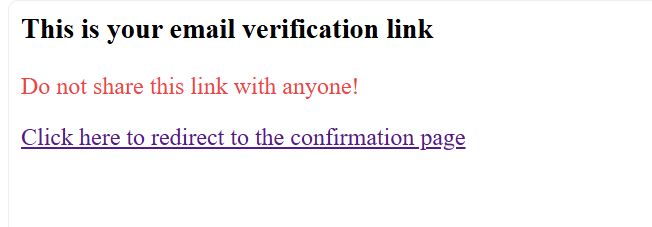

import { Aside } from "@astrojs/starlight/components";
import { FileTree } from "@astrojs/starlight/components";
import { Steps } from "@astrojs/starlight/components";
import { Tabs, TabItem } from "@astrojs/starlight/components";
import CollapseComponent from "@components/collapse.astro";

<ul class="steps steps-vertical">
  <li class="step step-primary">Register & Login UI</li>
  <li class="step step-primary">**⭐ Magic Link**</li>
  <li class="step">Forgot Password</li>
  <li class="step">Browser session management </li>
  <li class="step">Two-factor authentication</li>
  <li class="step">Role-base authorization with Teams</li>
</ul>

One of the core feature of the Authn process is to change critical information - like password, add/change secondary/primary email, perform some Admin options. To perform such core actions, usually, we need the users to verify their email, so that we can send them notification about what have changed.

After the Email verification, we can feasibly unlock features such as change password, Multi-factor Authentication (MFA), ....

The email verification process is usually done by a magic link, sent to the user email inbox. It contains a server endpoint that verify the link. If the link appropriate (contains the correct code and in the allow time period), the user is marked as verify (by changing the field `verified_at` in the database to current timestamp)

Email verification process includes:

<Steps>

1. Create a table for email verification storing (or using an in-memory object) 
2. Create an API endpoint called `send-email-verify`, which compose the verification object. The new data is stored in the database and the magic link with the generated token is sent via email to the user
3. Create an API endpoint called `verify-email`. This route checks the token sent by the user.
4. Update the client UI to send email verification
5. Create a masked client page. This client page contains a button with a payload as token. When clicked, a `GET` request will be send to the `verify-email` API endpoint 

</Steps>

## 1. Verify email

Verify email is a security measure, especially for simple login service that solely relies on a password token. Verify the email helps authenticator to "trust" the user, and send vital magic links like password reset, team invitation to the user (these features bypass the JWT token, directly mutate the user information)

### 1. Update the model

### 2. `send-email-verify` endpoint

1. Create if the user's `email_verified_at` is null or not. If not null, throw the `EmailAlreadyVerifiedException` error
2. Get the row record from the `EmailVerification` table (or an in-memory object). 

- If there's no previous email verification request, create a new one - with default retries as 0
- If there's already email verification request, first:

  - Check for the `request_penalty`. The user is able to send maximum 5 requests in an interval. After sending 5 requests, the user must waits till `request_penalty` time reaches before continues to send more requests
  - If `request_penalty` passes, checks if retries reaches limit. If yes, set the `request_retry` and throw HTTP Exception. Else, invalidate the old token (by updating the new token with a new `expired_at`), and bump the retries number up

3. Sends the email. This is only the example, so I'll use a testing service `Mailtrap` to send pseudo message. The message looks like this:

In real example, you should either use an Gmail SMTP server, or a professional Mail server like `Mailgun` or paid `Mailtrap` to send your email.

### 3. `verify-email` endpoint

This endpoint should not be protected, since this route's UI is embedable to the email body content. This route is a dynamic route (`verify-email/:token`)

1. Find the token in the `EmailVerification` table (or in-memory object). This query should returns the `id`, `expired_at` and the `userId` field. 
2. Checks for the `expired_at`. This should protect the email from brute-force attack (This mostly applies to the email-recovery feature, which also based of the magic-link feature, similar to this feature)
3. Create a transaction. Simultaneously deletes the request from the table and add the timestamp to the `email_verified_at` column of the `user` table.

### 4 & 5. Create the UIs

There's no special UI from this section. It just inherit from the previous articles.

## 2. Reset password

Reset password is an important feature, especially with simple username-password flow. This feature is a twin: Change password and forgot password.

**Change password**: This feature is simple. It is an authenticated request, just like updating the information (like updating the avatar, the name), with the extra checks for current password matching.

**Forgot password**: This feature is an un-authenticated request made to change the current password. It doesn't allow password matching. Therefore, security measures should be made carefully. For this reason, we must make sure that the user's email is verified. Implementing this feature:

1. Create an UI for sending password reset request (`auth/forgot-password.tsx`).
2. Send the request to the `send-password-reset` route. This checks:
  - If previous request existed. If yes, check the criteria ([see the previous section](#2-send-email-verify-endpoint))
  - If not, create a token for password reset route, sends the message to the user via email.  
3. When the user click to the link, it should navigate the user to the reset form UI (`magic-links/reset-password.tsx`)
4. The form is submitted to the dynamic route. 
  - First checks the validity of the dynamic route.
  - Then create a transaction. Simultaneously destroy the token, and reseting the password.
5. Redirect the UI.

The frontend and backend source code is simple. It is just copy and paste from previous section. 