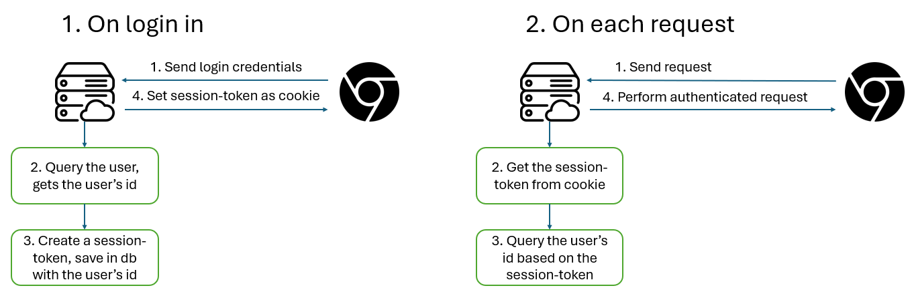
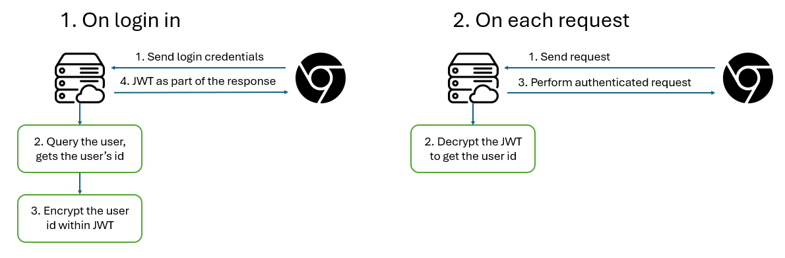

**Authentication** means to identify a user request. In an application, a user mostly be identified by an auto-generated id. Using this id, we enable the user to perform actions on the authorized resources. 

## Session Token

A classical server-side authentication process is depicted as follows:

**Pros:**

- The data is securely store within the server
- Easily invalidate the token if compromised
- Easily detecting device activity

**Cons**

- In a very high access frequencies application, this could leads to performance issues.
- Usually a web standard approach. For cross-platform, need more coding on the client-side to store this token.
- Being said to be device activity friendly, cookies on browser must have an expiration date. Therefore, extra logic needs to be coded for the browser to "remember" the session-token correctly

Usually, the session-token is the most accessed property of the server - since they need to be queried on each and every authenticated request. Therefore, the session-token are normally stored within memory-based database like `Redis` to offload the stress on the main databases and increase the speed. But the big **"L"** of these databases are that they are very expensive.

## JWT Token

JWT token approach is the complete opposite of the session-token.

**Pros:**

- Since late born, this approach is highly adopted by different platforms
- Reduce the cost of having a high performance database 
- Scale agnostic - Encryption and Decryption of JWT works regardless of one server or distributed ones

**Cons**

- Very insecured - The token is stored within the client, so the request is very prone to imposter attack
- Cannot invalidate the token if compromised, since the JWT is stateless (meaning that the JWT is created and encrypted on the fly without being saved to any of the server's facility)
- Impossible to track device activities due to the stateless nature

## Access token and Refresh token

The authentication based on token nature is complicated due to the cons of both Session Token and JWT:

- The session-token approach is too much costly - for both start-ups and high volume applications
- The JWT approach is too much unreliable. The JWT token needs to be short-lived so that they cannot bring long-term damaging effect if compromised, but for the trade-off of user has to be constantly login to refresh the JWT

We need an approach that bring out the best of both world: "Being easily to track state, easily to invalidate if compromised, and low-cost". **The solution is simple - Just use both !!!**.

Rather than using a single token to solve the authentication problem, we are using two tokens, but with fancier names: `Access token` for JWT and `Refresh token` for Session token. 

The authentication process of the tokens looks like:

