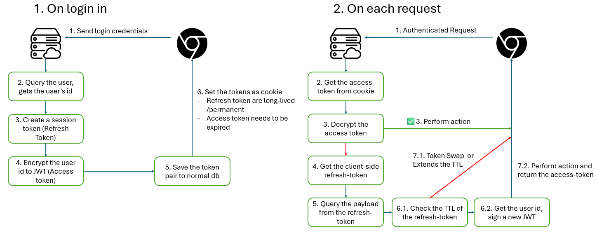

Authentication procedure has two main methods: `token-based` and `session-based`. 

## Session-based authentication

A classical server-side authentication process is depicted as follows:

**Pros:**

- **The data is stored securely.** The session token is stored in form of HTTP-only cookie within the browser, making it inaccessible for browser's scripts.
- **Easily invalidate the token if compromised.** Each access from the user requires a token check (querried from a databases), making invalidating token easy.

**Cons**

- **In a very high access frequencies application, this could leads to performance issues.** This is due to the nature of server-side token, that each request requires a token check.
- **Usually a web standard approach.** For cross-platform, need more coding on the client-side to store this token.

To boost the performance of the authentication process, usually the session token is stored within a very fast read database like `Redis`. This raise a dilemma for most small application - to balance the cost and speed of the program.

## Brower-based authentication

The limitation of session token leads to the invention of new authentication form: Browser-based authentication, in which the most famous form is `JWT token`.

The authentication process of `JWT authentication` is depicted as follow:

**Pros:**

- **Highly adopted by different platforms**. Since late born, most modern tech-stacks (web, mobile, desktop) has develop it own standard way to store and use the JWT token appropriately.
- **High performance**. Each request requires the server to decrypt the token. This process is much faster than database query, making the response time much quicker.
- **Scale agnostic**. Encryption and Decryption of JWT works regardless of the scale of servers, unlike the centralize nature of the databases that held session tokens.

**Cons**

- **Very insecured.** The token is stored within the client, so the request is very prone to imposter attack. This is means that the attacker can write a script that reads all the stored tokens, and making devastating requests.
- **Cannot invalidate the token if compromised**, since the JWT is stateless (meaning that the JWT is created and encrypted on the fly without being saved to any of the server's facility)work

The JWT token, eventhough encrypted, is vunerable to be exploited. That is why, most backends that allow JWT authentication must have same site CORS enabled.

## Modern authentication process 

The cons of both session-based and browser-based authentication leads to a more fine-grained authentication procedure that utilize both the tokens. The tokens are also named differently, namely: `Access-token` for browser-based and `Refresh-token` for session-based.

The process of authentication is depicted as follows:

### Token rotation

Server-side token that saves the token in HTTP-only cookie requires a **max-age**. This could be done be set the max-age of the token at a very distance in the future (10 years, 20 years), or utilizing token rotation.

When an `Access-token` timeout, the `Refresh-token` is queried and checked. If the token date is too old, new token is updated. This keeps the `Refresh-token` fresh.

