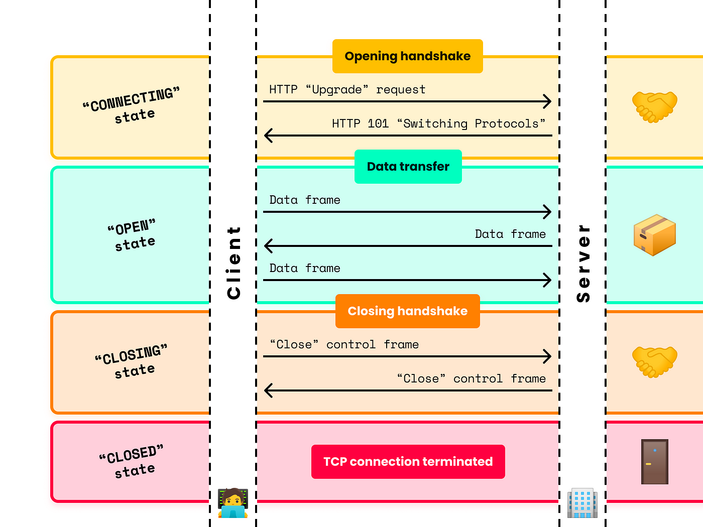

Hôm nay học xây dựng hệ thống notification như là Facebook.

First let's learn some terminologies.

Websocket is an advanced HTTP that maintain the connection between client and server until terminates. In a traditional HTTP request, client engage for connection (request), waits for the response, then terminates. In websocket, client establish a handshake with the server, then the connection doesn't terminates until one of two party terminates. Within the handshake, realtime data is sent back and forth.

## Event 

Socket server is client agnostic. It means, that they do not understand client-server connection like HTTP. When server send the data, they send the data towards `event`.

Think event is like an HTTP resource. When a client connects with the server, they can receive the data if subscribe to an appropriate event. This is the foundation of `Notification System Design`. When a user making an action, we want all the recipients to be notified ASAP. The server reacts to the action be publish the notifications to an event.

## Room

As we can see, an event is not private. Any one who connected to the server is eligible to subscribe and reveive message from an event. 

Room is a private connection between the client and server. When the client first connect to the server, we place them into appropriate room. Then, whenever the server sends the notification, they can privately sends to the room, via an event.

In the first model, the *user_1* and *user_3* reads the same message sent by server. But since the *user_3* not join the room, it cannot read the first payload sent to *user_1*

Room are much more flexible when compares to event. Event are static, because they directly link to event handler (a function in subscriber that process data sent from event). Imagine you have a specific permission to only one post (some post from other account that you are tagged in), Facebook can send notifications about that post, but not other posts from the different account. 

I will use NestJS and React for backend and frontend, MySQL and Prisma for database - but you can use anything. The core here is to learn about `WebSocket` for server to client communication and database design for one of the most complex design system out there.

NodeJS has `Socket.IO`, which is a tech build on top of WebSocket. In this article I will use that. But if you are using any other servers (Java, Python, ...) the same principle can be applied (different only in the API)

