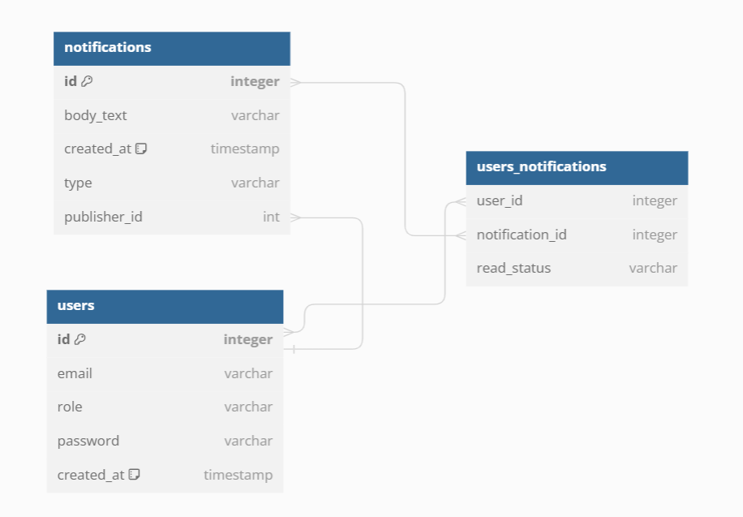
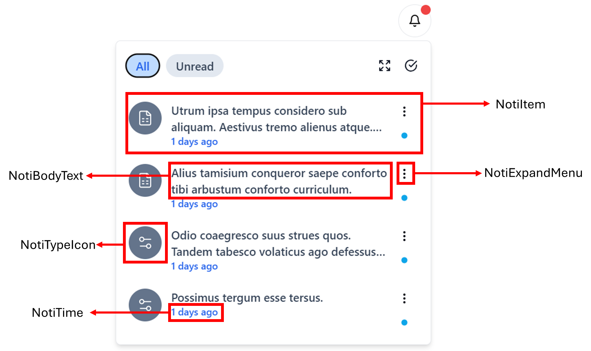

import { Aside } from '@astrojs/starlight/components';

<Aside type="tip">

Again, make sure the **[basic notification architect](/app_design/notification/simple-architect/)** works flawlessly before migrating to this feature. **⚠️ DO NOT OVER COMPLICATED YOURSELF!!!** 

</Aside>

Notice when you click to view a notification on facebook, it marked as read? Let's archieve this feature.

Before going into the article, we must know that there are more than just one database paradigm. If you have used Collection Databases with nested object (like MongoDb, Cassandra and DynamoDB) - your life will becomes much much easy. We will learn more about database migration later. Here in this article, we focus on the design of relational database, which will be much much harder to implement.

## Database design

To keep track of which user reads which notification, we introduce a many-to-many relationship table called `users_notifications`. When a user read a notification, we add a record to this table. Therefore, the unread notifications are the one that does not existed in this table. We can perform an anti-join to query this!

**SQL Query logic for fetch unread message**

<iframe
  src="https://carbon.now.sh/embed?bg=rgba%28171%2C+184%2C+195%2C+1%29&t=seti&wt=none&l=text%2Fx-mysql&width=625.5&ds=false&dsyoff=20px&dsblur=68px&wc=true&wa=true&pv=8px&ph=16px&ln=true&fl=1&fm=Hack&fs=14px&lh=133%25&si=false&es=2x&wm=false&code=SELECT%2520notifications.*%250AFROM%2520notifications%250ALEFT%2520JOIN%2520users_notifications%2520%250AON%2520notifications.id%2520%253D%2520users_notifications.notificationId%250AWHERE%2520users_notifications.notificationId%2520IS%2520NULL%250AAND%2520notifications.publisherId%2520%253C%253E%252011%250AAND%2520%28%250A%2520%2520%2520%2520%28SELECT%2520role%2520FROM%2520users%2520WHERE%2520id%2520%253D%252011%29%2520%253D%2520%27admin%27%2520OR%2520%250A%2520%2520%2520%2520notifications.type%2520IN%2520%28%27record%27%252C%2520%27database%27%29%250A%29%250AORDER%2520BY%2520notifications.createdAt%2520DESC%250ALIMIT%252010%253B"
  style="width: 1024px; height: 473px; border:0; transform: scale(1); overflow:hidden;"
  sandbox="allow-scripts allow-same-origin">
</iframe>

With this SQL in mind, you can get the unread notification from whatever you please: use an ORM like Prisma, save as UDF (User Defined Function). Here's how you can translate the SQL to Prisma (in Prisma there's no Subquery, so you have a distict query to determine the role)

<iframe
  src="https://carbon.now.sh/embed?bg=rgba%28171%2C+184%2C+195%2C+1%29&t=seti&wt=none&l=application%2Ftypescript&width=625.5&ds=false&dsyoff=20px&dsblur=68px&wc=true&wa=true&pv=8px&ph=16px&ln=true&fl=1&fm=Hack&fs=14px&lh=133%25&si=false&es=2x&wm=false&code=const%2520%257B%2520role%2520%257D%2520%253D%2520await%2520this.DbService.user.findFirstOrThrow%28%257B%2520where%253A%2520%257B%2520id%253A%2520id%2520%257D%2520%257D%29%253B%250A%250Aconst%2520adminFilterCondition%2520%253D%2520%257B%250A%2520%2520AND%253A%2520%255B%250A%2520%2520%2520%2520%257B%2520publisherId%253A%2520%257B%2520not%253A%2520id%2520%257D%2520%257D%252C%250A%2520%2520%2520%2520%257B%2520usersNotifications%253A%2520%257B%2520none%253A%2520%257B%257D%2520%257D%2520%257D%252C%250A%2520%2520%255D%252C%250A%257D%253B%250Aconst%2520userFilterCondition%2520%253D%2520%257B%250A%2520%2520AND%253A%2520%255B%250A%2520%2520%2520%2520%257B%2520publisherId%253A%2520%257B%2520not%253A%2520id%2520%257D%2520%257D%252C%250A%2520%2520%2520%2520%257B%2520usersNotifications%253A%2520%257B%2520none%253A%2520%257B%257D%2520%257D%2520%257D%252C%250A%2520%2520%2520%2520%257B%2520type%253A%2520%257B%2520in%253A%2520%255B%27database%27%252C%2520%27record%27%255D%2520%257D%2520%257D%252C%250A%2520%2520%255D%252C%250A%257D%253B%250A%250Aconst%2520data%2520%253D%2520await%2520this.DbService.notification.findMany%28%257B%250A%2520%2520take%253A%252020%252C%250A%2520%2520orderBy%253A%2520%257B%2520createdAt%253A%2520%27desc%27%2520%257D%252C%250A%2520%2520where%253A%2520role%2520%253D%253D%253D%2520%27admin%27%2520%253F%2520adminFilterCondition%2520%253A%2520userFilterCondition%252C%250A%257D%29%253B"
  style="width: 781px; height: 464px; border:0; transform: scale(1); overflow:hidden;"
  sandbox="allow-scripts allow-same-origin">
</iframe>

## Update the UI

## Read message mechanism

After updating the UI, let's makes the core functionality works. The **"read"** functionality is private to each user, so it doesn't has to be websocket. We can create plain old HTTP endpoints for this.

