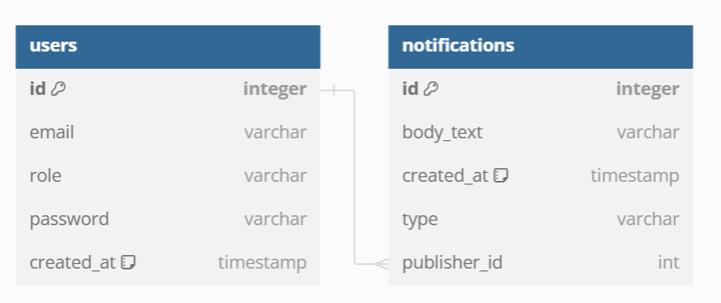
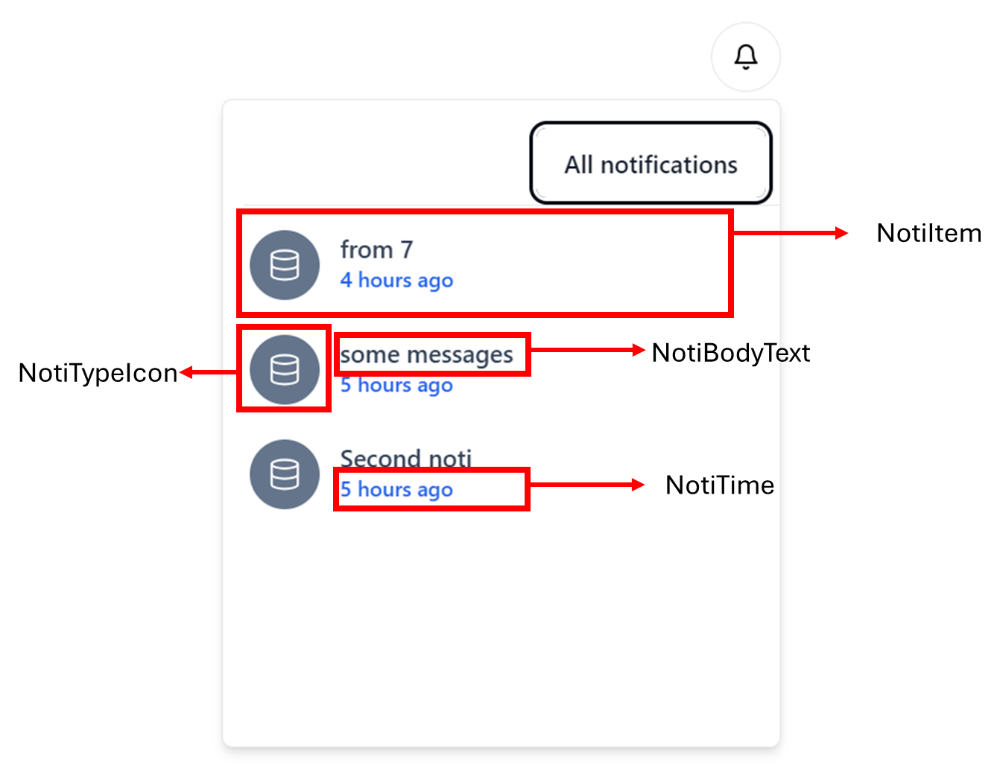

import { Aside } from "@astrojs/starlight/components";

In this system design, a user publish a message to the server, and server process the message (save to database) then broadcast the message to all other users.

<Aside type="tip">

Most of the case, this is all you need! Don't over complicates yourself !!! Focus on the business logic

</Aside>

### Setup socket connection

**Frontend code**

<iframe
  src="https://carbon.now.sh/embed?bg=rgba%28171%2C+184%2C+195%2C+1%29&t=seti&wt=none&l=auto&width=680&ds=true&dsyoff=20px&dsblur=68px&wc=true&wa=true&pv=56px&ph=56px&ln=false&fl=1&fm=Hack&fs=14px&lh=133%25&si=false&es=2x&wm=false&code=import%2520%257B%2520io%2520%257D%2520from%2520%2522socket.io-client%2522%253B%250A%250Aconst%2520socket%2520%253D%2520io%28%2522http%253A%252F%252Flocalhost%253A4000%2522%29%253B"
  style="width: 513px; height: 242px; border:0; transform: scale(1); overflow:hidden;"
  sandbox="allow-scripts allow-same-origin"
></iframe>

**Backend code**

<iframe
  src="https://carbon.now.sh/embed?bg=rgba%28171%2C+184%2C+195%2C+1%29&t=seti&wt=none&l=auto&width=680&ds=true&dsyoff=20px&dsblur=68px&wc=true&wa=true&pv=56px&ph=56px&ln=true&fl=1&fm=Hack&fs=14px&lh=133%25&si=false&es=2x&wm=false&code=import%2520%257B%250A%2520%2520SubscribeMessage%252C%250A%2520%2520WebSocketGateway%252C%250A%2520%2520WebSocketServer%252C%250A%257D%2520from%2520%27%2540nestjs%252Fwebsockets%27%253B%250Aimport%2520%257B%2520Server%252C%2520Socket%2520%257D%2520from%2520%27socket.io%27%253B%250A%250A%250A%2540WebSocketGateway%28%257B%250A%2520%2520cors%253A%2520%257B%250A%2520%2520%2520%2520origin%253A%2520%27*%27%252C%250A%2520%2520%257D%252C%250A%257D%29%250Aexport%2520class%2520NotificationGateway%2520%257B%250A%2520%2520%2540WebSocketServer%28%29%2520io%253A%2520Server%253B%250A%250A%2520%2520handleConnection%28client%253A%2520Socket%29%2520%257B%250A%2520%2520%2520%2520console.log%28%2560%2524%257Bclient.id%257D%2520connected%2560%29%253B%250A%2520%2520%257D%250A%250A%2520%2520handleDisconnect%28client%253A%2520Socket%29%2520%257B%250A%2520%2520%2520%2520console.log%28%2560Disconnected%253A%2520%2524%257Bclient.id%257D%2560%29%253B%250A%2520%2520%257D%250A%257D"
  style="width: 550px; height: 616px; border:0; transform: scale(1); overflow:hidden;"
  sandbox="allow-scripts allow-same-origin"
></iframe>

I know, it's damn hard to read dependency injection framework like NestJS. But let's stick to the basic. We create a socket server at line `15`, and call it `io` (just like the frontend code). The socket server can handle on connected and on disconnected event of the client. Here we don't do nothing, so we just log the connection status of a client. SocketIO also subject to CORS blocking, so in dev mode (and microservices), you must allow CORS (line `10-12`)

With server and client setup, let's define the notification shape by step over the table design.

### Database design

Every notification has a `type` and a `publisherId`. PublisherId helps to deduplicate the notification. If a user commit an action, you don't want them to receive the notification of their own - hence publisherId is used to filter the message belongs to them (to exclude them). Type is used for notification mask. Each user has a role, and some notification doesn't meant for some role. By identifying a user's role, we can then filter the notification type that a user can receive.

**Query Logic**

<iframe
  src="https://carbon.now.sh/embed?bg=rgba%28171%2C+184%2C+195%2C+1%29&t=seti&wt=none&l=text%2Fx-mysql&width=625.5&ds=false&dsyoff=20px&dsblur=68px&wc=true&wa=true&pv=8px&ph=16px&ln=true&fl=1&fm=Hack&fs=14px&lh=133%25&si=false&es=2x&wm=false&code=select%2520notifications.*%2520%250Afrom%2520users%250Aleft%2520join%2520notifications%250Aon%2520users.id%2520%253D%2520notifications.publisherId%250Awhere%2520notifications.publisherId%2520%253C%253E%25207%250Aand%2520%28%250A%2520%2520%28select%2520role%2520from%2520users%2520where%2520users.id%2520%253D%25207%29%2520%253D%2520%27admin%27%250A%2520%2520or%250A%2520%2520notifications.type%2520in%2520%28%27record%27%252C%2520%27database%27%29%250A%29%250Aorder%2520by%2520notifications.createdAt%2520desc%250Alimit%252010%253B"
  style="width: 1024px; height: 473px; border:0; transform: scale(1); overflow:hidden;"
  sandbox="allow-scripts allow-same-origin">
</iframe>

We fetch all the top 10 latest notifications chronologically order. Here we have a subquery that fetch the role of the user, then compares the role. If the role isn't `admin`, we returns only the two notification type (limiting the views) 

Base on this SQL, we can implement them everywhere. Here I am display how to do the queyr on Prisma ORM. Prisma ORM doesn't support subquery (if does, not that good to be honest), so I split the code to 2 queries. One for fetching the role, one for return all the notifications

<iframe
  src="https://carbon.now.sh/embed?bg=rgba%28171%2C+184%2C+195%2C+1%29&t=seti&wt=none&l=application%2Ftypescript&width=625.5&ds=false&dsyoff=20px&dsblur=68px&wc=true&wa=true&pv=8px&ph=16px&ln=true&fl=1&fm=Hack&fs=14px&lh=133%25&si=false&es=2x&wm=false&code=async%2520getAllNotifications%28userId%253A%2520number%29%2520%257B%250A%2520%2520%2520%2520const%2520%257B%2520role%2520%257D%2520%253D%2520await%2520this.dbService.user.findFirstOrThrow%28%257B%250A%2520%2520%2520%2520%2520%2520where%253A%2520%257B%2520id%253A%2520userId%2520%257D%252C%250A%2520%2520%2520%2520%2520%2520select%253A%2520%257B%250A%2520%2520%2520%2520%2520%2520%2520%2520role%253A%2520true%252C%250A%2520%2520%2520%2520%2520%2520%257D%252C%250A%2520%2520%2520%2520%257D%29%253B%250A%2520%2520%2520%2520let%2520data%250A%2520%2520%2520%2520if%2520%28role%2520%21%253D%253D%2520%27admin%27%29%2520%257B%250A%2520%2520%2520%2520%2520%2520data%2520%253D%2520await%2520this.dbService.notification.findMany%28%257B%250A%2520%2520%2520%2520%2520%2520%2520%2520take%253A%252020%252C%250A%2520%2520%2520%2520%2520%2520%2520%2520orderBy%253A%2520%255B%257B%2520createdAt%253A%2520%27desc%27%2520%257D%255D%252C%250A%2520%2520%2520%2520%2520%2520%2520%2520where%253A%2520%257B%250A%2520%2520%2520%2520%2520%2520%2520%2520%2520%2520publisherId%253A%2520%257B%2520not%253A%2520userId%2520%257D%252C%250A%2520%2520%2520%2520%2520%2520%2520%2520%2520%2520type%253A%2520%257B%2520notIn%253A%2520%255B%27permission%27%252C%2520%27user%27%255D%2520%257D%252C%250A%2520%2520%2520%2520%2520%2520%2520%2520%257D%252C%250A%2520%2520%2520%2520%2520%2520%257D%29%253B%250A%2520%2520%2520%2520%257D%2520else%2520%257B%250A%2520%2520%2520%2520%2520%2520data%2520%253D%2520await%2520this.dbService.notification.findMany%28%257B%250A%2520%2520%2520%2520%2520%2520%2520%2520take%253A%252020%252C%250A%2520%2520%2520%2520%2520%2520%2520%2520orderBy%253A%2520%255B%257B%2520createdAt%253A%2520%27desc%27%2520%257D%255D%252C%250A%2520%2520%2520%2520%2520%2520%2520%2520where%253A%2520%257B%250A%2520%2520%2520%2520%2520%2520%2520%2520%2520%2520publisherId%253A%2520%257B%2520not%253A%2520userId%2520%257D%252C%250A%2520%2520%2520%2520%2520%2520%2520%2520%257D%252C%250A%2520%2520%2520%2520%2520%2520%257D%29%253B%250A%2520%2520%2520%2520%257D%250A%2520%2520%2520%2520return%2520data%253B%250A%2520%2520%257D"
  style="width: 630px; height: 594px; border:0; transform: scale(1); overflow:hidden;"
  sandbox="allow-scripts allow-same-origin"
></iframe>

### Publish a notification

Realistically, notification is a part of database life-cycle hooks, meaning the notification only be dispatched only when a database transaction completes. But for the sake of simplicity, we will send the notification directly on the client-side.

**Frontend emit function**

<iframe
  src="https://carbon.now.sh/embed?bg=rgba%28171%2C+184%2C+195%2C+1%29&t=seti&wt=none&l=auto&width=680&ds=true&dsyoff=20px&dsblur=68px&wc=true&wa=true&pv=56px&ph=56px&ln=true&fl=1&fm=Hack&fs=14px&lh=133%25&si=false&es=2x&wm=false&code=const%2520publishNotification%2520%253D%2520%28eventType%29%2520%253D%253E%2520%257B%250A%2520%2520const%2520data%2520%253D%2520%257B%250A%2520%2520%2520%2520bodyText%253A%2520%2522%253Csome_text%253E%2522%252C%250A%2520%2520%2520%2520createdAt%253A%2520moment%28%29.tz%28%2522Asia%252FHo_Chi_Minh%2522%29.toISOString%28%29%252C%250A%2520%2520%2520%2520notiType%253A%2520eventType%252C%250A%2520%2520%2520%2520publisherId%253A%2520userId%252C%250A%2520%2520%257D%253B%250A%2520%2520socket.emit%28%2522new-notification%2522%252C%2520data%29%253B%250A%257D%253B"
  style="width: 676px; height: 337px; border:0; transform: scale(1); overflow:hidden;"
  sandbox="allow-scripts allow-same-origin"
></iframe>

This function is simple enough. From a client, we **emit** a payload to the server. This equivalent to sending a GET request to "/new-notification" with body=payload. Inside the server, we specify a handler to process this request - as same as a controller for a API route

**Backend event handler**

<iframe
  src="https://carbon.now.sh/embed?bg=rgba%28171%2C+184%2C+195%2C+1%29&t=seti&wt=none&l=auto&width=680&ds=true&dsyoff=20px&dsblur=68px&wc=true&wa=true&pv=56px&ph=56px&ln=true&fl=1&fm=Hack&fs=14px&lh=133%25&si=false&es=2x&wm=false&code=%252F%252F%2520notification.gateway.ts%250A%250Aimport%2520...%250Aimport%2520%257B%2520NotificationService%2520%257D%2520from%2520%27src%252Fnotification%252Fnotification.service%27%253B%250A%250A...%250Aclass%2520NotificationGateway%2520%257B%250A%2520%2520%2540WebSocketServer%28%29%2520io%253A%2520Server%253B%250A%250A%2520%2520constructor%28private%2520readonly%2520NotificationService%253A%2520NotificationService%29%2520%257B%257D%250A%250A%2520%2520%252F%252F%2520Some%2520code%2520...%250A%250A%2520%2520%2540SubscribeMessage%28%27new-notification%27%29%250A%2520%2520async%2520broadcastNewNotifications%28client%253A%2520Socket%252C%2520payload%29%253A%2520Promise%253Cvoid%253E%2520%257B%250A%2520%2520%2520%2520const%2520arg%2520%253D%2520%257B%250A%2520%2520%2520%2520%2520%2520bodyText%253A%2520payload.bodyText%252C%250A%2520%2520%2520%2520%2520%2520createdAt%253A%2520payload.createdAt%252C%250A%2520%2520%2520%2520%2520%2520type%253A%2520payload.notiType%252C%250A%2520%2520%2520%2520%2520%2520publisherId%253A%2520%252Bpayload.publisherId%252C%250A%2520%2520%2520%2520%257D%253B%250A%2520%2520%2520%2520await%2520this.NotificationService.createNotification%28arg%29%250A%2520%2520%2520%2520client.broadcast.emit%28%27new-notification%27%252C%2520payload%29%253B%250A%2520%2520%257D%250A%250A%2520%2520%252F%252F%2520More%2520code%2520...%250A%257D"
  style="width: 802px; height: 672px; border:0; transform: scale(1); overflow:hidden;"
  sandbox="allow-scripts allow-same-origin"
></iframe>

Here in the backend is the code for `new-notification` event handler. We try to save the notification to the database at line `22`. What to mind is on line `23`, where we called `client.broadcast.emit`.

<Aside>

In SocketIO terminologies, the word `Broadcast` means to publish the message from the server to all the users that subscribed, EXCEPT the publisher.

</Aside>

Using the syntax from line `23`, we essentially send the message to all the clients that subscribe to the `new-notification` event that _user_1_ has committed a new notification, and all the other client's React Components must now update this notification to their UI.

This is the power of Websocket. When a user commit an action to the server, all other clients update their UI in real-time!

### Receiving a notification

<iframe
  src="https://carbon.now.sh/embed?bg=rgba%28171%2C+184%2C+195%2C+1%29&t=seti&wt=none&l=auto&width=680&ds=true&dsyoff=20px&dsblur=68px&wc=true&wa=true&pv=56px&ph=56px&ln=true&fl=1&fm=Hack&fs=14px&lh=133%25&si=false&es=2x&wm=false&code=useEffect%28%28%29%2520%253D%253E%2520%257B%250A%2520%2520socket.on%28%2522new-notification%2522%252C%2520%28data%29%2520%253D%253E%2520%257B%250A%2520%2520%2520%2520setNotiList%28%28oldArray%29%2520%253D%253E%2520%255Bdata%252C%2520...oldArray%255D%29%253B%250A%2520%2520%257D%29%253B%250A%257D%252C%2520%255Bsocket%255D%29%253B"
  style="width: 592px; height: 262px; border:0; transform: scale(1); overflow:hidden;"
  sandbox="allow-scripts allow-same-origin"
></iframe>

Using a plain old useEffect, we can subscribe to an event at client side.

### Initial notification load

Initial data load is flexible. We can either fetch the notification via HTTP, or Websocket. We will try to use Websocket approach.

**Frontend code**

<iframe
  src="https://carbon.now.sh/embed?bg=rgba%28171%2C+184%2C+195%2C+1%29&t=seti&wt=none&l=auto&width=680&ds=false&dsyoff=20px&dsblur=68px&wc=true&wa=true&pv=8px&ph=16px&ln=true&fl=1&fm=Hack&fs=14px&lh=133%25&si=false&es=2x&wm=false&code=useEffect%28%28%29%2520%253D%253E%2520%257B%250A%2520%2520if%2520%28userId%29%2520%257B%250A%2520%2520%2520%2520socket.emit%28%2522all-notifications%2522%252C%2520%252BuserId%29%253B%250A%2520%2520%257D%250A%257D%252C%2520%255BuserId%255D%29%253B"
  style="width: 470px; height: 166px; border:0; transform: scale(1); overflow:hidden;"
  sandbox="allow-scripts allow-same-origin"
></iframe>

`useEffect` with empty dependency array means run exact once when component load - so we can emit an event to the server at componet loaded. Our query logic depends on **userId**, so I add them to the dependency array

**Backend code**

<iframe
  src="https://carbon.now.sh/embed?bg=rgba%28171%2C+184%2C+195%2C+1%29&t=seti&wt=none&l=application%2Ftypescript&width=625.5&ds=false&dsyoff=20px&dsblur=68px&wc=true&wa=true&pv=8px&ph=16px&ln=true&fl=1&fm=Hack&fs=14px&lh=133%25&si=false&es=2x&wm=false&code=%2540SubscribeMessage%28%27all-notifications%27%29%250Aasync%2520deliverAllNotifications%28client%253A%2520Socket%252C%2520userId%253A%2520number%29%253A%2520Promise%253Cvoid%253E%2520%257B%250A%2520%2520if%2520%28userId%29%2520%257B%250A%2520%2520%2520%2520const%2520notifications%2520%253D%250A%2520%2520%2520%2520%2520%2520await%2520this.NotificationService.getAllNotifications%28userId%29%253B%250A%2520%2520%2520%2520this.io.to%28client.id%29.emit%28%27all-notifications%27%252C%2520notifications%29%253B%250A%2520%2520%257D%2520else%2520%257B%250A%2520%2520%2520%2520this.io%250A%2520%2520%2520%2520%2520%2520.to%28client.id%29%250A%2520%2520%2520%2520%2520%2520.emit%28%27socket-error%27%252C%2520%257B%2520message%253A%2520%27User%2520ID%2520not%2520provided%27%2520%257D%29%253B%250A%2520%2520%257D%250A%257D"
  style="width: 739px; height: 296px; border:0; transform: scale(1); overflow:hidden;"
  sandbox="allow-scripts allow-same-origin"
></iframe>

In the publishing part, we use the method `<cls>Socket.emit()` to send the message from server to client. Using `Socket` class, the client is non-deterministic. To send private message to a specific user (deterministic), we must use `<cls>Server` (`io` is an instance of class `Server`) to send the message. Here, when the client browser send request to 'all-notifications' event, we return the notifications to that specific agent

### Role based message publish

In the example provided earlier, everytime a notification created, we publish the message via `socket.broadcast()` method. However, this introduce a bug - a big one: this message broadcast the message to all the users - without considering the mesage type. We have lay a rule in database design, that the `user` role should only be subscribed to `record` & `database` type.

To be able to solve this issue, we introduce `Room`. We learn from the fundemetal article that Room is a secure channel to client. When a user connect to a socket server, we should connect the client id to a room.

<Aside>

At this point, we should differentiate client's id and user's id. Each browser connected to the socket server is given an id. This is called a client id. A user can login to the socket server via different browsers, hence one user id can have different client id. Socket server only works with client's id

</Aside>

The client's socketio instantiation (`io()`) has two argument: a URL and `...args`. Inside of args, there's a query parameter. We can send our userId to via the `{query: Object}`. Here post another problem: The client needs to have userId before instantiate socket connection. Therefore, we move the socket instantiation to the useEffect lifecycle.

**Frontend code**

<iframe
  src="https://carbon.now.sh/embed?bg=rgba%28171%2C+184%2C+195%2C+1%29&t=seti&wt=none&l=application%2Ftypescript&width=625.5&ds=false&dsyoff=20px&dsblur=68px&wc=true&wa=true&pv=8px&ph=16px&ln=true&fl=1&fm=Hack&fs=14px&lh=133%25&si=false&es=2x&wm=false&code=useEffect%28%28%29%2520%253D%253E%2520%257B%250A%2520%2520if%2520%28userId%29%2520%257B%250A%2520%2520%2520%2520const%2520socketClient%2520%253D%2520io%28%2522http%253A%252F%252Flocalhost%253A4000%2522%252C%2520%257B%250A%2520%2520%2520%2520%2520%2520query%253A%2520%257B%2520userId%2520%257D%252C%250A%2520%2520%2520%2520%257D%29%253B%250A%2520%2520%2520%2520socketClient.on%28%2522connect%2522%252C%2520%28%29%2520%253D%253E%2520%257B%250A%2520%2520%2520%2520%2520%2520setSocket%28socketClient%29%253B%250A%2520%2520%2520%2520%2520%2520socketClient.emit%28%2522all-notifications%2522%252C%2520%252BuserId%29%253B%250A%2520%2520%2520%2520%257D%29%253B%250A%2520%2520%257D%250A%257D%252C%2520%255BuserId%255D%29%253B"
  style="width: 1024px; height: 473px; border:0; transform: scale(1); overflow:hidden;"
  sandbox="allow-scripts allow-same-origin">
</iframe>

**Backend code**

<iframe
  src="https://carbon.now.sh/embed?bg=rgba%28171%2C+184%2C+195%2C+1%29&t=seti&wt=none&l=application%2Ftypescript&width=625.5&ds=false&dsyoff=20px&dsblur=68px&wc=true&wa=true&pv=8px&ph=16px&ln=true&fl=1&fm=Hack&fs=14px&lh=133%25&si=false&es=2x&wm=false&code=async%2520handleConnection%28client%253A%2520Socket%29%2520%257B%250A%2520%2520console.log%28%2560%2524%257Bclient.id%257D%2520connected%2560%29%253B%250A%2520%2520const%2520userId%2520%253D%2520client.handshake.query.userId%253B%250A%2520%2520if%2520%28userId%29%2520%257B%250A%2520%2520%2520%2520const%2520%257B%2520role%2520%257D%2520%253D%2520await%2520this.dbService.user.findFirstOrThrow%28%257B%250A%2520%2520%2520%2520%2520%2520where%253A%2520%257B%2520id%253A%2520%252BuserId%2520%257D%252C%250A%2520%2520%2520%2520%2520%2520select%253A%2520%257B%2520role%253A%2520true%2520%257D%252C%250A%2520%2520%2520%2520%257D%29%253B%250A%2520%2520%2520%2520if%2520%28role%2520%253D%253D%253D%2520%27admin%27%29%2520%257B%250A%2520%2520%2520%2520%2520%2520client.join%28%255B%27user%27%252C%2520%27permission%27%252C%2520%27database%27%252C%2520%27record%27%255D%29%253B%250A%2520%2520%2520%2520%257D%2520else%2520%257B%250A%2520%2520%2520%2520%2520%2520client.join%28%255B%27permission%27%252C%2520%27user%27%255D%29%253B%250A%2520%2520%2520%2520%257D%250A%2520%2520%257D%2520else%2520%257B%250A%2520%2520%2520%2520this.io%250A%2520%2520%2520%2520%2520%2520.to%28client.id%29%250A%2520%2520%2520%2520%2520%2520.emit%28%27socket-error%27%252C%2520%257B%2520message%253A%2520%27User%2520ID%2520not%2520provided%27%2520%257D%29%253B%250A%2520%2520%257D%250A%257D"
  style="width: 630px; height: 427px; border:0; transform: scale(1); overflow:hidden;"
  sandbox="allow-scripts allow-same-origin">
</iframe>

In the server side, we can capture this userID, and based on the role, we can assign the client id to the room correspond to the notification type they allow to access.

**Dispatcher updates**

<iframe
  src="https://carbon.now.sh/embed?bg=rgba%28171%2C+184%2C+195%2C+1%29&t=seti&wt=none&l=application%2Ftypescript&width=625.5&ds=false&dsyoff=20px&dsblur=68px&wc=true&wa=true&pv=8px&ph=16px&ln=true&fl=1&fm=Hack&fs=14px&lh=133%25&si=false&es=2x&wm=false&code=client.broadcast.to%28arg.type%29.emit%28%27new-notification%27%252C%2520payload%29%253B"
  style="width: 621px; height: 92px; border:0; transform: scale(1); overflow:hidden;"
  sandbox="allow-scripts allow-same-origin">
</iframe>

We make one crucial update on the server dispatcher. Rather broadcasting to everyone, we securely broadcast to the room according to its type. Therefore, `user` type who restricted access to notification cannot receive 'permissions' & 'user' notification

### UI

The UI is fairly simple. You can reference the source code to modify the notification base on your need

