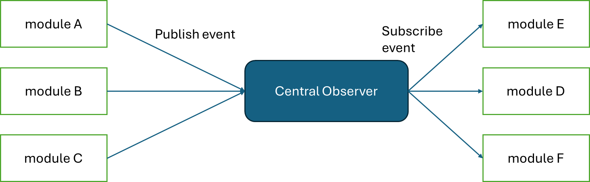

import { Aside } from "@astrojs/starlight/components";

In this project, we will refactor our code to match production settings

## 1. Client socket server to Context

it is good practice put socket server into Context provider, so we have only one pool connection.

<iframe
  src="https://carbon.now.sh/embed?bg=rgba%28171%2C+184%2C+195%2C+1%29&t=seti&wt=none&l=application%2Ftypescript&width=625.5&ds=false&dsyoff=20px&dsblur=68px&wc=true&wa=true&pv=8px&ph=16px&ln=true&fl=1&fm=Hack&fs=14px&lh=133%25&si=false&es=2x&wm=false&code=import%2520%257B%2520createContext%252C%2520useContext%252C%2520useEffect%252C%2520useState%2520%257D%2520from%2520%2522react%2522%253B%250Aimport%2520%257B%2520Socket%2520%257D%2520from%2520%2522socket.io-client%2522%253B%250Aimport%2520%257B%2520io%2520%257D%2520from%2520%2522socket.io-client%2522%253B%250A%250Aimport%2520type%2520%257B%2520Dispatch%252C%2520PropsWithChildren%252C%2520SetStateAction%2520%257D%2520from%2520%2522react%2522%253B%250Aimport%2520%257B%2520useUser%2520%257D%2520from%2520%2522.%252Fuser-providers%2522%253B%250A%250Ainterface%2520SocketContextType%2520%257B%250A%2520%2520socket%253A%2520Socket%2520%257C%2520null%253B%250A%2520%2520%252F%252F%2520setErr%253A%2520Dispatch%253CSetStateAction%253Cstring%2520%257C%2520undefined%253E%253E%253B%250A%257D%250A%250Aconst%2520SocketContext%2520%253D%2520createContext%253CSocketContextType%2520%257C%2520undefined%253E%28undefined%29%253B%250A%250Aexport%2520const%2520SocketProvider%2520%253D%2520%28%257B%2520children%2520%257D%253A%2520PropsWithChildren%253C%257B%257D%253E%29%2520%253D%253E%2520%257B%250A%2520%2520const%2520%255Bsocket%252C%2520setSocket%255D%2520%253D%2520useState%253CSocket%2520%257C%2520null%253E%28null%29%253B%250A%250A%2520%2520const%2520%257B%2520user%2520%257D%2520%253D%2520useUser%28%29%253B%250A%250A%2520%2520useEffect%28%28%29%2520%253D%253E%2520%257B%250A%2520%2520%2520%2520if%2520%28user%29%2520%257B%250A%2520%2520%2520%2520%2520%2520const%2520socketClient%2520%253D%2520io%28%2522http%253A%252F%252Flocalhost%253A4000%2522%252C%2520%257B%250A%2520%2520%2520%2520%2520%2520%2520%2520query%253A%2520%257B%2520userId%253A%2520user.id%2520%257D%252C%250A%2520%2520%2520%2520%2520%2520%257D%29%253B%250A%2520%2520%2520%2520%2520%2520socketClient.on%28%2522connect%2522%252C%2520%28%29%2520%253D%253E%2520%257B%250A%2520%2520%2520%2520%2520%2520%2520%2520setSocket%28socketClient%29%253B%250A%2520%2520%2520%2520%2520%2520%257D%29%253B%250A%2520%2520%2520%2520%257D%250A%2520%2520%257D%252C%2520%255Buser%255D%29%253B%250A%250A%2520%2520return%2520%28%250A%2520%2520%2520%2520%253CSocketContext.Provider%250A%2520%2520%2520%2520%2520%2520value%253D%257B%257B%250A%2520%2520%2520%2520%2520%2520%2520%2520socket%252C%250A%2520%2520%2520%2520%2520%2520%257D%257D%250A%2520%2520%2520%2520%253E%250A%2520%2520%2520%2520%2520%2520%257Bchildren%257D%250A%2520%2520%2520%2520%253C%252FSocketContext.Provider%253E%250A%2520%2520%29%253B%250A%257D%253B%250A%250Aexport%2520const%2520useSocket%2520%253D%2520%28%29%2520%253D%253E%2520%257B%250A%2520%2520const%2520context%2520%253D%2520useContext%28SocketContext%29%253B%250A%2520%2520if%2520%28%21context%29%2520%257B%250A%2520%2520%2520%2520throw%2520new%2520Error%28%2522useSocket%2520must%2520be%2520used%2520within%2520an%2520SocketProvider%2522%29%253B%250A%2520%2520%257D%250A%2520%2520return%2520context%253B%250A%257D%253B%250A"
  style="width: 739px; height: 985px; border:0; transform: scale(1); overflow:hidden;"
  sandbox="allow-scripts allow-same-origin">
</iframe>

Here we create `socket-provider` context. We also use `user` as a higher order context provider, so make sure to implement it yourself.

## 2. Notification dispatcher in server side code

Like I said before, usually the notification is a life-cycle hook to the database. You should only dispatch an action when a transaction is complete, not at client-side. In NestJS (and most other frameworks), you can simply import the `<cls>Server` and dispatch an action. But as we learn about dependency injection, I want to talk about `Observer Pattern`

### Observer pattern

**Observer Pattern** is a design pattern that works exactly like the notification, but for module-wise. 

Observer pattern has a singleton class: `Observer`. This class has two important method: `register` and `run`. A `register` method add the listener (or subscriber) class to an internal datastructure (mostly a hash map with keys is the event name and values is an array of listener). `run` is a decorator method, that add upon the listener class to its own method (using this way, we do not need the same interface method name for the listener class). When a publisher publish the message to an event, the Observer iterate through the events list, runs the `run` method of each class (Again, the `run` method is a decorator, so we actually run the decorated method).

Most Depdendencies Injection supports this pattern out-of-the-box, just install some dependencies and you all good.

### Implement observer pattern in NestJS

[See the full implement of EventEmitter here](https://www.youtube.com/watch?v=-MlXwb42nKo)

In this example, I have created a pseudo service called `record` (by running `nest g resource record`). Here I put the logic to emit the `record` event to the `notification.gateway`, which will add new notification to the database and broadcast that to the clients.

<iframe
  src="https://carbon.now.sh/embed?bg=rgba%28171%2C+184%2C+195%2C+1%29&t=seti&wt=none&l=application%2Ftypescript&width=625.5&ds=false&dsyoff=20px&dsblur=68px&wc=true&wa=true&pv=8px&ph=16px&ln=true&fl=1&fm=Hack&fs=14px&lh=133%25&si=false&es=2x&wm=false&code=%252F%252F%2520record.controller.ts%250A%2540Post%28%29%250A%2520%2520async%2520create%28%2540Body%28%29%2520createRecordDto%253A%2520CreateRecordDto%29%2520%257B%250A%2520%2520%2520%2520this.recordService.create%28createRecordDto%29%253B%250A%2520%2520%2520%2520this.eventEmitter.emit%28%27record.create%27%252C%2520%257B%2520userId%253A%2520createRecordDto.userId%2520%257D%29%253B%250A%2520%2520%2520%2520return%253B%250A%2520%257D"
  style="width: 756px; height: 203px; border:0; transform: scale(1); overflow:hidden;"
  sandbox="allow-scripts allow-same-origin">
</iframe>

<iframe
  src="https://carbon.now.sh/embed?bg=rgba%28171%2C+184%2C+195%2C+1%29&t=seti&wt=none&l=application%2Ftypescript&width=625.5&ds=false&dsyoff=20px&dsblur=68px&wc=true&wa=true&pv=8px&ph=16px&ln=true&fl=1&fm=Hack&fs=14px&lh=133%25&si=false&es=2x&wm=false&code=%252F%252F%2520notification.gateway.ts%250A%2540OnEvent%28%27record.create%27%29%250A%2520%2520async%2520RecordCreateListener%28arg%29%2520%257B%250A%2520%2520%2520%2520const%2520newNotification%2520%253D%2520%257B%250A%2520%2520%2520%2520%2520%2520publisherId%253A%2520arg.userId%252C%250A%2520%2520%2520%2520%2520%2520createdAt%253A%2520moment%28%29.tz%28%27Asia%252FHo_Chi_Minh%27%29.toDate%28%29%252C%250A%2520%2520%2520%2520%2520%2520type%253A%2520%27record%27%252C%250A%2520%2520%2520%2520%2520%2520bodyText%253A%2520%2560User%2520%2524%257Barg.userId%257D%2520has%2520create%2520a%2520record%2560%252C%250A%2520%2520%2520%2520%257D%253B%250A%2520%2520%2520%2520const%2520newId%2520%253D%250A%2520%2520%2520%2520%2520%2520await%2520this.NotificationService.createNotification%28newNotification%29%253B%250A%2520%2520%2520%2520const%2520transformedData%2520%253D%2520plainToInstance%28NotificationDto%252C%2520%2520%257B%2520id%253A%2520newId%252C%2520...newNotification%2520%257D%29%253B%250A%250A%2520%2520%2520%2520this.io%250A%2520%2520%2520%2520%2520%2520.in%28%27record%27%29%250A%2520%2520%2520%2520%2520%2520.emit%28%27new-notification%27%252C%2520transformedData%29%253B%250A%2520%257D"
  style="width: 899px; height: 389px; border:0; transform: scale(1); overflow:hidden;"
  sandbox="allow-scripts allow-same-origin">
</iframe>