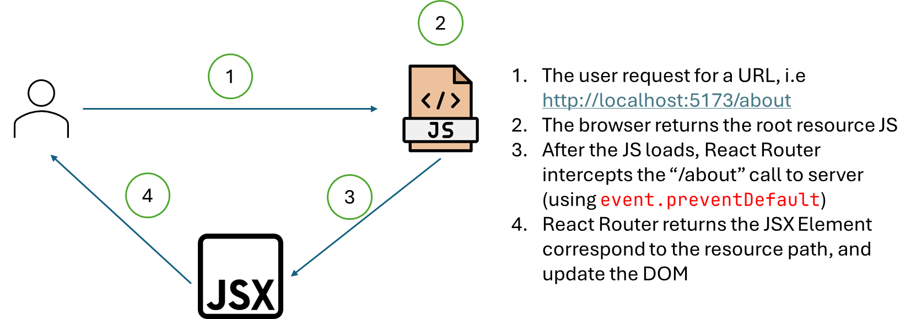

import { Aside } from '@astrojs/starlight/components';
import { FileTree } from '@astrojs/starlight/components';

React Router is a client-side routing framework. Rather than sends the URL to the server, React Router intercept this URL and return the JSX Component to the user.

## 1. Simple React Router

The most fundemental of React Router is client-side routing, meaning to creates meaningful URL for JSX Element. Assume I have two components: `<Index/>` & `<About/>`, using React Router, I can create two routes: `localhost:5173/` for `<Index/>` and `localhost:5173/about` for `<About/>`

When accessing a route ("localhost:1234/about"), the request first hits the domain ("localhost:1234"), requesting the HTML, JS & CSS from server (or CDN). After the root JS resource loaded (which comprise the React Router), all the subsequent URL resource ("/", "/about", ...) will be subsequently intercept and provided by the React Router. Therefore if you decided to provide the webpage from server framework, make sure **ALL** the routes under the web-framework does not overlap with the client routes (by placing them under a different sub-domain).

When you visit '/' page, then '/about' page, then '/' page again, the server-side routing will be refreshed 3 times, a total of 3 new HTML/CSS/JS will be fetched from the server (eventhough we only access 2 pages). Client-side routing does not cause a full page reload. We only fetch one big HTML/CSS/JS from the begining, and after React Router loaded, we no longer interact with the server for static contents. However, React Router will not works if we enter the URL in the URL bar, this would cause a full DNS query, which will always reload the root JS resource. To be able to perform client-side routing (no resource fetched), we must implement given JSX Element such as `<Link>` or `<Form>` provided by the React Router framework, for the React Router to be able to intercept the URL change correctly (by placing the `event.preventDefault` on the JSX Element). Another method is to use the `useNavigation` hooks to redirect programmatically.

[For the example code visit the source code at branch `simple-navigation`](https://github.com/highlander-spirou/react-router-tutorial/tree/simple-navigation)

## 2. Router Layout

[Example code branch here.](https://github.com/highlander-spirou/react-router-tutorial/tree/router-layout)

Eventhough client-side routing doesn't cause full page reload (comes with the annoying flickering), it does cause a content-shift. Eventhough two JSX Element with the same Higher Order Component `HOC` is implemented, changing the route cause a full unmount-mount recycle to the HOC component. This means that for a very slow website, content-shift does cause flickering. To deal with this issue, React Router provides a Route Layout.

Route layout provide an `<Outlet>` component. It is a slot that inject all the JSX element from the children into parent. Rather than directly call the `element` on the router register, we call the Layout Element in the `element` key, and inject the element via `children` key. The `element` of the children will be inject to the slot `<Outlet>`. View the route register from the source code for more details. 

Route Layout also allow for custom Error page, using `errorElement`. If you want to redirect to error page, you should create a fallback route ("*"), and redirect to the fallback route via `useNavigate("/*")`

<Aside>

    When using useNavigation, navigate('a') will navigate to ./a, means if you are on URL http://localhost:4000/profiles, and use navigate('1'), it will navigates to http://localhost:4000/profiles/1.

    So if you want to navigate to http://localhost:4000/about, you should use "/about" (with "/" at the begining)

</Aside>

<Aside>

    useNavigation provide a quite handy `replace` option. When you navigate to a page that will throw an error, you want to redirect to error page with `replace:true`. This will replace the page with error (like http://localhost:1234/error-params) with the error URL (http://localhost:1234/*). Using this way, if a user navigate to the previous link, they will not navigate to the broken link.

</Aside>

## 3. Form action

[See the full source code implementation here.](https://github.com/highlander-spirou/react-router-tutorial/tree/form-action)

Site routing not only from typing the new URL, clicking an `<a>` tag, it can comes from `<Form>`. Form has two control, `method` (which only includes `GET` and `POST`) and `action` (which URL resource does the form forwarded to). 

*`<form method="post" action="some-route">` will send a post request an encrypted form-field to '/some-route'. `<form method="get" action="some-route">` will redirect the user to http://localhost:1234/some-route?q=abc, with "q" is the `name` of the `<input>` element of the `<form>`. The default value of **action** is the same route, so `<form method="post">` will send a post request to the same route that the form live*.

Submitting the form sends a GET/POST request, and triggers a full page reload after the request is sent (including refetching all the static HTML/CSS/JS). React Router comes with its own `<Form>` element, which mimick the native HTML Form, but intercept the full refresh signal and process signal based on a callback function. React Router Form support all sorts of HTTP Verb based on standard API (GET/POST/PUT/DELETE, ...), [see the link here](https://reactrouter.com/en/main/components/form#mutation-submissions).  

`<Form>` action eventhough does not cause a full page reload, still append the page to the history stack (so you can click back). To disable this feature (sends `Form` request without changing the path) use the `useFetcher` hooks. This is a decorator to the `<Form>` element (`<fetcher.Form>`), that prevent the React Router to perform any page navigation at all (no history stack).

`<Form>` GET request will change the URL by adding query parameter to the URL. In the React Router example, we invoke this by filtering (Youtube use this technique to filter for video!). This would NOT trigger an action, like mutation verbs like PUT, POST, ... To be able to interact with this form data, we use the `useSearchParams` hook to capture the URL change.

## 4. Data loader

[View the source code for the branch here.](https://github.com/highlander-spirou/react-router-tutorial/tree/data-loader)

The biggest merit about `Data loader` is `React Suspense`. Using useEffect, we must use `tracker states` (isLoading, isError, data) to conditionally render the UI. This cause a lot of problem, because it requires a lot of anticipation in the code (We must anticipate the UI behaviour based on the combination of `tracker states`), and sometimes, buggy behavior can happens (face it, we are bad programmers 🥲). Data Loader + React Suspense solve this problem, by putting a resolver (a Promise value) to a `<Suspense>` element. This `<Suspense>` element will load the *Loading UI* if the Promise not resolve, load the *Error UI* if error thrown, and load the *Main UI* when the data is resolved. All of this is done automatically, so no `tracker states` needs. This approach also ensures that the *Main UI* **ALWAYS** being fed with available data, excluding any catch statements in the *Main UI* - simplifying the UI code.

## 5. Data Loader with React Query

[The full source code for this branch is here.](https://github.com/highlander-spirou/react-router-tutorial/tree/react-router)

This is the final of our journey with React Router. We can sees that the Sidebar UI does not updates when we create or delete new record (but it should be). To be able to sync the different components that calls the same data repositories, we will use React Query. When data mutated, all the data within the same key gets updated. 

There's a whole spectrum that needs to learn from React Query. But we here only for the basics. The only thing we need to change is with the Data Loader API. Route action (sends by `<Form>` element) has a completely overlap functionalities with React Query Mutation. In fact, with `Suspense` and `useNavigation`, I recommend that you prioritize RR Route Action than RQ Mutation. 

So, what's change on the Data Loader side. First, we use the `queryClient.ensureQueryData` method to get the data from the client (rather than fetch or axios). Since the Data Loader is not a component (it runs before the component loaded), we must pass a global queryClient singleton. Therefore, we observer this crazy syntax: `export const loader = (queryClient: QueryClient) => async ({ request }): Promise<any> => {}`

Second thing is the data ussage. Rather than use `useAsyncValue` in the `AsyncView`, we will use the `useQuery` from RQ. This is because when mutation happens, we trigger the data invalidation. If use `useAsyncValue`, the data always stale. But if the data is getting from `useQuery`, the data will be refetched base on query keys. Quite neat!

## 6. Refactor

This is the finally of our React Query tutorial. Here, we just refactor our code to be a monorepo. Meaning that putting all the layouts, routes, UIs and controllers to the same `page`. Then we only export the router to the react router. By using monorepo method, we do not need to jump back and forth between our component. We extends our project by copy-paste the whole repo, and gradually change what needs to be change!

<FileTree>

- router.tsx
- layout.tsx If multiple layouts, convert to layout folder
- ... CRUD UI, with action and loader
- index.tsx
- new.tsx
- ... 
- query/
  - fetcher.ts contains axios GET, POST, PUT, DELETE, ...
  - queryKeyFactory.ts factories for React Query keys
  - params.ts parameters to put into react query

</FileTree>