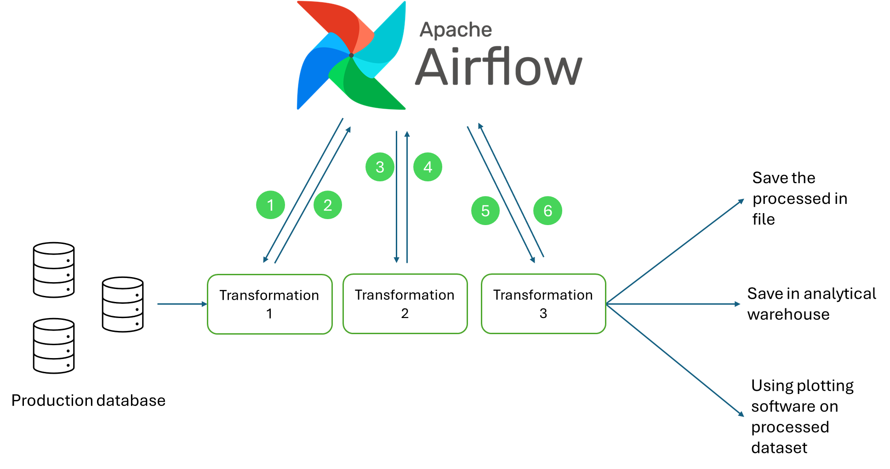
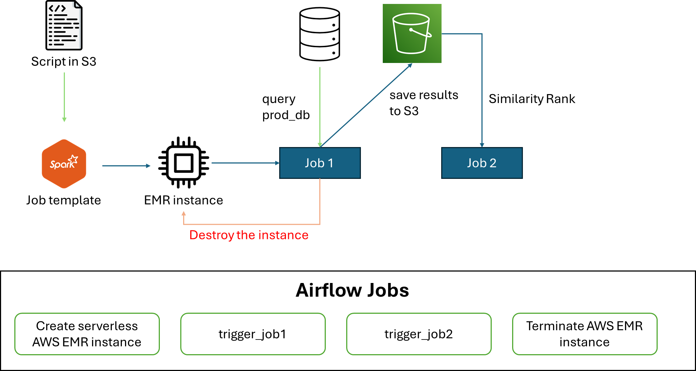
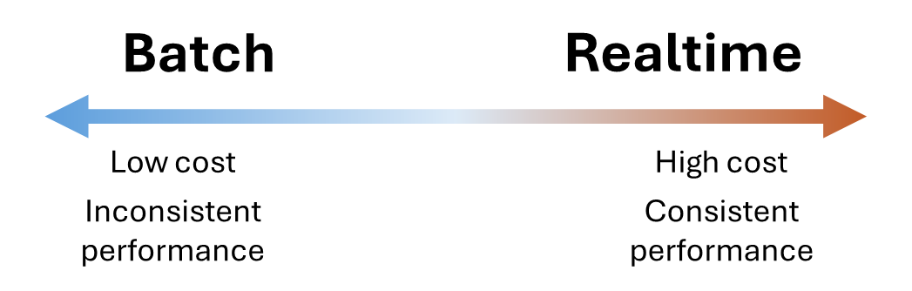
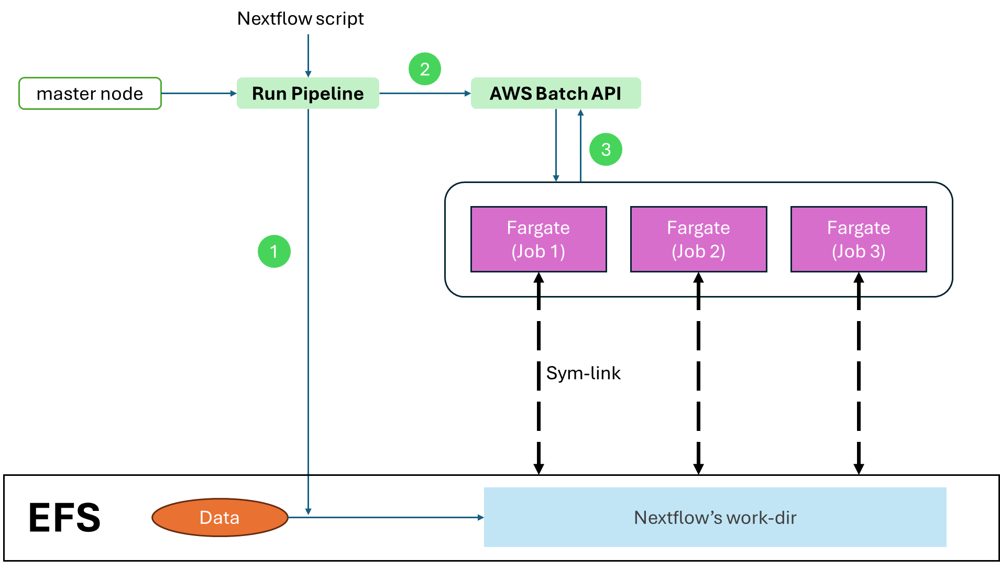

import { Aside } from '@astrojs/starlight/components';

Data processing is a big deal. Traditionally, the data processing works like this:

1. The data produced by the user saved in production database (which normally be a SQL database)
2. In another machine, a data processing software (Pandas, Spark, SQL engines, ...) queries these data, join and transform the data.
3. The processed data is saved and/or reported.

## Basic architecture

`Batch processing` refers to the fact that we run the diagram above every interval. Usually, we process the data every day/week/month. By using a job scheduler, we can do this part easily (using Apache AirFlow).

1. Airflow runs the task every interval
2. The process run, and report the status to the Airflow controller (the data is saved inside of the database of Airflow)
3. If `Transformation 1` success, Airflow triggers the `Transformation 2`. If failure, Airflow goes to failure pipe
4. Airflow runs through all the tasks defined in the DAG.

Here's the real-life workflow of batch processing, using Airflow, AWS EMR and Spark:

**Setup**: Upload your spark script, and create a job definition in EMR
1. Airflow create the EMR instance (EC2 with Spark installed and script downloaded from S3)
2. Airflow trigger the EMR instance to run the job (query the production database and do some data processing, then save the data to S3)
3. Airflow terminates the EMR instance after the batch job is done
4. Airflow runs the Similarity Rank algorithm. This is ran using Airflow's worker node.

*Step 3 and 4 are direct descendants of step 2, so they are scheduled to run concurrently*

There's also 2 types of data that we need to know when dealing with batch processing interval data.

1. We are dealing with interval only. This is called daily/weekly/monthly data. *For example, a data analyst gathers the sale data of all the stores daily.*
2. We are collecting historical data. This means that we are gathering data of not only the day we want, but also the days before that. *For example, the head quarter wants to compare the sales of the 12 months, of all the stores.*

Dealing with the first kind is simple. In this type of analysis, we only query a very small subset of the complete data, so the computation unit (CPU/RAM) requirement is not that big of a deal. But in the second kind, the problem is more troublesome. The historical data could be very very big, leading to more computation requirements. This let to technologies like Spark, where we can split the data and process among many computers. AWS EMR (Elastic MapReduce) is a serverless way of managing Spark cluster. With EMR, we can simply define the spark script, and let AWS does all the hard work of creating and managing Spark cluster (a Spark cluster is an intricate network, with master node - worker node connecting via IP addresses and so on)

## Extract - Load - Transform

Production database have one principle: **Extremely fast for point read**. To optimize point read, you risk the performance of batch read. So if the database has a lot of data, a single batch read can slow down the database system. This can leads to bad customer experience. Therefore, the analytical process describe in the diagram above becomes depricated - you don't want your analysis affect the client's database. [There are databases that are optimize for analytical process](/database/columnar-database/column-db/). This post the need for a new task: moving the data efficiently from the production database to analytical database, without compromising the production database performance. The task involve three jobs: `Extract` the data out of the production database, `Transform` the data to match the analytical database and `Load` the data to the analytical database. 

In every article out there, they teach you that there are two seperate process based on the order of the jobs: ETL and ELT. However, in reality, there are just one process, `Extraction` and `Ingestion`. The `Load` and `Transform` are just part of the Ingestion process.

### Extraction

There are two extraction methods: `Batch` and `Realtime`. Realtime extraction response to a DML command (create new record, update a record, delete a record). Using this method, you have to spend money on a machine that needs to continously running, and response to the events emitted from the database. However, this method does not interfering the production database performance - since they perform no query to the database.

Batch extraction means we runs a batch query on an interval (usually one per day). The query is something like: `SELECT * FROM tbl WHERE dt = DATE(NOW())`, and the results is forward to the ingestion phase. Using this method, we save money on extraction phase - we only run a computer that execute the batch query once a day. However, this affects the production database - because we do perform a query against the database.

The choice of Batch and Realtime is not based on the size of the database, but based on a question: **Can we choose a timeframe that the batch query can run?**. Only a certain amount of apps that need to be consistently run smoothly 24/7 (a game database, stream/chat database). Any lag (due to analytical process interfere) is unacceptable. In this case, Realtime extraction is the only option. Most applications, there will be a calm time (the user cannot use the app 24/7 right, they need to sleep!). We can leverage these moments to run the Batch extraction to migrate the data. 

### Ingestion (Load and Transform)

After the extraction, you need to put the data somewhere. There are two places you can put the data in, either in a structured destination, or an unstructured destination. 

An unstructured destination usually a disk, like S3. Extracted data saved inside of S3 usually in the format of CSV, Parquet or JSON (Parquet is the most prefered). Using unstructured destination, the file can be directly dumped to S3, then be transformed and processed later by the data analyst. This process is called `ELT (Extract-Load-Transform)`.

A structured destination is a columnar database (Hbase, BigQuery, RedShift). Since it is a database, we must match the extracted data with the destination - meaning **transform** the data (usually means guarentee the column format, sort the row, columns engineer (split column, change data notation, binning, ...)). Using a columnar database helps the analyst to directly interact with the data without performing complex transformation queries. This process is called `ETL (Extract-Transform-Load)`.

The data engineer world has involed so much that the gap between ELT and ETL has been closing in the recent year. The choose of ELT and ETL nowadays is purely based on the `Client terms and conditions`. Big companies only able to access certain customer's information (limited access on personal info like credit card, social number, ...). These information must only be stored in the production database. If a data analysis department is working with databases contains these information, they must implement ETL, where Transformation step is implemented to filter out these columns. Else, it doesn't matter. The choice is based on the preference

## Batch processing using Nextflow

Nextflow is natively supports for application running in containers (where you have absolutely no control over the code, it just plug-and-play), and Airflow support running in scripts. Container runtime is supported later in Airflow, closing the gap between Airflow and Nextflow.

Since Airflow written in Python, naturally they have more support on the ecosystem (every job that you want, there is a very high chance that someone already written and publish it), where Nextflow ecosystem is extremely lacking (comeon, who is written in Groovy anyway). So, if you just want to get the job done, use Airflow (rich community, already having code for literally everything). There is a niche case of prefering Nextflow over Airflow is processing one very big file.

Airflow manage all of its state using a database, while Nextflow created a folder called `work-dir`. When available, containers that run Nextflow jobs will create a sym-link to that work-dir folder, minimize copy/paste operations. A chain fs operation requires read-write multiple times to a file, so using the same files within the same `work-dir`, Nextflow is surpasses the speed and RAM capacity over Airflow. If you happens to process a file with 50GB that cannot be splitted into partition (a video perhaps), then Nextflow is the to-go solution.

**Setup**: Developer develop the Nextflow script, and run them in a computer (an independent EC2 or there personal computer)

1. When the Nextflow pipeline is ran, the work-dir is created. This work-dir is specified by the master node, and this master node must connected to the work-dir while launch the Nextflow pipeline. All the data initially requires from Nextflow jobs is copied to this folder (this is the only copy step of the Nextflow)
2. Nextflow using the AWS Batch API, translate its job and DAG to AWS Batch's job definition and queue. 
3. AWS Batch run the job. Using EFS and Fargate, a Sym-link directly connects the file from EFS to Fargate container's volume, without the need of copying the file.

<Aside type="caution" title="Watch out!">
  If your organization decided to use S3 rather than EFS, then all the perks of Nextflow is thrown to the trash bin. Nextflow's docs explicitly state that in order to use Nextflow with S3, you need to create a container with AWS Cli, so that nextflow can COPY the data from S3 to container's volume
</Aside>