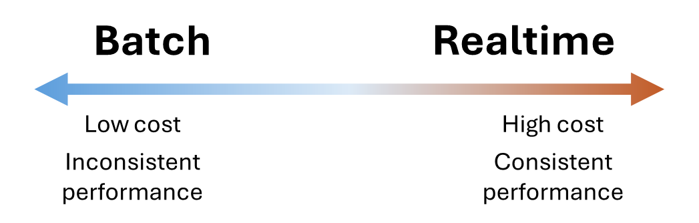
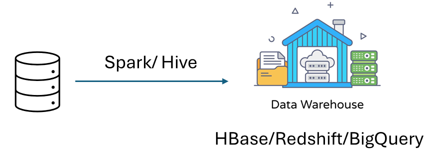
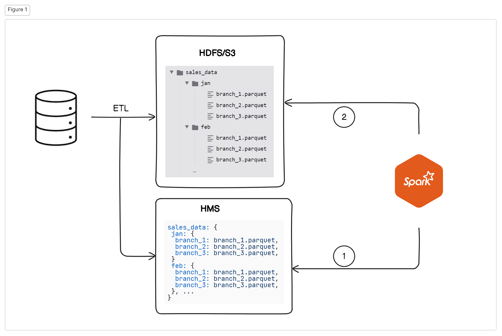

import { Aside } from '@astrojs/starlight/components';

Production database have one principle: **Extremely fast for point read**. To optimize point read, you risk the performance of batch read. So if the database has a lot of data, a single batch read can slow down the database system. This can leads to bad customer experience. Analytical process performs a lot of batch read, so the analytical process describe in [batch processing](/aws/data-processing/batch/) is very bad design - because they query directly on production database. [There are databases that are optimize for analytical process](/database/columnar-database/column-db/). This post the need for a new task: moving the data efficiently from the production database to analytical database, without compromising the production database performance. The task involve three jobs: `Extract` the data out of the production database, `Transform` the data to match the analytical database and `Load` the data to the analytical database. 

In every article out there, they teach you that there are two seperate process based on the order of the jobs: ETL and ELT. However, in reality, there are just one process, `Extraction` and `Ingestion`. The `Load` and `Transform` are just part of the Ingestion process. Understanding this is important - this helps you with stupid interview questions where they ask you about ETL vs ELT

## Extraction

There are two extraction methods: `Batch` and `Realtime`. Realtime extraction response to a DML command (create new record, update a record, delete a record). Using this method, you have to spend money on a machine that needs to continously running, and response to the events emitted from the database. However, this method does not interfering the production database performance - since they perform no query to the database.

Batch extraction means we runs a batch query on an interval (usually one per day). The query is something like: `SELECT * FROM tbl WHERE dt = DATE(NOW())`, and the results is forward to the ingestion phase. Using this method, we save money on extraction phase - we only run a computer that execute the batch query once a day. However, this affects the production database - because we do perform a query against the database.

The choice of Batch and Realtime is not based on the size of the database, but based on a question: **Can we choose a timeframe that the batch query can run?**. Only a certain amount of apps that need to be consistently run smoothly 24/7 (a game database, stream/chat database). Any lag (due to analytical process interfere) is unacceptable. In this case, Realtime extraction is the only option. Most applications, there will be a calm time (the user cannot use the app 24/7 right, they need to sleep!). We can leverage these moments to run the Batch extraction to migrate the data. 

## Ingestion (Load and Transform)

After the extraction, you need to put the data somewhere. There are two places you can put the data in, either in a structured destination, or an unstructured destination. 

An unstructured destination usually a disk, like S3. Extracted data saved inside of S3 usually in the format of CSV, Parquet or JSON (Parquet is the most prefered). Using unstructured destination, the file can be directly dumped to S3, then be transformed and processed later by the data analyst. This process is called `ELT (Extract-Load-Transform)`.

A structured destination is a columnar database (Hbase, BigQuery, RedShift). Since it is a database, we must match the extracted data with the destination - meaning **transform** the data (usually means guarentee the column format, sort the row, columns engineer (split column, change data notation, binning, ...)). Using a columnar database helps the analyst to directly interact with the data without performing complex transformation queries. This process is called `ETL (Extract-Transform-Load)`.

## Legacy Extraction - Ingestion architecture

To decoupled the analytical process from the production database, we use the ETL process to Extract-Ingest the data directly into the Data warehouse.

In this architecture, a Spark application using SQL to query the production database, making transformations then ingest the data to the data warehouse. Each data source complies to a transformation code. This process covers most of all the use cases out there in the industries. The only problem is, when the data analytical team expand, and a single data source now undergoes different transformation at the same time, the model breaks. We now either has to perform multiple queries on the production database (one for each transformation), or clone the data to different process (data lives in RAM, so the cloned data consumes a lot of money). Therefore, we rely on a different solution: ELTL

In this architecture, the data first extracted using Spark, then dump (raw, no transformation) into a file system like S3 as a CSV/JSON/Parquet/ORC file - the `EL` part. The file system like this is called a `Data Lake`. After that, each analytical team can specify there own transformation code, then apply directly onto the files saved within Data Lake, and load them into the data warehouse - the `TL` part.

## Modern Lakehouse solution

As data continues to expand, the ELTL process expose its weaknesses. First of all, manage files inside of data lake is a nightmare. Secondly, too much money is spent to migrate the file from data lake to data warehouse at large scale. With the rising of Parquet file format and metadata store, data engineer landscape welcomes a friendlier solution that able to works from small scale to hyperscale: Data lakehouse.

### Parquet file and modern query engines

Modern query engines are powerful since they are not working as a single computer, they are a fleet of computers that can break down large files into smaller ones and process them one by one. This not only save RAM but also allow faster computation since you are able process the files in parallel. 

Parquet is a file format that are closely represent a columnar database. In fact, Parquet save data in a columnar format - with data stored in columns and redundency removed by RLE. [Review columnar database](/database/columnar-database/column-db/). Parquet is also super efficient in reading the file, since each column first and last position is stored within the file header, so the modern query engines only need to read certain range of bits to get the columns they want, rather than parsing the whole files (you can observe the similar behaviour by Pandas reading CSV file by chunks). 

By combines modern query engines and parquet, we archieve a close analytical performance as data warehouse. This removes the need of moving the data from data lake to data warehouse just to perform analysis.

### Metadata store

Two most popular metadata store is `Hive Metastore (HMS)` and `Apache Iceberg`, let's learn them.

#### Hive Metastore (HMS)

HMS is a database that records partitioned files from HDFS/S3 so that query engines (DuckDB, Presto (AWS Athena), Hive, Spark) can use them to locates the files easily. HMS also contains information about the files like column names, dtypes. When you manually create a table in Hive, Hive automatically creates a metadata store in Hive Metastore.

*Example, let's say you a hive table called sales_data that is partitioned by months and branches. Spark can query data from June to October using the query `"SELECT * FROM <hive_db>.sales_data WHERE sales_month BETWEEN 6 and 10"`. Under the hood, Spark will: 1/ request the locations of the partitioned files from HMS, 2/ use its own engine to read the files*

#### Apache Iceberg

Apache Iceberg is an upgrade of HMS. Query engines can relies on Iceberg to locates the parquet files, read and even modifies them, with ACID compliance. *Hive can utilize Iceberg instead of HMS!* Iceberg is way newer than HMS, so if you have a choice, prioritize Iceberg for the sake of simplicity and powerful features. 

### Data lakehouse components

Every data lakehouse contains a query engine, a data catalog (metastore) and a file system. You can either build your own data lakehouse architect using the moving parts listed in the diagram, or using a full data lakehouse solution (like `Databrick`)

Here, we also discuss about the read and write of the data lakehouse.

#### Read in data lakehouse

1. User submit the SQL query to query engine
2. The query engine checks the filter condition (`WHERE` clause) against the metastore, identifies the location of parquet files
3. The query engine reads the parquet files, compiles the SQL query to their own actions and perform data analysis

#### Write in data lakehouse

1. Extraction and Transformation perform against the production database
2. The query engine checks the data based on the metastore, which identifies the data's partition
3. The query engine dumps the data into the appropriate partition as parquet files. 

In data lakehouse, new data comes in as new parquet file rather than modify the existing files. This is because parquet files are sorted, adding new entry requires massive overhead (writing a parquet is extremely slow). Secondly, a data lakehouse usually having `Data version control`. By not modify the files, we efficiently versioning the files at folder level, not file level like git.

## AWS Glue

AWS Glue is a serverless data integration service. Under the hood, AWS Glue is an Spark cluster that AWS managed. Sounds familiar? Yes, that's the same description as AWS EMR. What's the difference? When to use what?

First of all, AWS Glue is a multi-service. They contains a `Data Catalog`, a scheduler and a Spark engine

Let's first learn about `Data catalog`. To understand the Data catalog, first we need to understand `Hive Metastore (HMS)` and `Apache Iceberg`. This is concept is also crucial for data engineering.

### Apache Hive

Hive is just DuckDB, but works only for HDFS compatible storage (like S3). It means that using Hive, we can use SQL to query files like CSV, JSON, Parquet, Orca,... Hive translate the SQL (called HiveQL) into MapReduce jobs, that runs on a Apache MapReduce cluster. 

<Aside type="tip">

  The architecture where you store the data in disk (HDFS, S3) and use engine to query directly onto the files is also called **"Data Warehouse"** or **"Data lakehouse"**

  So things like Snowflake, Databricks,... are actually the same 💩, just with difference query engine!

</Aside>

<Aside type="tip">
  
  If you encounter a service with an introduction **"Data warehouse"**, it can be a columnar database, or a file-system with query engine. 

  But if you see a **"Lakehouse Solution"**, you damn sure it is a file-system with query engine. 

</Aside>

### Glue data catalog

As an intergration service, AWS Glue expects a lot of data source. This could be S3, databases (within or outside of AWS), streamming provider (kafka, message queues), ... These data source has different format, so AWS provides a central management to views & manage these data source's format, call `Data governance`. This is call `Data Catalog`.

Currently, AWS Glue Data catalog support two backends: HMS and Iceberg. Data schemas organized into `Database` and the metadata of each data source is stored within a `Table`. This table is either HMS or Iceberg. These metadata store is stored physically inside S3 (for Iceberg) or within Glue (HMS). 

Data catalog is the backbone of the Glue ecosystem, it will automate the Transform of the Ingestion phase