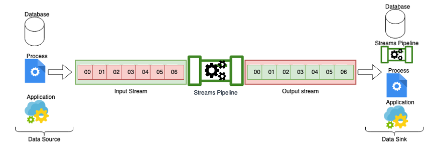
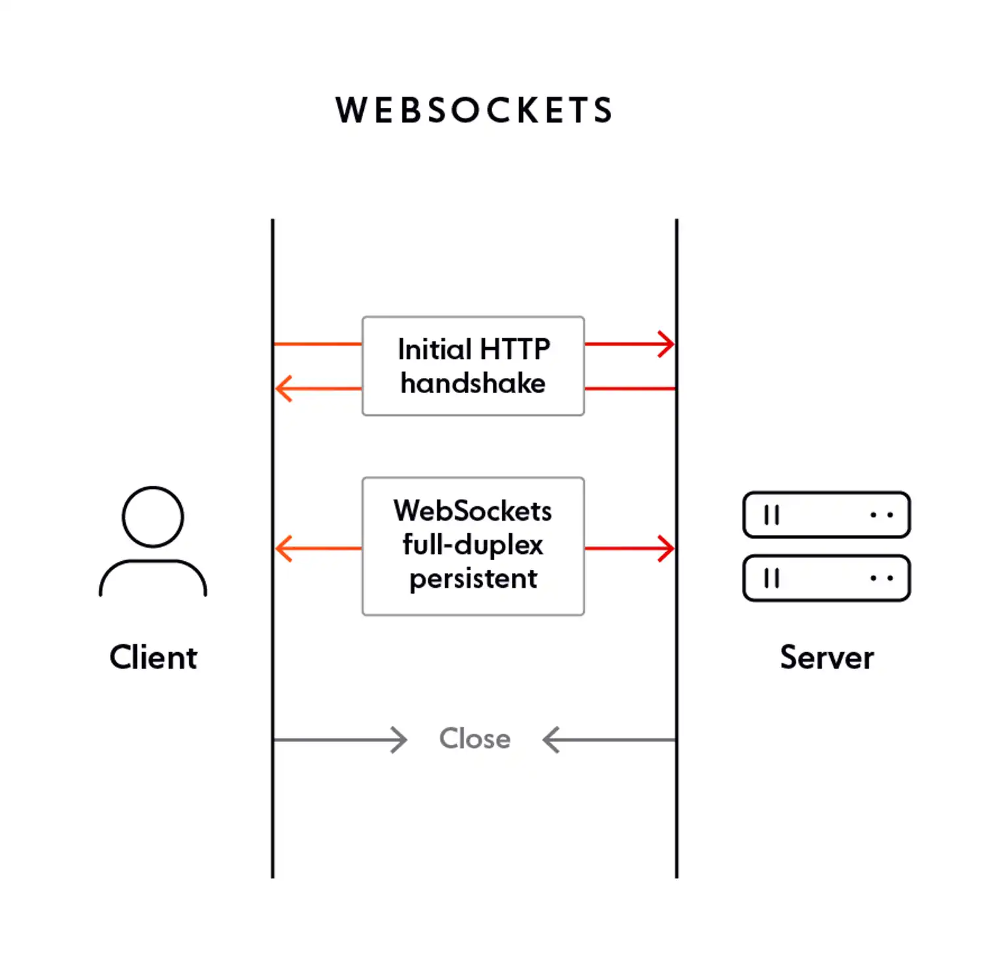
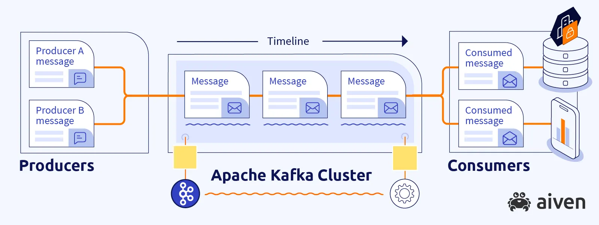

import { Aside } from '@astrojs/starlight/components';

Scenario:

You are designing a warehousing app for a cosmetic franchise. The franchise has one data warehouse where it holds all the products, and several stores. When the customer orders a product from a store, the store request the item from the warehouse. The warehouse receive its products from several assembly factories. The diagram looks like this:

The warehouse serve a database. Each store has an app that reads the number of products in stock from the database. When a store orders a product, it decrease the number of product in stock from the database. When that happens, all the other stores now holding out-dated data. 

*Assume there are 10 sunscreens in the warehouse. Store A, B, C get the stock status at 10 A.M. At 10.05 A.M, store A sells 3 sunscreens. In the warehouse, the number of sunscreens is now 7. Store A, due to commiting a transaction, receive new stock status (7 sunscreens), but store B & C still display 10 because they haven't read the new data*

When the factories restock the products, it increases the number of stocks from the database.

*Likewise, at 10.30 A.M, 100 sunscreens product get restocked. Warehouse now have 107 sunscreens, but store A still reads 7, while store B & C reads 10.*

To maintain a consistent stock status between the database and all of the stores, we design the app so that it resend request the database every interval (let's say we refresh every 30 minutes). 

*So, at 10.30 AM, all the three stores reads 107 sunscreens*

Among the 30 minutes interval, the data is not updated. It is called `staled data`. The store does not serve customers every 30 minutes (may be one or two every 45 minutes to 1 hour), so the 30 minutes stale time is acceptable. 

Now, the franchise becomes more popular, each store now serves more customers - with a rate of 10 customers every 20 minutes, so they need to updates the stock status more often. To be able to maintain data freshness for the stores to operates, We reduce the refresh interval to every 5 minutes. As more customers comes in, the need of getting fresh data keep increases, leading to the refresh interval decreases, to the point that the refresh interval happens every 1 seconds, or more extreme, every milliseconds. Every time the database updates (store decreases the stock/factories increase the stock), all the stores get the update immediately (with only 1 seconds delay). To a human eye, this pretty much seems like "real-time" updates.

<Aside>

The process of running a batch process every small interval is called `Micro-batch`. Micro-batch is called near-real-time processing, because the lag (stale time) between two intervals is unrecognizable to a human eye.

</Aside>

However, microbatch is not optimal for database. Each seconds/milliseconds, the database is getting bombarded with dozens of requests, even though new transactions does not occurs every seconds. Meaning most of the time, the same response (the same number of stocks) is being replied by the database

This post a need for a new approach, a more friendly approach works for both the client (the store's app) and the database. We want the stores to updates the stocks everytime the database changes. This is called real-time processing, or stream processing.

<Aside>

Real time processing is called Stream processing because the the data comes into real time processing in form of a stream of data 

</Aside>

## Real time streaming architecture

You may find the real time processing familiar. You are right, it is closely related to Event-driven Architect. In fact, the stream processing follows the same architecture principle as the Event-driven architect, just different technologies being implemented.

### Legacy streaming architecture

The heart of legacy streaming architecture is web socket.

Each connection from the client to the backend is a socket connection. Socket implements a channel that does not close between the two entities (frontend and backend). The client subscribe to a channel which implement in a web framework. Inside of the channel of the backend, an ORM is communicates to the database. When one client perform an action to a database, it goes through the web socket's channel to the ORM. The ORM proxies the request to the database, and cascade the new status of the database to all the clients. Hence, all the clients subsribe to the channel receive real-time updates.

### Streaming source broker

Using a backend as stream mediator has its pros and cons. It has advantage of being simple, low cost, but all the client has to connects to the same machine. When the flow of data increases, as well as the number of connectors increases, the machine becomes overloaded. This post the need to have a centralize place to connects the client and the source. Inspired by Event Driven Architecture, streaming broker is born.

The most notorious streaming broker is Kafka. Using Kafka, the client (or producer) can inject the data in streaming fashion or non-streaming fashion. In Kafka, the connectors (sink/stream process) complies to `Kafka Connectors API` to receive new data flow into `Kafka Topics`.

### Streaming Processors

Streaming processors takes the data from the streaming source (most likely to be Kafka), process and direct them to a `Sink`.

Stream processor can be a single machine that with Kafka API to continously pulls the data from Kafka to process (worker node), to a cluster of machines that process the data based on the volume.

The two most famous stream processor cluster is `Spark` and `Flink`. Spark doesn't have native polling API, so they microbatching the Kafka topic, while `Flink` use native polling signals. 

The choice of Spark or Flink can be difficult, since each provides different code. `Apache Beam` is unifying language to write stream processing logic, and it will getting transpile to native `Spark` or `Flink` job. 

<Aside>

Apache Beam is especially needed for non-java developer, since Flink is java only (needs .jar file), so we need Beam to able to write code in any language, then transpile them to .jar file

</Aside>

