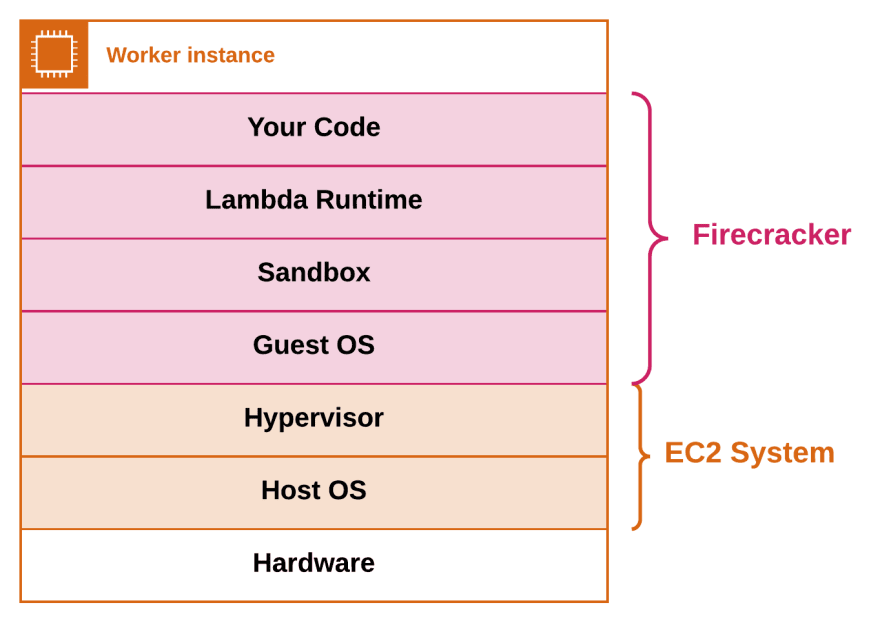
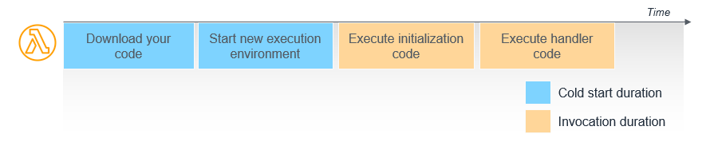

AWS Lambda is a `Function as a Service (FaaS)`. It means that Lambda runs a single function. This function is triggered by an event, hence the name Event-Driven Architect.

## Function as a Service

The idea of function as a service is simple. Since frontend application (driven by React, Vue) directly coupled APIs, the need to write simple API code becomes more popular. Native web server Express or FastAPI seriously makes your code easier to write. But people grew tired of setting up EC2 instance, Load balancer & internet facing to in order to make the web server to works. 

Devs also findout a similar pattern. Each resource, regardless of the programming language and web framework, tends to have a single function as a controller. This function could be authentication, database CRUD, ... This makes AWS thinking: What if the devs define their own controller inside of a function (called an entry point), and AWS will takes care of all the deployment (hosting), load balancing & internet facing. This architect is called Function as a Service (FaaS)

This architecture model has span over all the cloud landscape. Now every big cloud provider serve there own FaaS. The use of FaaS is simple. You define a programming language (with the desired version), define all package dependency, and the code. While multiple files are permitted, but we has to define the file with correspond function name as an entry point. The FaaS will invoke this function. The entry point function receive two important argument from the invoker: The `context` and `event`. These argument usually in form of object (dict if you use python 👎).

FaaS architecture, was primarily served as API endpoint controller. But seeing the potential of the FaaS service, including:

- Easy to setup
- Easy to code
- Easy to invoke
- Easy to integrate with cloud services,

cloud provider making it the first class citizen for event driven architect. Meaning all of cloud services (not just HTTP request) can trigger Lambda function. 

*For example, S3 events (you can trigger Lambda function when new object being added to S3, deleted from S3, modified from S3)*. 

*Another example, record on DynamoDB can invoke Lambda function to react to new record on table, changes on tables, ...*

## Lambda anatomy

The Lambda function is simple. It works as an ECS instance with predefined template. A very powerful computer with excess CPU and RAM are split up to Virtual Machine using Virtualization. After a virtual machine is created, containerization software download appropriate environment image (with program language specify by the user). Then, the function code and dependencies are copied to the container. This VM then sits behind a Load Balancer. The host invoke the Lambda function by send HTTP request to this Load Balancer endpoint, triggering the function inside the container. This container does not dies immediately but sits for a while to receive more request. And if requests increases, more VMs with more functions are created.

AWS Lambda is the leading provider in FaaS. Lambda Functions use there own Virtualization + Containerization software - called `Firecracker` to provision Lambda environment. This only takes upto seconds to create the whole environment (including download the source code from S3) - which makes this very very very fast (To create EC2 with Docker alone has taken minimum minutes!!!)

[This article shows detailed about Firecracker](https://blog.acolyer.org/2020/03/02/firecracker/)

Now, Firecracker used in both Lambda and Fargate, making AWS the number one in both short-lived functions (Lambda) and tasks (Fargate)

[Learn more about AWS Life cycle here](https://docs.aws.amazon.com/lambda/latest/dg/lambda-runtime-environment.html#runtimes-lifecycle)

## Invocation methods

Lambda can be invoked in two different ways:

**Push invocation model** - Lambda function is executed when a specified event occurs in one of the AWS services. This might be a new SNS notification, new object added to S3 bucket or API Gateway request

**Pull invocation model** - Lambda pulls the data source (might be SQS queue so called Event Source Mapping) periodically and invokes your lambda function passing the batch of pulled records in an event object.

Push invocation is a real-time model. When a new event happens, it immediately invoke a Lambda function. With Pull invocation, it works by batching events. After hitting certain limit, or after some times, the Lambda function is ran and process data by batch. 

## Lambda invocation flow

Lambda service is in fact a whole set of services cooperating together to provide the full range of Lambda functionalities.

`Load Balancer` responsible for distributing invocation requests to multiple Frontend Invokers in different Availability Zones. It is also able to detect the problems in a given AZ and route the request to remaining ones

`Frontend Invoker` is a service that receives invocation request, validates it and passes it to the `Worker Manager`

`Worker Manager` is a service that manages Workers, tracks the usage of resources and sandboxes in `Workers` and assigns the request to a proper one

`Worker` provides a secure environment for customer code execution, this is the service responsible for downloading you code package and running it in a created sandbox.

Additionally there is a `Counter service` responsible for tracking and managing concurrency limits and a `Placement Service`, that manages sandboxes on workers to maximize packing density.