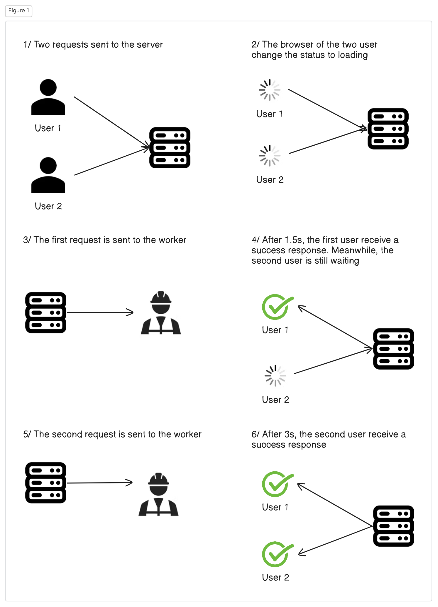
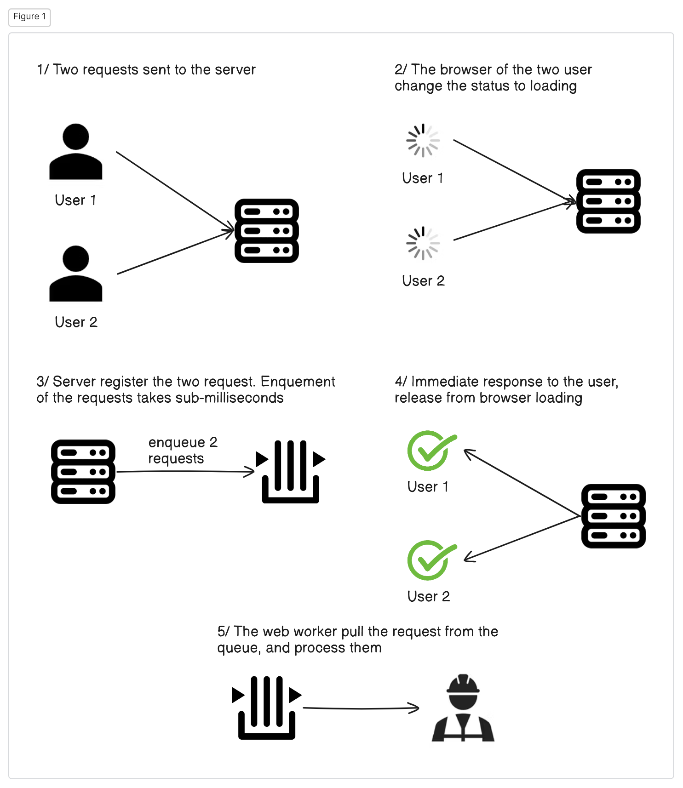
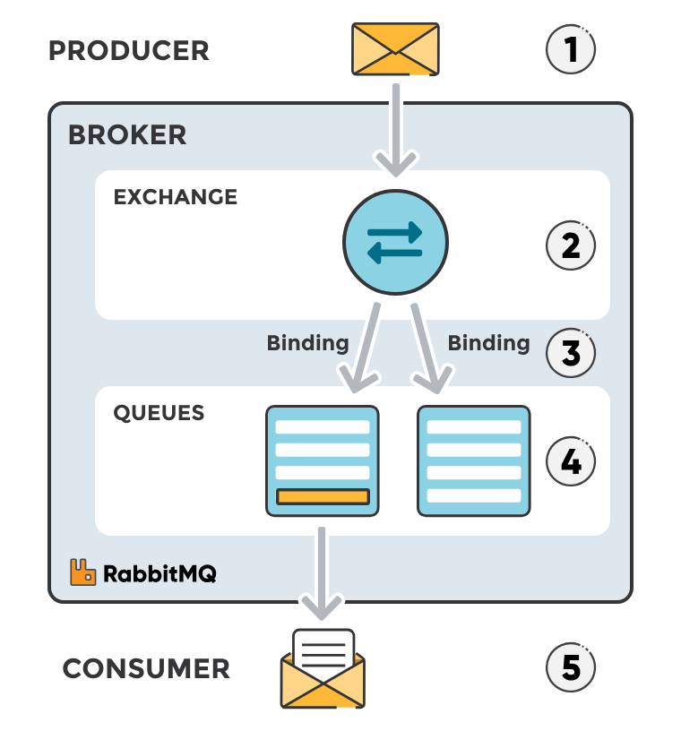
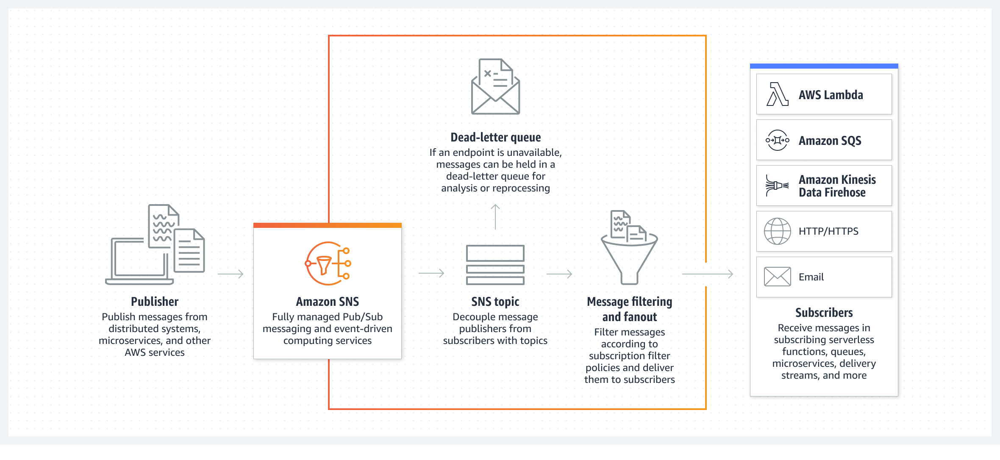
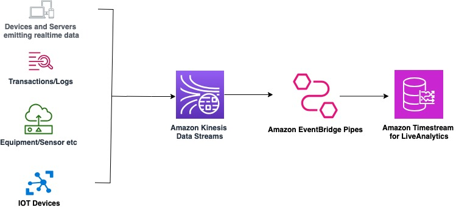

*This article assume understanding about [CPU bound task and Web worker](/others/web-workers/).*

## Communication between web worker and web server

### Synchronous connection

HTTP request is synchronous. Let's learn what that means (under the browser loading mechanism).

1. Client engage HTTP request on the browser (enter a URL, click a submit button,...).
2. Right after the HTTP request engaged, the browser display a loading state (you know, when the spinning icon appears on the tab name, and the loading bar appears at the top of the page)
3. The loading bar appears until the HTTP response is sent back by the server.
4. While the loading (of the browser) is available, every interuption (reload, close the browser) results in connection termination. Also, under the loading, every subsequent action (click, enter, ...) result in new action is being triggered.

This is infuriating, because after submission a long task, we still want to interact with the other parts of the website. Modern frontend framework (React, Vue) can help with that. These frontend web framework isolate the node where fetching happens, freeze only that part, without making the whole website freeze. However, the node cannot be unloaded, it means that in the meantime the HTTP request is waiting for the response, we cannot navigate to different pages.

Sometimes, there are certain process that tooks very long (you try to decode a DNA, perhaps). This means, that the user has to maintain there websites for three hours, which is unrealistics. 

Using message queue, we can solve this problem

### Asynchronous connection

## AWS MQ

AWS MQ is the AWS's managed service for RabbitMQ. RabbitMQ is a traditional service for doing Message queue. While it is tempting to learn about AWS SQS, SNS and EventBrige, these are just managed service by AWS built for simplicity. Learning the core (RabbitMQ) is the most important thing to learn about Event-Driven Architecture.

RabbitMQ leverage messaging protocols (AMQP 0.9.1, AMQP 1.0, MQTT, STOMP) to communicates between the components. Among the protocols, the AMQP 0.9.1 is the most popular. AMQP is the protocol at the layer 7 of the OSI model, implementing TCP at layer 4 (AAMQP is sibling of HTTP). Using AMQP, RabbitMQ ensures that the connection between components are asynchronous - meaning that client doesn't need to wait for the response, it can comeback anytime it wants.

There are 3 components of the Message Queue architect: a Publisher (Producer), a Broker and a Consumer (Receiver). Message queue is the broker.

## RabbitMQ components

### Queue

The queue is the core of the RabbitMQ. It accummulates the message sent by the producer inside RAM (and periodically flushed to disk if `Message consistency` enabled). 

### Exchange, Binding and Routing key

In AMQP 0.9.1, the producer nevers interact directly with the queue, they interact with the exchange. The exchange determines what type of message is it, and route the message to the appropirate queue (Exchange is like a Route 53 for RabbitMQ). Using an exchange, we can implement different Event-driven architecture. [Learn more about exchange type here](https://www.cloudamqp.com/blog/part4-rabbitmq-for-beginners-exchanges-routing-keys-bindings.html)

## AWS SQS

`AWS Simple Queue Service (SQS)` is simply a service with a queue. In SQS, the publisher connects directly the queue, removing the overhead of creating and managing routing key. 

SQS also support strict ordering (FIFO stack) - which message can be process sequentially. A FIFO stack generally has only one consumer per queue, to ensure strict ordering. This pattern is called point-to-point messaging.

## AWS SNS

`AWS Simple Notification Server (SNS)` is simply a service with topic/fanout exchange.

As you can see from the diagram, SNS works kinda reverse compares to topic/fanout exchange. In RabbitMQ, the message is processed by the exchange, then getting pushed to a queue, where the consumer can pull the message. In SNS, the message is pushed to a queue. The consumer subscribe to the exchange (rather than the queue), then pull the message based on its type.

SNS can have a SQS as a consumer. Using the SNS-SQS pattern, we essentially get back to the RabbitMQ - SNS works as an exchange, SQS is the queue.

## EventBridge

`AWS EventBridge` use event bus architect. This is just an advance Topic/Header exchange. Using SNS, you have a limited functionality of filtering your message (using Topic). Using EventBridge, you have more rules, that extends the capabilities to the messaging broker.

Another use case is that EventBridge have native support for more AWS services than SNS (both producer and consumer).

Using EventBridge, you can listen (subscribe) to nearly all the AWS services. These events are sending to EventBridge as JSON, so you can filter them (Header/Topic exchange). The filtered event are pushed to AWS services.

## EventBridge Pipe

Pipe is a point-to-point messaging that takes data from a real-time source (Kafka, Kinesis stream, DynamoDB stream), filter/enrich (using AWS Lambda) the object, then pass to an real-time receiver (Kinesis firehose, AWS Lambda, SNS/SQS, ...).

Using EventBridge Pipe, you have created your first realtime data pipline. Below is a simple realtime data processing using EventBridge Pipe

