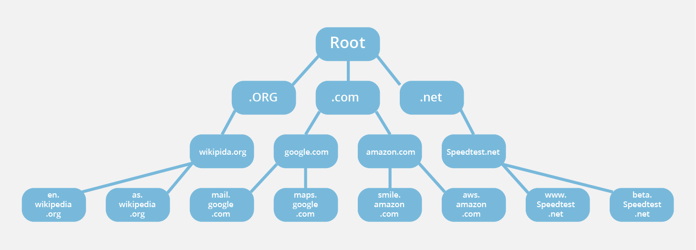
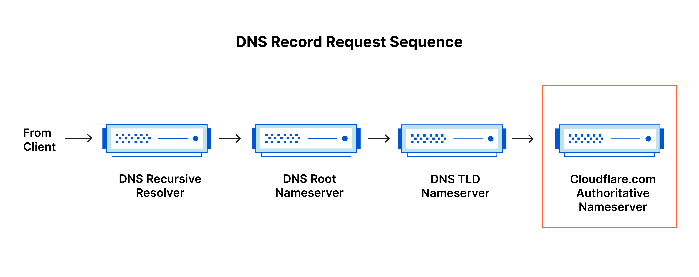
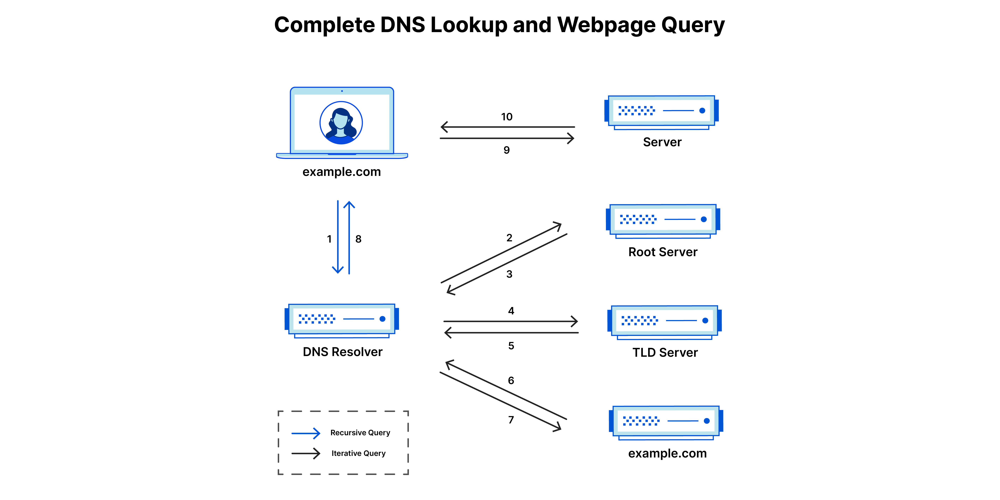

What happens if we go to Chrome and search *"www.google.com"*

[A very easy to understand diagram here](https://www.instagram.com/p/C4-5aBkyXUs/?igsh=dTN1cmVxdG8wMWRy&fbclid=IwAR2hHKhT9o4Tdheu_hjioIQx3DP920ZQ31Lv5-hnL8aoqcE10jY2Aqn0rAg)

[A very detail article here](https://www.cloudflare.com/learning/dns/what-is-dns/)

## Domain Name

First of all, *www.google.com* is called a `Domain Name`. Normally you buy a domain name from a provider (AWS, Google Hostinger, ...). These provider that gives you access to a domain is called `Domain Name Registrar`. What you get when you are buying a domain? You get two things: a `Top Level Domain (TLD)` and a `Second Level Domain (SLD)`. You must choose a TLD from the list offered by your provider, and you can choose your own SLD, but they must be unique among the TLD.
*Example, for www.google.com, "www." indicates this website belong to the World Wide Web, "google" is the SLD, ".com" is the TLD*. The combination of TLD+SLD (*google.com* is call a `Root Domain`)

Eventhough you only buys *"google.com"*, you automatically possesses other domain such as *"docs.google.com"*, *"mail.google.com"*. This is called lower level domain, and they are positioned to the left of the SLD, and must be separated by a dot (".")

## From browser to the internet.

### 1. From browser to DNS recursive resolver
You gained access to the internet by your `Internet Service Provider (ISP)` like FPT, VNPT, Viettel... They provide you with internet cables that connects your modem (internet point of your entire household) to a big ass server located at the nearest data center. In these data centers, there are servers called `DNS recursive resolver`.

User type *www.google.com*, and the **DNS recursive resolver** try to find an IP address in its cache. If available, the server immediately return the IP address. 

### 2. From browser to DNS root servers

Your first entry point to the Internet. DNS root servers managed by the ICANN, and they have one purpose - point the DNS resolver to the nearest TLD nameserver.

### 3. From DNS resolver to TLD nameserver

If you wonder why there are only a certain TLD, like .com, .en, .vn, ... because there only that much TLD nameservers. Domain name records are saved as they are python dictionary, and TLD nameservers have a mission to manage that dictionaries.

When DNS resolver does not find the domain name in its cache, it will identify the TLD (.com) and ask for the nearest DNS root server, which will point to the nearest ".com" TLD nameserver for more information. So, if you are in Vietnam, and try to get a Russian domain, it will be pretty slow (since the nearest ".ru" TLD nameserver are pretty far away).

### 4. From DNS resolver to Authoritative Name Server

The TLD nameserver does not save the record of every IP address that registered under its name. Do you remember who did? Yes, the **Domain Name Registrar**. Technically, your IP does not save at Domain Name Registrar, they are saved at `Authoritative Name Server`. What the fuck with all these confusions 😕?

Domain Name Registrar are just seller. They sell TLD/SLD behave of ICANN (which responsible for the maintenance of DNS root servers, your first entry point to the internet). 

When you manage a TLD & SLD, you do not just manage a domain (*google.com*), but you have to manage all the low level domain (LLD) associate with it. This becomes such overhead for TLD nameservers. So they pass its responsibility to `Authoritative Name Server`. Companies with their own resources host there own Authoritative Name Server, with their own sets of techonology that comply to some rules defied by the ICANN. *Think this as Apple reseller. Apple company will authorize other company - FPT, CellphoneS - to sells iPhone, with there own prices and discount programs.*

When you purchase a domain from a Domain Name Registrar, the Domain Name Registrar gave you a license. This license is registered at DNS root server. You then must placed this license to Authoritative Name Server for management. Large Authoritative Name Server companies like Hostinger has there own Authoritative Name Server and they will place the license to their server automatically for you. But you can change to your preferred Authoritative Name Server (like AWS which we will see below)

Now you know why a domain name cost so much. You have to pay for the Authoritative Name Server, Domain Name Registrar, TLD nameserver and DNS root servers. Yikes 😬

## Recursive and Iterative query

Remeber the flow diagram at the top of the article. Well, that is just a comprehensive view. This is the real sequence.

Each server we observe earlier has an IP address, like every other computer on the internet. When we first ask a DNS Root Server, they replied with an IP address. Then the DNS Recursive Resolver grab the IP address and ask the TLD nameservers for a sub-domain address. The TLD answer with an IP address (Authoritative Name Server). Then the Resolver grab the IP and ask for the server address. The Authoritative Name Server then ask the registered load balancer (which is registered by the developer), then the developer ask for the physical server - for the respond. This process recursively until the Resolver find the appropriate respond - which is NOT AN IP ADDRESS.