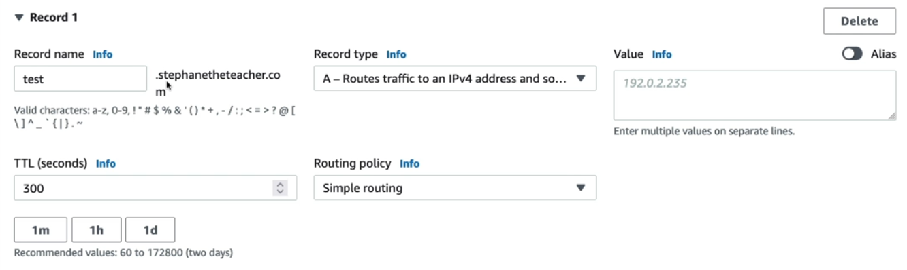
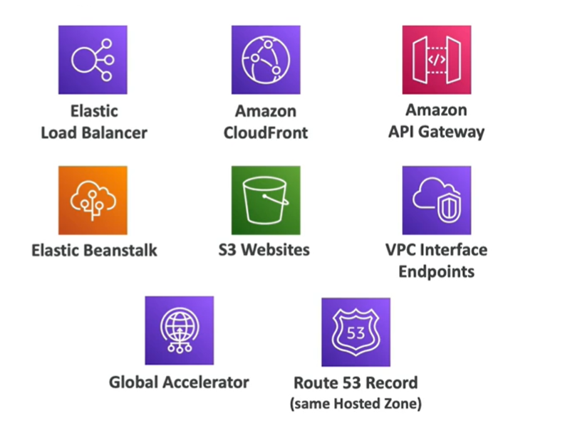

import { Aside } from '@astrojs/starlight/components';

*This article assume understanding about the article [DNS Basic](/aws/global-service/internet-routing/)*

AWS Route 53 is an Authoritative Name Server, meaning it points the DNS Resolver to a web server for a appropriate response, most of the time, an HTTP response.

While most of your DNS Registrar has there own Authoritative Name Server (and you are already paid for it when you purchase a domain name), AWS Route 53 offers a more tight intergration with AWS ecosystem, including AWS Cloud Map and AWS Load Balancer, make it easier to work with complex AWS project.

## DNS Records

There are several record types: 

- `A` record: Associate with IPv4 response
- `AAAA` record (pronounce "Quad A" - or "Bốn A"): Associate with IPv6 response
- `CNAME` record: foward to another domain or sub-domain, instead of an IP address
- `NS` record: foward to another TLD nameserver

## Register a domain record

This is what inside of a domain record register. First you need to register an subdomain associated with this record (leave blank it you want to register SLD). 

When choosing the `A` record (and `AAAA` record), the AWS Route 53 will prompt the dropdown for you to choose what service to associate the domain with.

## Time-to-live (TTL)

Time-to-live (TTL) determines the number of time the DNS Resolver will be cache. If the cache time is long, the DNS resolver doesn't have to goes through all the Recursive Querying for the web server IP address, while shorter time means that when disruption happens on the server, the DNS resolver can point to an healthy IP.

## CNAME, SOA and Alias

CNAME is a general technique to redirect to a sub-domain. Let's say you are exposing a Load balancer from a website host in another service or cloud provider. To point to that load balancer (which has IP is not static), we use DNS CNAME record. 

<Aside type="caution" >

    You CANNOT use CNAME record to associate with a root level domain (only sub level domain), since root domain pointer are reserved for DNS SOA record and one CNAME record has been created automatically when you register your domain name (Domain record conflict).

</Aside>

In AWS, most of the time the services are non-root level domain. But some are. In these case, AWS Route 53 offers `Alias` record. This feature is specific to AWS and use to point to both root and non-root domain inside of AWS. The complete list of resource available for Alias record 👇.

<Aside type="caution" >

    You CANNOT use DNS Alias record to point to a public EC2 instance DNS

</Aside>

<Aside type="tip" >

    Most of the time the application lives under the Load balancer. Use `Alias` record to connect them. Use `A` and `AAAA` to give the Load balancer or Bastion EC2 instance a DNS. Use `CNAME` when connect to outside of AWS

    [More tip from AWS](https://docs.aws.amazon.com/Route53/latest/DeveloperGuide/resource-record-sets-choosing-alias-non-alias.html#:~:text=A%20CNAME%20record%20redirects%20DNS,such%20as%20A%20or%20AAAA.&text=In%20the%20response%20to%20a,such%20as%20A%20or%20AAAA. )

</Aside>

## Route policy

A DNS record can have multiple IP addresses associate to them. Rather than return all of them then the DNS resolver can randomly pick one (usually the first 🙃), we can return the most appropriate DNS record base on certain route condition. (When DNS resolver ask Authoritative Name Server - Route 53 - they also provide metadata about the DNS resolver to aid the route decision).

### Simple policy

Simple policy is exactly what we discuss earlier. We return all the IP addresses that associated with the DNS record, and let the DNS resolver choose what to pick.

### Weighted policy

The weighted policy is simple, pick an DNS and a weight, Route 53 will foward x% of the traffic to that IP address.

### Latency policy

AWS itself has an algorithm to calculate latency between an DNS resolver and the Route 53 (inside of a Region). Therefore, this latency policy will return the IP address at the least latency region. 

By having to calculate the latency, this policy is noticably slow compares to the previous policy.

### Geolocation policy

Geolocation is based on the DNS resolver location. This helps with serving difference content to difference countries. This also prevent access to certain IP address from the geolocation.

### Geoproximity policy

We know that some countries (US) has a lot of AWS regions. By using Geoproximity, traffic will be directed to the nearest Region. Geoproximity introduce `bias`. `Bias` is just a weighted version of geoproximity, where a region can have more traffic than the other. *We can use geoproximity policy to direct 70% of traffic to ap-southeast-2, and 30% to ap-southeast-1 (since ap-southeast-2 has much less traffic than ap-southeast-1, leading to general faster response)*

### IP-based policy

This filter IPs bases on CIDR, which some sensitive application may need.

## Route health check

We can add health check (usually an HTTP GET request to a specific port and path) to Route 53 to check for an IP address (mostly a Load balancer). if > 18% of the health check send return 2xx or 3xx status, it is consider healthy. If website is a microservice, the health check can combines individual service health check (called `Child Health Check`) into one big health check (called `Parent Health Check`). Route 53 will refers to the Parent health check to determine if the IP is healthy or not. By adding health check, the Route 53 will never point to the broken one. (This health check checks Load Balancer health, difference from Load balancer's health check checking health of individual EC2).

Since Simple policy return all IPs, they are not available for health check.

<Aside type="caution" >

    Route 53 is a service exists outside of the VPC, so health check cannot check for private subnet endpoints. 

</Aside>

<Aside type="tip" >

    Health check can be associate with CloudWatch to check health of private subnet or any service that not available for regular health check. 

</Aside>

### Failover policy

We can add a Failover policy to a DNS record. If Health check fails on normal policy, traffic will then flow to that Failover policy's IPs.

### Solution architect: Build a fault tolerant application with Route 53

[See the link here for full details](https://docs.aws.amazon.com/Route53/latest/DeveloperGuide/dns-failover-complex-configs.html#:~:text=The%20health%20check%20failed%2C%20so,for%20ap%2Dsoutheast%2D2.)

In this solution architect, we deploy our application on two regions: ap-southeast-2 and us-east-1. On each region, application is deployed on duplication (on 2 distinct AZ). We create a `A | AAAA` record (if not use Load Balancer) or `CNAME` record (if use Load Balancer). We now have 4 URLs (or Domain name, whatever you prefer). On each region, we build a `Alias` record - so two `Alias` records since we have two regions. Lastly, we expose our application to a `Latency` record, so normally, user across the world can access the web server that are closest to them. If traffic spikes, we can ensure that there are more than one web server per region to serve. If an AZ is down, traffic will redirect to a different AZ, and if a region is down 👀, we redirect to a different region.