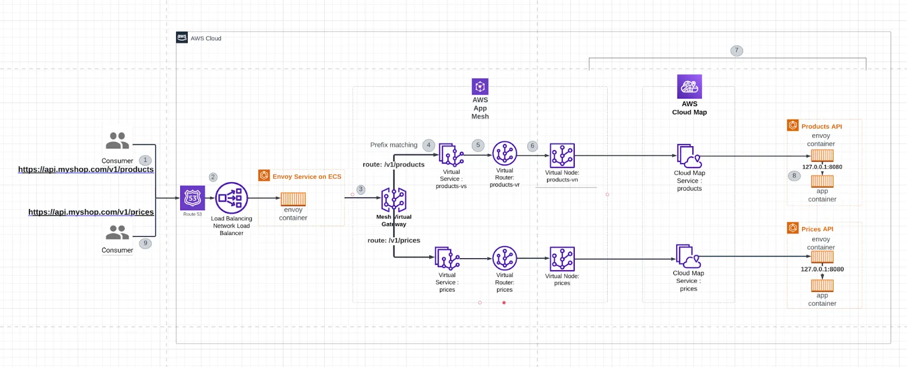

import { Aside } from '@astrojs/starlight/components';

AWS ECS is born in the container orchestrator war, as a native AWS solution to run microservices. Apparently, K8s wins. So, naturally, k8s will always be the de-facto approach for new microservices. But for those learning AWS certificates, and those have (wrongly) put their fate into AWS, you will need to learn ECS. 

## Auto Scaling Group

`Auto Scaling Group (ASG)` is the most primitive form of web scaling. It is also the most primitive way of ECS to control the lifecycle of containers - aka services. In ASG, you define a [Launch Template](/aws/ec2-backup/#launch-template), and specify the minumum/maximum number of instance. Based on the metrics (from CloudWatch), ASG will create EC2 instance and horizontal scale your EC2 instances based on the CloudWatch rule.

## Fargate

With [Firecracker](https://blog.acolyer.org/2020/03/02/firecracker/), AWS can create a machine and virtualize them within miliseconds. Fargate is one of two services (the other is Lambda) that is eligable for this technologies. Therefore, running the EC2 within ASG has depricated, and ECS + Fargate is now widely use as a de-facto way to run containers within AWS.

## ECS Task Family

In ECS, each service is defined as `Task Family`. `Task Family` is similar to K8s `Deployment`, where you define your container image, provisioned resource (CPU/RAM), the VPC (for IP creation), IAM role (if need to interact with other AWS services). 

## ECS Service Discovery 

The only problem with Fargate + ECS that ASG doesn't have is the entry point of service. With ASG, you are recommended to assign a load balancer or a static IP to the ASG group. This helps with the Service Discovery. But for ECS + Fargate, new instance spawn automatically, and there IP is assign randomly. ECS holds all the IP information, while each service knows nothing about the other containers. So how can services can communicate with each others?

This is the big L for ECS making it loses the container orchestrator war - lacking an efficient and proper Service Discovery. Up until now, AWS has three.

### Service discovery

Service discovery utilize `AWS Route 53` and `AWS Cloud Map` to automatically register the IP of newly created Fargate to a Route 53 domain, base on its service type.

1. When creating instances from `Task Family`, the created Fargate with receive an IP.
2. The newly assign IP is registered to the Cloud Map namespace. This represent the service name.
3. The Route 53 sub-domain is mapped to Cloud Map namespace.

When another service wants to call this service, it makes API call to the Route 53 sub-domain. The sub-domain is an Alias record that points to the Cloud Map namespace. The Cloud Map namespaces works as a load balancer, forwards the request to one of the Fargate instances that belong to the service.

### Service Mesh

Service Mesh is a universal ways for microservices systems to securely connects services (like HTTPS). This concepts can be apply to K8s as well.

#### Sidecar container

Within a same k8s pod (Fargate instance), we are not only have one container, but many. But the general thumb, we pick one container as a main app. Other container that is not the main is called sidecar container. 

Using sidecar container, we have these merits:

1. Main app should be environment agnostic. It means that the same code should not know that they are running on dev, stage or prod environment. We normally archieve this behaviour by .env files, but sidecar container can add another layer of agnostics. 
2. There are many extra functionalities that a service needs, such as sending logs of each instance to the central log, sending usage (CPU/RAM) to Control Plane to decide auto scaling, etc. Old microservice systems before service mesh and sidecar requires a service making network connection to every single instance of every services among the microservice to collect the above information. This process is extremely annoying - because it breaks the first rule of microservices (collector service needs to know all the underlying status of another service) and it is extremely expensive on network bandwidth. Sidecar containers were born to solve the above problem, because Sidecar containers are allowed to access main_container via localhost (shared host so does not consume any bandwidth), and share a file system.

App Mesh uses a reverse proxy system called Envoy. It consists of a reverse proxy center (Front Proxy) and Envoy apps as sidecar containers. When a Pod/Fargate is assigned an IP address, the Envoy sidecar reads this IP address and registers with the Envoy Front Proxy. 

Let’s see how Envoy can provide an entry point through the sidecar.

#### Envoy architecture

`AWS App Mesh` is a full services implement service mesh in AWS. It allow you to define service name, point to ECS tasks (services) and `AWS App Mesh` will do the rest (manage config file, manage Envoy Front Proxy node, register the IP from Envoy sidecar to Route 53 via Cloud Map)

##### Virtual Nodes

`Virtual Nodes` points to a `K8s Deployment` or `ECS Task Family`. You can think Virtual Nodes as a load balancer. When requests hits the Virtual Nodes, it forwards its request to one of the Pod/Task that are running the correspond service. To able to know the exact pod/task that are running the service, the Virtual Nodes request for the IP from Cloud Map. Cloud Map returns a list of IPs that correspond to the namespace, so that Virtual Nodes can load balancer between the IPs.

##### Virtual Service

Each service should have a single entry point. Virtual service sits on top Virtual Node, given it a namespace within the App mesh ecosystems. When service_A wants to communicates with service_B, it will send the request to the namespace that has been registered by the Virtual Service.

##### Virtual Router and Routes

Sitting behind a Virtual Node is one Deployment/Task Family. But Virtual Service can be home to different Virtual Nodes. *For example, you want to have A/B testing on your service, so you create service_A1 and service_A2, and you want to route 70% the traffic to service_A1, 30% the traffic to service_A2*. This is where Virtual Router comes in. Virtual Router is a load balancer sits on top of Virtual Node, that direct traffic flow to according services. Rules that allow Virtual Router making the decision is called `Route`. Route is the same as ALB's rule, that able to intercept HTTP header, resouce path,...

##### Virtual Gateway

All of services sits inside of a VPC called a `Mesh`. This mesh shield the services from all of the external requests. To allow external internet connection (ingress), we have to make a Virtual Gateway (This concept is pretty much identical to VPC). `Gateway Route` is ALB's rule for the Virtual Gateway (intercept HTTP headers, blah blah blah, ...).

#### App Mesh dataflow

[See how to setup ECS + AWS App Mesh here](https://medium.com/@garry.passarella/aws-app-mesh-adding-a-service-mesh-to-ecs-eefee4414a82)

#### App mesh architecture

[The blog here](https://blog.stackademic.com/demystifying-aws-app-mesh-navigating-the-world-of-microservices-communication-5c354d5115d1) shows us a real life architecture of App mesh within ECS.