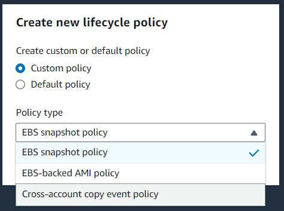
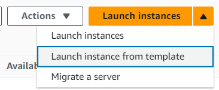

import { Aside } from '@astrojs/starlight/components';

## Snapshot

When running a virtual machine, we often install software and make some configuration to the OS. All of these changes are saved within the disk.

The disk data can be back up by creating a snapshot. A snapshot saved all the data that is saved on disk at a specific time (Point-In-Time), and save it in a snapshot store.

To restore the data, we spin up new EBS volume, with the template using the snapshot we have captured, therefore retained all the information.

<Aside type="caution" title="Watch out!">
  EBS snapshot does not retain OS specific disk data, so that it can be mounted to different EC2 instances (that has the same OS)
</Aside>

### Incremental Snapshot

When taking a snapshot of an EBS, we usually want to take snapshot periodically (like for a database, or we are running a very sensitive application that can survive any disruption). In AWS, all snapshot are created **incrementally**.

When we taking a first snapshot, it copies all the data from the disk (as mentioned, exclude the OS data) and hash all the files. When second snapshot is taken, AWS will compare the hash files with the new hash, and only replace/append/delete new files, old file will not saved in the new snapshot. [Learn about the incremental snapshot here](https://docs.aws.amazon.com/ebs/latest/userguide/ebs-snapshots.html#how_snapshots_work)

## Amazon Machine Image (AMI)

To make a perfect snapshot of the whole EC2 instance - the OS, the data (from all the EBS attached to it), we use AMI

`AMI` copy everything related to the EC2 at that particular timestamp (call a snapshot). This snapshot is saved in the Elastic Block Store. When we create a new machine, rather than choosing a default OS (default AMI of the OS), we can choose our AMI to re-create the EC2 instance at the exact moment that we capture the snapshot.

<Aside type="caution" title="Watch out!">
  An AMI only capture certain OS feature on RAM, but not all of it. If the application are RAM only, AMI cannot saved the current status of the application. 
</Aside>

<Aside type="tip">
  EBS snapshot takes one EBS volume, and exclude OS data if it is a root volume, while AMI capture all the data of all the EBS attached to them
</Aside>

## Lifecycle manager

Whether you create a snapshot or a AMI, AWS provide us a way to automate and schedule the creation of them for backup.

In the panel, you can create specify whether you want to backup all assets (`Default policy`) or just some explicit assets (`Custom policy`). Then you can specify the type of assets (AMI or EBS) and the schedule, and the retention period.

### Deleting a snapshot after retention period expires

[All you need to know is here](https://docs.aws.amazon.com/ebs/latest/userguide/ebs-deleting-snapshot.html). I am going to summarize a little bit.

Since the snapshot is incremental, when we delete a certain snapshot, we only delete the files with hashes that unique to that snapshot. *If a file involve in snap_A, snap_B, snap_C, and we delete snap_B, the file is still remain (and charge money 🥲)*. If we delete the root snapshot, then the whole referenced file will be transfer to the next snapshot, and that snapshot is now the new root snapshot.

## Launch Template

In some scenario, we do not want to take a snapshot. *Example, we want to create an EC2 instance, create a user, then install a database (either Postgres or MySQL). We want that each new EC2 instance that we launch will have the same OS configuration and user*. We can use `Launch Template`.

`Launch Template` let we capture the step that we define when we create a new EC2 instance. [Recall the steps here](/aws/ec2/#ec2-components). By using the launch template, we can re-create a new EC2 instance with primary configuration match the old version

