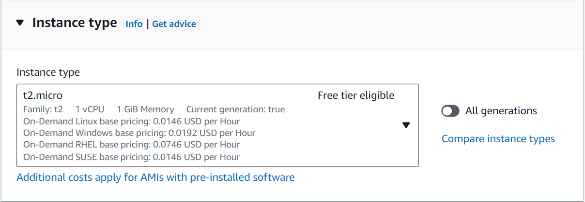
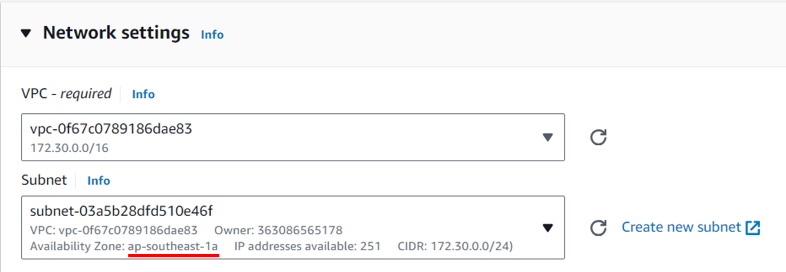
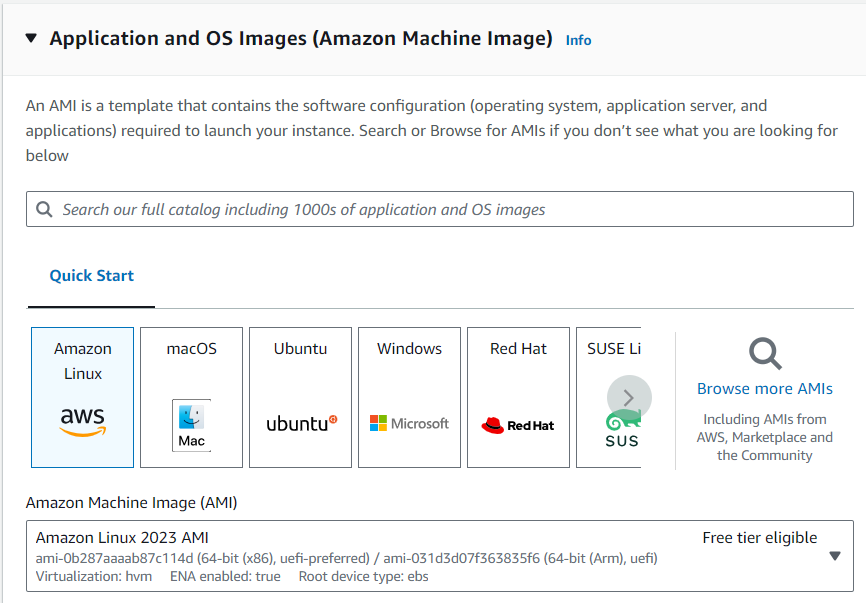
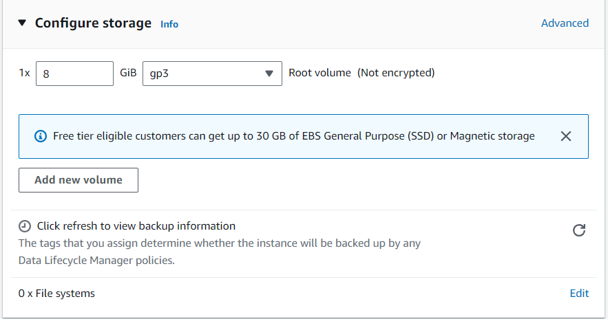
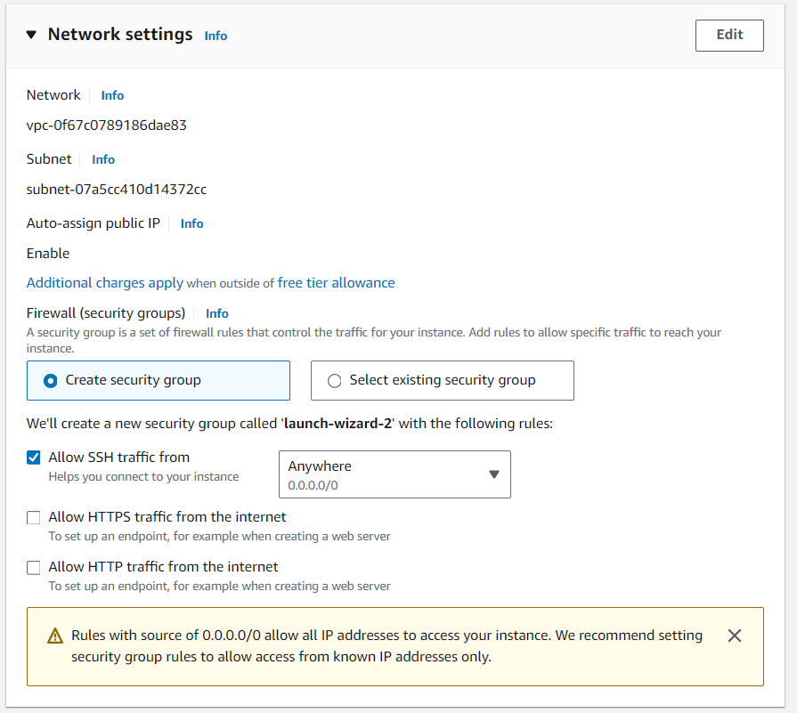
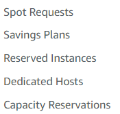

*This article assume understanding about the article [AWS Infrastructure](/aws/infrastructure)*

## Virtual machine and EC2

Us, as developer, usually need a moderate computer to run a program (or an application). *Example, a web developer may need a 0.5MHz of CPU and 500MB of RAM to run a website, and may be require more computing power when there are more traffic (user access the web)*

A single computer inside a rack inside one data center of AWS is extremely powerful, surpass many times the requirement of a single application. Therefore, AWS should only gives a small subset of it massive computer to the developer. 

In order to "chop" a big computer hardware to smaller units, AWS use [`Virtualization`](https://www.ibm.com/topics/virtualization). A virtual machine is a computer that is born by the virtualization process. By leveraging `virtualization` technique, AWS save money for both developer and the company, by only granting the client a virtual machine that closely match the dev requirement - no more, no less.

**Elastic Cloud Compute (EC2)** is the virtual machines that created by the virtualization of AWS's computers in an AZ.

## EC2 components

### 1. Computing power

When creating an EC2 instance (one EC2 computer is called an EC2 instance), we first need to define our computing power here.

Here, we want a computer with 1 vCPU and 1GB of RAM from AWS server.

### 2. Location

Then we need to know where our computer is located at. 

You don't have to know what VPC and Subnet are in this article. ([Learn more about VPC and Subnet here](/aws/vpc/intro/)). But we can see that we are renting a computer inside of a data center (AZ) called `ap-southeast-1a`, on Singapore Region. If we click on the subnet (assume we are using the default VPC), we can switch the AZ to `b` or `c` pretty easy. To change the region of the EC2 instance, we need to change the region of the project (on the top right corner).

### 3. Operating system (OS)

Modern computer need operating system to operates. We can choose our OS here.

### 4. Disk

A modern OS require a disk to store long term data. 

Here we order a 8GB disk storage on our EC2. Learn more about [AWS Storage here](/aws/network-drive/)

When the EC2 is created, it always mounted with one volume, either created alongside the EC2 instance, or have been created before. This volume should be specific to each EC2 (so other EC2 cannot use the same volume). This disk (or volume) is called `Root volume`. Root volumn contains the OS files, so that when destroying the EC2, it is also getting destroyed.  

In the life cycle of the EC2 instance, it can increase its disk capacity by attach to other volume. 

### 5. Internet connection

Internet connection of an EC2 is facilitated by two entities: VPC and Security Group. [Learn more about **Security Group** here](/aws/security-group/)

## EC2 planning

By default, EC2 instance follows a pay-as-you-go model. It means that AWS will charge you for every second that your EC2 instance is running. 

However, you can actually save money by pay upfront for your EC2 instances. Here are some other planning that aim to help you with your money:

[Read more about each plan here](https://cmctelecom.vn/bai-viet/4-mo-hinh-toi-uu-chi-phi-cho-doanh-nghiep-su-dung-dich-vu-amazon-ec2/)