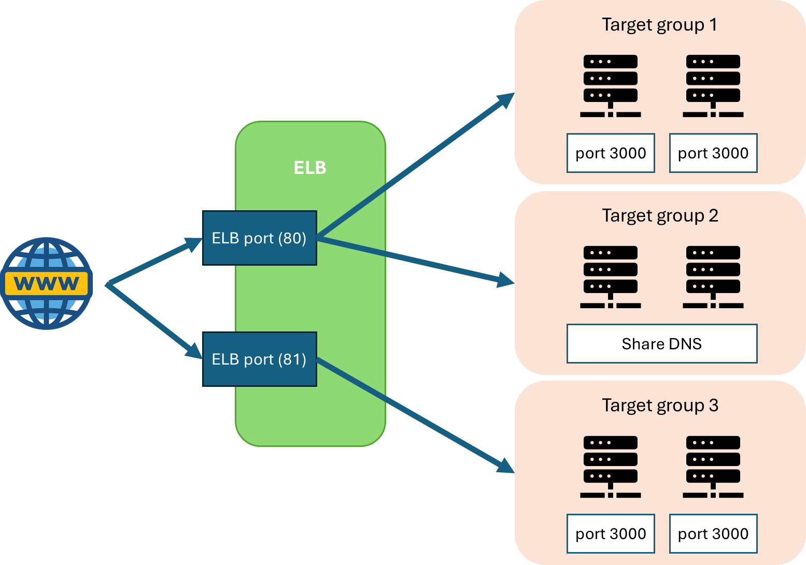
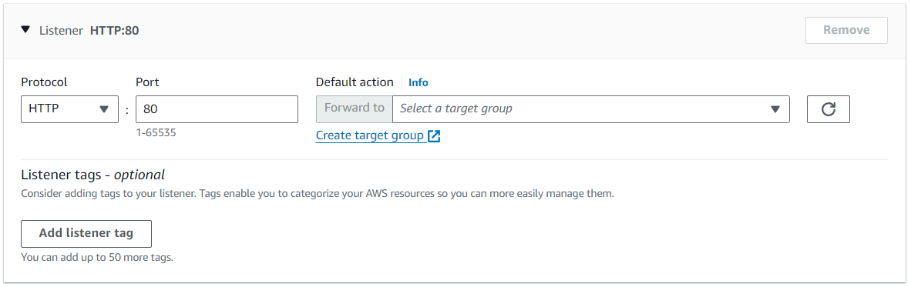
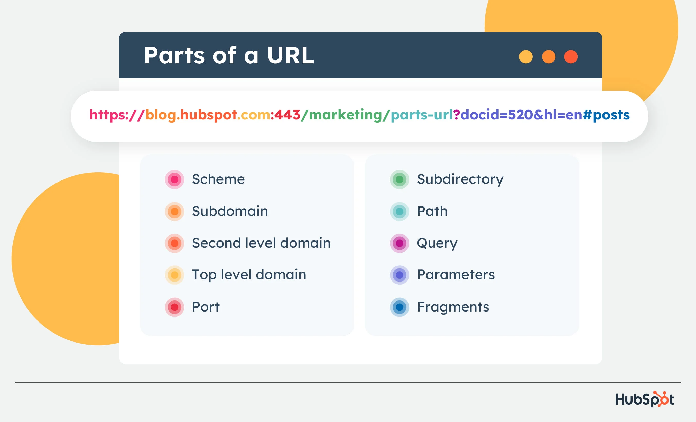

import { Aside } from '@astrojs/starlight/components';

This article assume understanding about OSI Layer, TCP and HTTP. [Learn them here](/networking/osi-model/)

This part also assume knowledge about DNS. Learn more at [DNS basic](/aws/global-service/internet-routing/) and [Route 53](/aws/global-service/route-53/)

## Proxy vs Reverse Proxy

[Detail about proxies visit this video](https://www.youtube.com/watch?v=4NB0NDtOwIQ)

`AWS Elastic Load Balancer (ELB)` is a reverse proxy. It receive the internet traffic (request), and fowards the request to the according web server.

## Load balancer

Internet traffic (user request) is direct to a port that is open on the ELB (port 80 for HTTP, 443 for HTTPS, ...). When DNS is routing to a default port, we do not need to specify the port in the DNS name. Normally, we need administration to open an application on port 80, and if a system with multiple apps want to open on port 80, port collision will happens. Load Balancer is a server (*a server is an application that stay on forever to accepts internet connection*) that specialize to open port 80 (and 443) for us, so we can developer our real application (Express, Spring Boot, FastAPI, ...) without having to hazzle about the porting. 

<Aside>From now on, **Web server** term refers to Express/Spring Boot/FastAPI hosted on an EC2 instance</Aside>

*Example, when develop an express application on port 3000, we need to specify the port to the DNS as http://localhost:3000, or if we host it on a domain name, it should be http://example.com:3000. A load balancer (AWS ELB, Caddy, NGINX, ...) operates on port 80, and reverse proxy to our application. So, we just need to enter http://example.com (without the port), and the load balancer forward the request to http://10.125.2.1:3000*

It doesn't mean that Load balancer only operates on port 80 (and 443). Load balancer can open all kinds of port, and they are used in combination with the DNS service (like Route 53) to handle both internal and external traffic. But the rule of thumb is to always expose our main application to port 80, for non-porting DNS name.

## Listener & Target group

This is the working model of an ELB.

Sits behind the ELB is what called `Target Group`. Each instance sits inside a target group must accept the same protocol and listen to the same port. Target Group can be created manually (inside of **EC2/Load Balancer** UI) or created automatically by the other services (like ECS).

A protocol with a port open on the ELB is called a `Listener`. 

A listener can be simple (forward to a target group), or complex (forward to a target group based on some rules). The complexity of the Load Balancer service incremetally are Network Load Balancer (NLB), Application Load Balancer (ALB) and API Gateway.

The two most common ELB of AWS: Application Load Balancer (ALB) and Network Load Balancer (NLB). ALB receive, recognize, intercept and redirect signals at HTTP/HTTPS (layer 7), while NLB receive, recognize, intercept and redirect signals at TCP (layer 4). 

<Aside>It is noteworthy that all HTTP protocols (HTTP, HTTPS, HTTP/1, HTTP/2, RPC) are TCP, but TCPs are more than just HTTP (there are also SSH, SMTP, FTP, ...)</Aside>

## Application Load Balancer

Application Load Balancer is an HTTP/HTTPS only. Recall from the OSI model, this layer expose to most of the internet transmission. 

### URL structure 

We learnt in DNS Basic that the DNS contains a TLD (.com), a SLD (google), and many LLD (docs, gmail). But what is an URL? A URL contains a domain name as unique identifier, and other parts to communicate with the web server.

The left side describe the DNS components. We have learnt them so let's move on.

After the domain name, we sees the **"/"**. This is called an URL path. **"/"** is often called a `root path`, When you enter the domain name, they gets redirected to the root path. **"/about"** is called about path, and by the figure, **"/marketing/parts-urls"** is called the /marketing/parts-urls path.

<Aside>Remember, every url path shoud start with a **"/"**</Aside>

After the URL path, you see the **"?"**. The **"?"** is the separator of the URL path and URL query parameters. Query parameters are key value pairs, they are encode by percent encoding.
*Query encoding encodes "Chào thế giới" to "ch%C3%A0o%20th%E1%BA%BF%20gi%E1%BB%9Bi"*. Each key value pair is seperated by the **"&"** symbol. As you can see on the figure, there are to key value pair. 

The **"#"** part guides the browser to a specific section on the HTML. In web server, this is neglected.

### HTTP Request

When a user type a URL, the Domain name are responsible to looking for the web server located somewhere on the world. After locating, an HTTP(S) request is sent to the server. What is an HTTP Request?

[Visit this article for more info](https://lanit.com.vn/http-request-la-gi.html)

A HTTP request contains `Request Line`. This identifies the version of HTTP (1.1, 2, ...), the method of the HTTP (GET, POST, DELETE, ...), and the resource path. The resource path contains all the parts after the domain name (including url path, query parameters and section)

<Aside>
Resource only differentiate themselves base on url path. So, two resources path "/users" and "/users?limit=10" are consider the same resource. Therefore, when developing web server, only consider query parameters as optional, extra functionalities. Query parameters are NEVER mandatory.
</Aside>

`Request header` are extra information about the sender (or receiver - response header). These includes the host (domain name), the browser they use, the device they used to send the request, ...

`Request body` contains base64 encoded message, HTML and XML request body. 

Why you giving me all this? It is because, it is noteworthy that all of what we just learn (URL path, query params) works on layer 7. So an application works on layer 6,5,4,3,2,1 cannot sees these components. 

Web servers like Express, Spring Boot and FastAPI are layer 7 applications and they work around these URL path and query parameters. Inside a web server, we define the the accepted routes, what to send back the response base on the information given to them (URL path, query parameter, request header and request body)

Application Load Balancer is also a layer 7 application. They can also read URL path, query parameter, request header (they do not read request body for security and privacy reasons). That mean that, base on these components, ALB can effectively redirect a resource path to a desired web server.

*For example, if you ever try to access http://www.facebook.com via the mobile browser, you see that it always redirect you to a http://m.facebook.com domain. On modern browser, when sending HTTP request, the browser also include a header called "Sec-CH-UA-Mobile". If the value of this header is "?0", it comes from the desktop version of the browser. If the value of this header is "?1", it comes from the mobile version. Under the hood, the ALB analyze this header, and redirect the request to a new domain*

*Another example, you know that Facebook has had it UI changed. But sometimes, when you go to the settings UI, you see that you are using the old UI. Facebook, under the hood, navigates only a portion of its client to the new settings UI - because they want A/B testing. This has done using the load balancer. When the client visits https://www.facebook.com/settings, the load balancer forwards 80% of the traffic to the new settings UI, and 20% to the old one*

ALB not just redirecting, but can add some more information to the request header. Like `stickiness session`. It means that when a user visited an EC2, the ALB saves that EC2 id to the request header. When the Load Balancer sees the next request from that user again, the Load balancer automatically sends the user to the EC2 instance that they were interacting, rather than the new instance.

## Solution Architect: API versioning in ALB

Here's some API version URL.

- http://v1.myapi.com/users
- http://myapi.com/users?version=1
- http://myapi.com/v1/users
- http://myapi.com/users with HTTP header \{"Api-version": 1\}

### First option: API version within domain name

This is hand down the best way to to deal with API versioning. The version is registered as a Low Level Domain (LLD) and using Alias record map to the ALB's DNS. *v1.myapi.com* for v1 web server, *v2.myapi.com* and *myapi.com* for v2 web server. Inside the ALB, the router rule base on the HTTP host name, forward to the correct EC2 instance. 

Pros of this method includes:
- The URL path is simple (the same as the user type versus the router logic inside the web server), 
- The user get to choose the version they want, and for simpler purpose, they direct to the latest version if they don't manually select the version
- The web server is version agnostic (the web server does not know about its version). This helps with loosely coupled development

### Second option: API version as query parameter

Most Load balancer (NGINX, Caddy, AWS ALB) works on Layer 7, so they can access and intercept query parameter. Since the query parameter is optional, this archieve the same effect as the first option. **This is also the best way to versioning your API.**. Using the ALB, we filter the URL base on query parameter, and redirect to the appropriate web server (we set the default case as the latest version with lowest priority score, so that if the user does not specify the version, we automatically redirect to the latest version)

### Third option: API version as URL path

This is down bad. Here's why

- In load balancer, we need to parse the URL (/v1/* and /v2/*), this means that we can't have the default version (user must always specify the version). 
- Secondly, the whole URL path is passed to the web server, that means that the server needs to be self-aware about its versioning. This could add complexity to the project.
- Wrongful URL is common in this pattern. Let's say the v2 version introduce a new path, /v2/blog that does not exist on v1. A person can request /v1/blog and still pass the ALB.

### Fourth option: API version as HTTP header.

This technically could works, but introduce overhead to the front-end, where the front-end engineer has to deliberately add the header to the request.

## Network Load Balancer

Network Load Balancer works with Layer 4, meaning they are working with low level packet transfering. Two most popular scheme for this layer is UDP and TCP. Some cases of Network Load Balancing is:

- Your application is running using UDP protocol
- Your application is running TCP but not HTTP
- Your application is running HTTP, but you need bare minimum requirement (just forward request, no route interception needed).

Since working on a lower OSI layer, the transfer rate of Network Load Balancer is super fast. They could handle millions of request per second.

Remember the API versioning when we discuss that http://v1.myapi.com/users is the best option? Here is why. If our application peaking at million of requests per second (happens during multi-user, near-realtime application), we cannot use ALB. By using NLB, we can host two NLB (one for v1 and one for v2), and route different record to different NLB. The only drawbacks is that routing decision happens at DNS level, so more routes need for the routing. 

You may think how can many load balancers are better than one? First, the NLB are very very durable (able to handle million requests per second). Secondly, they are cheap. Several NLB can be faster and more economical than the overhead ALB.

## API Gateway

Technically, API Gateway is its own service with many functionalities. Load balancer is just one of them. But, since we are discussing Load Balancer, we should know in depth about this service as well.

API Gateway are super expensive compares to ALB and NLB (and slower than both load balancers), but they have more functionalities (which helps you to greater simplified your web server code). It is a common trade-off between ease of development and speed (which we always prioritize ease of development)

Let's review how we create API so far. Using a web framework in a programming language (Express in JS, FastAPI in python, Spring Boot in Java), we specify the resource (the URL path) and how to the server logic within these resource (called a controller). We host the web framework in AWS resource (EC2, Lambda). This computing unit which hosted the web framework is called a web server. These resources sit behind a Load balancer, so they have a common host name, refer than individual IP. The Load balancer DNS is mapped to a production domain name, that expose to the user.

Using API Gateway, we further abstract the code. API Gateway gives us the load balancer and the route resource already, we only cares about the controllers. *Let's say we want an API with three routes: "/", "/about" and "/user/:id". Using API Gateway, we specify three resources, and the load balancer and api routes automatically created for us. The only code we need is to write the controller. If our application has multiple version, the API gateway takes care of versioning for us.*

API Gateway has three mode: HTTP (low cost, require more code for core functionalities like Authentication), REST (higher cost, includes more core functionalities like Authentication with AWS Cognito) and Web Socket. 

Usually our API interact with databases (CRUD operations). Using API Gateway, we can use what is called Service Proxy - which are pre-written code to help us interact with AWS services - to reduce the code we have to write.

API Gateway is used in combination with AWS Lambda, to create a truly serverless application. 