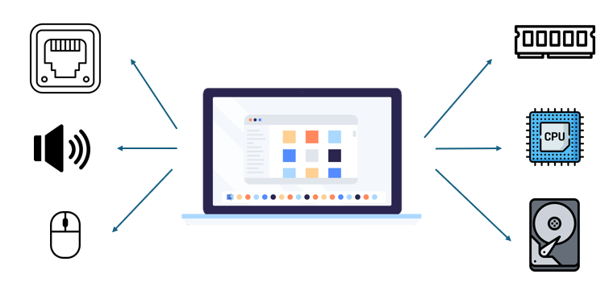
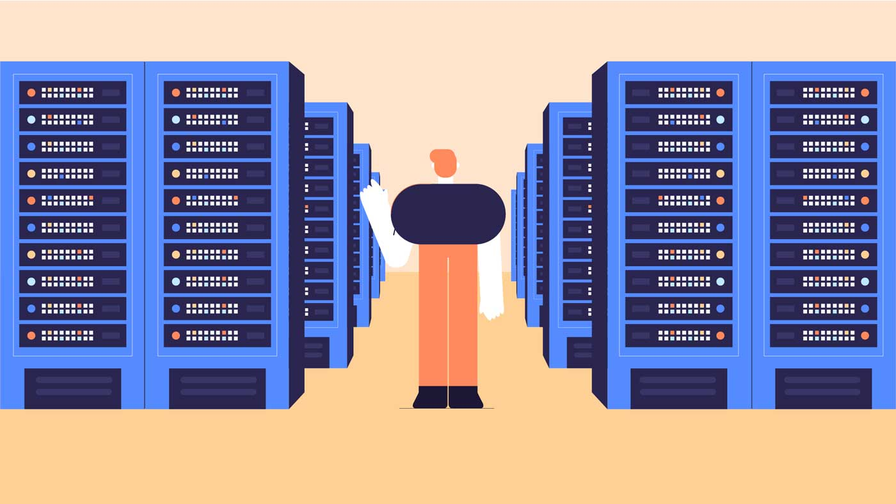

import { Aside } from '@astrojs/starlight/components';

## What is a computer?

At minimum, computer is comprise of CPU and RAM. Personal computer does a lot of things than just run a program - it display the UI, output volume, connect to the internet. To match with those requirements, we add more hardware to our regular computer.

Your typical computer (or laptop) may looks like this 👆. You have individual components (CPU, RAM, disk, ethernet, ...) that connected by a mainboard.

## Inside of AWS data center

Data center also contains computers. But rather than a single computer, with a single CPU, some RAMs, one or two disks, data centers contains a lot computers. And a lot, I mean, lots lots of computers - thousands of them. Computer in data center serve difference purpose than our regular computer. 

As we can see in the picture above, this is what it looks like inside a data center. Loads and loads of racks, each holds many computers. And computer, I mean a minimal computer, with only RAM and CPU that connected by a mainboard. 

This is because when we run a program, we expect the program to serve only one user - us. On the other hand, programs run on data center are expected to serve thousands of users (like website), or to perform calculation far beyond what our typical computer can do (run a HPC task) 

AWS (or Google) has many of these data center around the world, and they provide a way of accessing these resource, by internet. This is called **Cloud Computing**

## Regions

AWS is the biggest provider in the cloud computing landscape. AWS choose an appropriate geo-location to build their data centers. And they build not just one per location, there are at least two (usually three to four) data centers that only hundred kilometers apart from each other. These data center are connected by a network of ultra low latency fiber cables (AWS call these network `AWS PrivateLink`). A data center built like this is called `Availability Zone (AZ)`, and the geo-location is called `Region`. 

<Aside type="tip">

A **Region** is a geolocation with a special code name: like Singapore (ap-southeast-1), Ohio (us-east-2). A region contain at least two data center (**Availability Zone (AZ)**), which label alphabetically (ap-southeast-1a, ap-southeast-1b, us-east-2a, us-east-2b, us-east-2c)

</Aside>

<Aside type="note">

From now on, the term **AZ**, **Availability Zone** and **data center** will be used interchangeably

</Aside>

[Learn more about **Region** and **Availability Zone** here](https://aws.amazon.com/about-aws/global-infrastructure/)

## Cloud Services

**Availability Zone (AZ)** serve as a apartment rental service. User rent a home (a computer) in a apartment complex (AZ). Some people just want a blank apartment, other want furnitures and decorators already bundled within the condo. This is called a `service`.

*For example, we want a database in AWS. We can rent a computer, install an OS, then install and configure the database ourselves, or we can rent a database from AWS (AWS RDS). A blank computer refer to the EC2 service, while the premade database is the RDS service*

## Global Edge Network

The main goal of AWS is to host the web (hence the name Amazon **Web Service**). Therefore, in addition to giant data centers for renting services, AWS also has smaller data centers for internet transmission - with the purpose of reducing the response waiting time of websites hosted on AWS. These data centers are widely distributed around the world, helping it locate closer to internet users (the closer it is, the faster the response speed). AWS calls it the `Global Edge Network` system.

Global Edge Network support AWS's global services like Route 53, Global Accelerator and CloudFront.

Global Edge Network includes data centers called Points Of Presence (POP). POPs are installed in big cities, hosting the above global services. POP are connected to their closest AWS Region via AWS PrivateLink to ensure the maximum internet speed. Streaming services and large static contents with huge traffic volumes - requiring extremely high bandwidth consumption, and requiring extremely low latency - are becoming increasingly popular (TikTok, Netflix, e-commerce, ...). To solve the above problem, AWS combines with ISPs to usilize the available infrastructure of the ISPs to host Points of Presence (called Embeded POP). The ISP is the closest place to the user (directly providing internet to the user), so it can solve the latency problem well.

Learn more about [Edge Location here](https://aws.amazon.com/cloudfront/faqs/#Edge_locations) and [Embeded POP here](https://aws.amazon.com/cloudfront/faqs/#Embedded_Points_of_Presence)