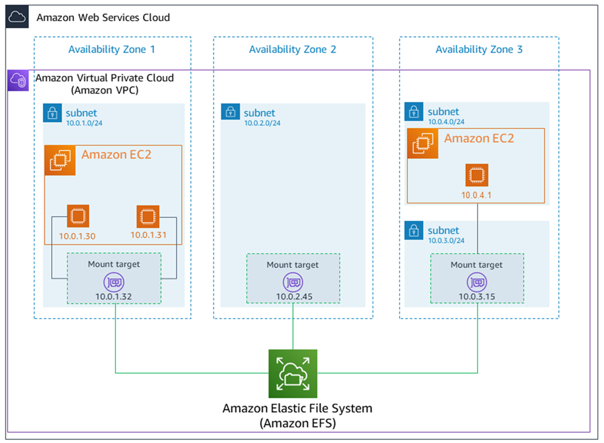

import { Aside } from '@astrojs/starlight/components';

In a normal computer, a disk is also attached to the main board, sits next to the CPU and RAM. But in AWS data centers, they have dedicated racks of disks, that lies separately from the CPU/RAM. In order to attach a virtual machine to a disk, AWS uses internet cables to connect them. So, all disks in AWS are **Network Attached Storage (NAS)**. Using NAS, an EC2 can attach/detach to many disks. 

## Elastic Block Store (EBS)

EBS are the most fundemental storage option, uses for many services (EC2, RDS, ...). EBS is like a virtualization of the disks inside the racks of the AWS AZ. Think EBS like disk `C\` or `D\` in your Windows PC, that separated files by virtual boundaries.

By theory, most EBS can only attach to one EC2 instance, but an EC2 instance can attach to multiple EBS (one-to-many relationship between EBS and EC2). There are an exception of [Amazon EBS Multi-Attach](https://docs.aws.amazon.com/ebs/latest/userguide/ebs-volumes-multi.html) - but they support very niche cases and probably you will never need this.

When EC2 claim a EBS, we call this `attach a volume`, but I like to think it as `docking`. *The EC2 is like a boat and EBS is like a harbour's dock station. The EBS has a minimum size, so only one boat (EC2) can be docked at a time. Some boat (EC2) is extremely large and can span many dock station*

<Aside type="note">

Just like EC2, EBS are only existed in one AZ. So, EC2 can only attach to those EBS on the same data center. 

</Aside>

## Elastic File System (EFS)

EFS is a special type of EBS. This file system implement newer technologies then EBS, so that they can be attached to many EC2 instances at the same time.

EFS implement **Network File System (NFS)**. It means an EFS will have its own IP address, and multiple EC2 instances can attach to the same EFS using this IP address. 

EFS has two model: `Regional` and `One Zone`. Regardless of the model, EFS must associate with a VPC (to provide an IP address) - [Learn more about VPC and IP address here](/aws/vpc/intro/).

On each AZ, EFS utilize VPC to create an IP on that region. This IP address is called a `mount target`. If an AZ has multiple subnets, you need to create one mount target for each subnet.
VPC, using DNS map all the mount targets to a domain name ([Learn more about DNS here](/aws/global-service/internet-routing/)), and VPC expose the EFS with that single domain name. EC2 instances reference this domain name to attach to EFS, which will be directed to the mount point in the AZ (and according subnet)

<Aside type="tip">

EFS One Zone are Regional EFS with only one mount target

</Aside>

<Aside type="caution">

EFS are POSIX storage, so they can only attach with Linux EC2 

</Aside>

Regional EFS are redundant, it means that they are replicated on every AZ in the same region. This helps with reading but making concurrent write extremely messy. When develop an application, always put a timestamp to prevent race condition when concurrent write across the region (two EC2 from two AZs try to write to the same file)

