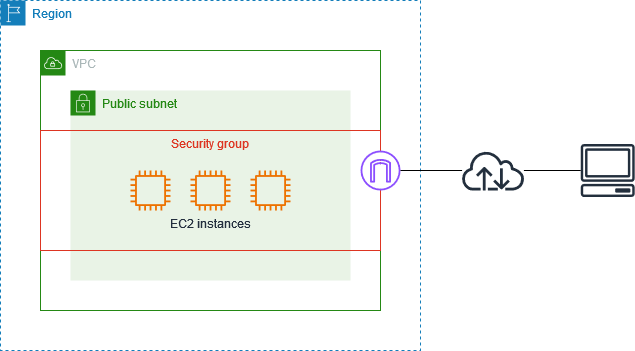
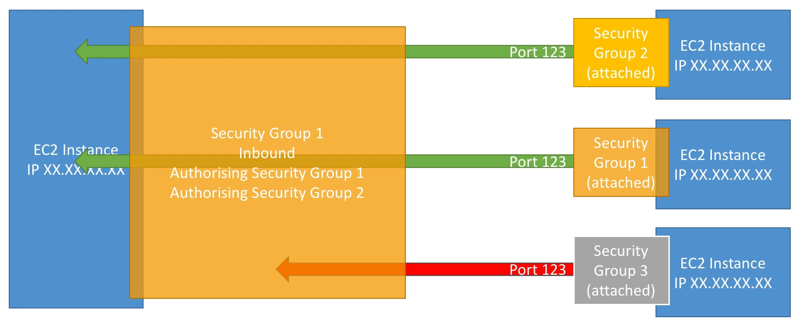

import { Aside } from '@astrojs/starlight/components';

`Security group` is a virtual firewall, allow access certain IP address in or out of the EC2 instance. From the above picture, IP address needs to flow from internet to VPC's subnet before reaching to the security group, hence security group is not available in private subnet (private subnet expect no outside internet connection).

Security group has two properties. First, they are **allow only**. Meaning that we want to decide what IPs that we want to allow to access ([using CIDR blocks](/aws/vpc/intro/)). Second, Security group are intersected. *Example, if sec_gr_A allow IP 1,2,3, and sec_gr_B allow 3,4,5, an EC2 instance inherit both security groups only able to allow traffic from IP 3*.

EC2 instance can give access to security group rather than IP address. This mechanism is available since securtity group is also an Amazon Resource Name (ARN). We can grant permission (both allow and deny) to an ARN via policy. [See this reference to know the policy JSON](https://docs.aws.amazon.com/IAM/latest/UserGuide/reference_policies_examples_ec2_securitygroups-vpc.html). The diagram of the process is display here 👇.

Security group filter all TCP standard connection (HTTP, HTTPS & SSH), and some UDP protocol. Security group also support [NFS](/aws/network-drive/) filtering, *so if you commercialize your AMI and security group, you can limit access certain user tier (free tier/premium) to certain EFS.*

<Aside type="caution">

Security group also support IPv6 and DNS filtering, but IPv6 must be enabled in VPC.

</Aside>