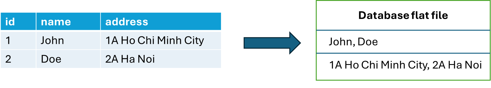
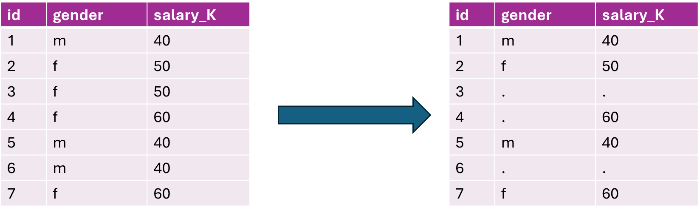
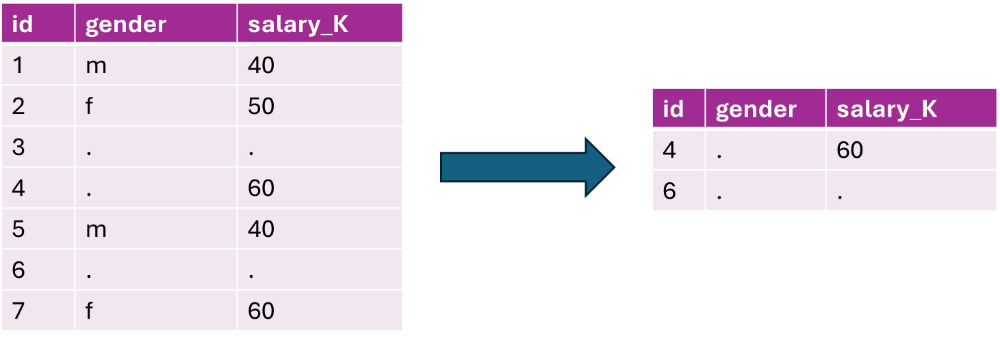

### OLTP and billion rows join!

Imagine a scenario. 

💡 We want to keeps track of the average flight distances of each passenger of all the flight from Vietnam in September. The *distance* and *passenger_id* are saved in *flight_details* table, and the *date* is saved in the *ticket* table. There are 6 columns and 100 millions rows in *flight_details*, and 3 columns and 4 billions rows in *tickets*.

To solve this problem, first we need to join these tables. Let's say there are no index and read optimization in the relational database. 
Hence, each time we run the query, we need to retrieve `6\*100millions + 3\*4billions` cells. We actually doesn't need that much cells, but since relational database are row-based, we need to retrieve the whole row just to perform a join, then later, aggregation. And the worst part is, we need to run this on every query, eventhough with cache, it will be a very large cache! This solution is horrible if we made this a view and makes it react to a condition (changing the date perhaps).


To solve this problem, tech geniuses utilize OLAP database and workflows around them.


## OLAP database

### Columnar Database


Columnar databases saves data in column format




Columnar databases are used for OLAP (Online Analytic Process). This is because the data saved in these databases are very efficient and small-sized compares to other databases.

Databases belong to this paradigm are:

- Amazon Redshift
- Snowflake
- Google BigQuery
- Apache HBase
- DuckDb

In OLTP, we usually dealt with one to two column(s) with millions/billions of records. This combines with database join, magnify the number of cells 3-4 times fold. 

In OLAP systems, since we store each column separately, to calculate aggregation on a column, or perform join on one column to another, we do not need to load the whole table's row, just the one we need. 

### OLAP store joined tables

In OLAP system, it is preferrably to store denormalized data. Normalization in Row-based helps with granuality read performance (query that reads on only one table) and save space, but it very sucks at joined read. This curse reflects the problem at the begin of the article.

Therefore, in OLAP system, data that getting loaded into the databases are normally results of the `JOIN` from an OLTP system. OLAP uses the `Run Length Encoding` (RLE) algorithm to minimizing the space impact to duplicated data, so it actually very space efficient to store large volumn to data. 

### Materialize views

Often, `JOIN` are compulsory. This happens because OLAP are usually store multiple sources, and data analytics need to unify these sources. OLAP databases also utilize query cache the same as Row-based, OLTP databases, that dumps the results into what is called `Materialize Views`. `Materialize views` - utilizing `RLE` to reduce the query size - makes it faster to perform computation (aggregations, window functions) then cache in OLTP.

Normally, data analytics use [DBT](https://www.getdbt.com/) to manage these `materialize views` lifecycle.


### Run Length Encoding (RLE)

Run Length Encoding is an algorithm that reduces the space that needed to store neighbouring duplicated data.

Run Length Encoding is a forward-fill algorithm, if the next row in the same column has the same value as the previous row, marks it as some bits rather than store the complete value. Therefore, we save a lot of spaces by replacing duplicated neighbouring data with bits



To maximizing the RLE in column-based databases, the data need to be sorted

#### Problem with point query in RLE available databases

Point query are queries that requires one exact values:

```sql
SELECT name FROM some_table
WHERE id = 1;
```

Now let’s query row with id=4 and id=6 in the encoded table. This is what we get when applying to a column-based databases



As we can see, it is impossible to read the row which value is masked with bits without traverse several row upward to findout what the original value is.

That is why, we cannot use OLAP with OLTP for client-related applications

### Partitions are always preferred

In OLTP databases, there are scenarios where the database's column has low cardinality (few possible values). We should construct partitions on these values. A partition is a logical group of pages that stored together. When filter for a partition, the query engine skip all the partition that does not satisfied the filter, makes sure that least number of scans are done.

Column-based also utilized disk block, with a disk block of 1 MB, and disk blocks are stored based on partition