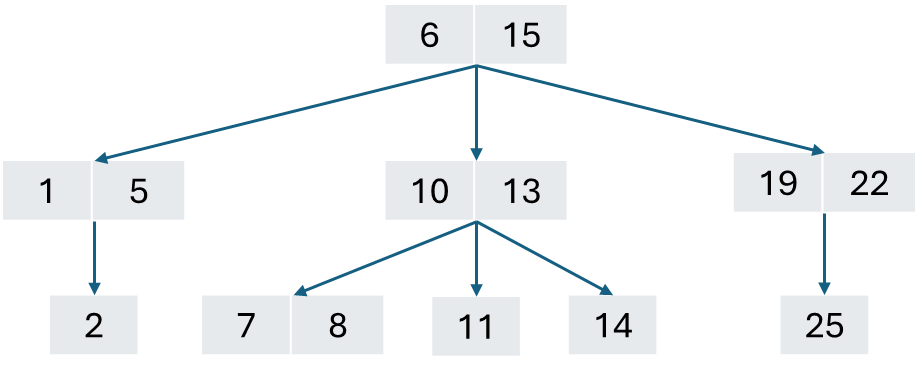
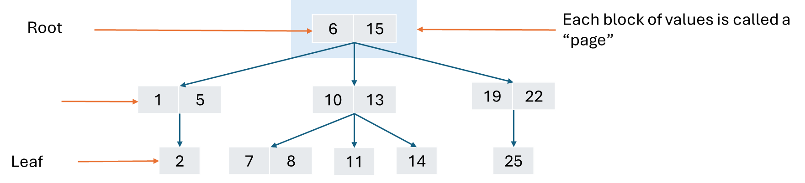
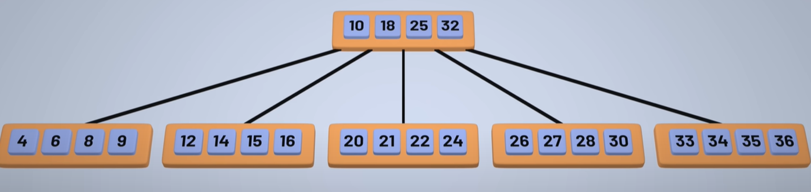

import TwoGrids from "@components/two-grid.astro";

## Binary tree

<div class="flex flex-col justify-center items-center">
  <figure>
    
  </figure>
  <p>This is a binary tree 👆</p>
</div>

The top most part is called a **root**, middle part is called **branch** and the last part is called **leaf**

In a binary tree, child node that are less than the parent node goes to the left, and the child node that greater than the parent node that goes to the right.


### Binary tree lookup

Lookup in binary tree is O(logn). It is crazily fast.

Example. Try to find the value “4” from the B-tree

```
4 < 8 => to the left
4 > 3 =>  to the right
4 < 6 => to the left 
Voila!
```

### Cons of binary tree

But database system is huge, it could contains billion of rows. The more the row, the deeper the tree, the more step we need

Worst case scenario, for a 1 billion indices in a Binary tree, we will have to traverse rougly 30103 nodes.

Is there a way to decreases tree depth, hence fasten the lookup speed? Thankfully, the answer is yes 👍.


## B-tree

Binary tree only holds 1 value per node.

With this simple B-tree, rather than hold on one value per node, we holds upto two value per node.

The rules also changes a little. The values that less than the left values goes to the first child, the values between the two parent values goes to the second child, and the values greater than the right goes to the third child

Each values in a node is sorted in an incremental order



### B-tree anatomy



### How to traverse a B-tree?

Let’s look for the value “8” in this B-tree

```
8 between 6 – 15 => goes to the the middle page
8 < 10 => goes to the first page
There’s 7 & 8 => voila!
```

## More complex B-tree

A B-tree can gets as complex as this 👇




In reality, each page holds a finite amount of nodes, ranging from minimum to maximum nodes.
When inserting, if the value gets overflow, or the deletion of nodes making the number of nodes in a page less than the minimum values required in a page, the rebalancing algorithm will be triggered.

[Learn more about the b-tree index (Insert & delete)](https://www.youtube.com/watch?v=K1a2Bk8NrYQ)

The real question is, why goes through all this pain, why can’t we use a normal binary tree that could led to straight to hell?

It is because of **DISK ACCESSING**

We all know (or now you know) that disk accessing is slow and blocking. When we tap into a page (a binary tree is a page with a singular node and a singular value), we perform a disk accessing.

Binary sort and binary search is fast, since we are performing a seeking operation. Therefore, databases actually sacrifice the write complexity to improve the read performance by reduce the disk accessing operation


