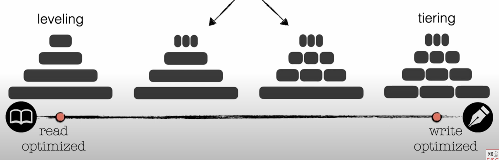

[Complete LSM-tree index course](https://www.youtube.com/watch?v=hkMkBZn2mGs&t=3s) 

LSM tree index serve for an extreme writing speed. 
To archieve this, LSM tree write into RAM rather than directly to disk like B-tree index.

Therefore, LSM tree index is not a singular structure like B-tree, it combines two parts: RAM part and Disk part.

## Memtable

When a user add a value, the data is written into RAM, inside of a Memtable.
The data is written into a self-balanced tree data struture, called Red-Black Tree data structure (similar to B-tree, this data structure has a O(logn) for both read and write speed)

The data in RAM are regularly sync in disk into a WAL if not full. This ensure that the data is available in case of interuption

[Find out more about Red-Black tree datastructure](https://www.youtube.com/watch?v=t-oiZnplv7g&t=1264s)

The tree has a predetermined size. When the size is full, the tree is flushed into disk into SSString table

## Sorted Strings table - SSTable

An SSTable is a datastructure that implement LSM tree, hence the name LSM tree index.

An SSTable is an append-only table, something like a Change data capture (CDC) log

What is CDC? Rather than deleting a value in the log file, the SSTable just create a new entrance, mark it at deleted. This is called a **tombstone**. Modifying is the same. New value is added to the log-file, and mark as latest

Traversing a CDC log is backward. We goes from latest to oldest log files.

Memory buffer when fulled is flushed to a single table, therefore the number of items from the mem-buffer is the same as each individual SSTable.

Each SSTable lies within a level. Each level hold a maximum number of record (entry). When the mem-buffer flushed the data into the SSTable, it flushed to level 1. When the number of entries surpassed the maximum threshold, a **Compaction** appears

## Compaction

A Compaction is a Merge-sort-like operation, hence the named LSM – `Log-structured Merge`. Compaction merge LSM tree on a level and move it to a lower level, so the level 1 will be merge first, then the second level, then the third level, and so on. This represents a Tree – hence the name `LSM Tree`

*Why compaction helps read but affecting write performance?* It all has to do with disk accessing and merge-sort. Compaction perform `merge-sort` - a locking operation. It is also a very expensive algorithm, hence drastically reduce the speed of writing. After compaction, there are fewer SSTables lying around the disk block. We know that disk accessing is slow, hence reduce the number of SSTables reduce the number of disk accessing, increasing the read performance

## Compaction strategies

### Leveling Compaction

When the threshold is reached, all the SSTables in the first level will be merged to create a larger LSM-Tree. This tree is then put into the next level. This operation propagates to the next level if the threshold on the next level is also reaches.

### Partial Compaction

When merging a level, rather than merge all of the SSTable files from the first level to the next, we pick two or some SSTables to from the first level and merge it, them put them to the next level.
This helps to reduces the number of records involing in merging per each level, gaining tremendous boost in write speed.
Only **Leveling Compaction** cannot implement this type of compaction granularity, since all files are merge when flushed

3 variantions of Partial compaction is **1-leveling** (where partial compaction only occurs on the 1st level), **L-leveling** (partial compaction all levels except the last level) and **tiering** (partial compaction all levels)

## Read optimization

### Fence pointers

Fence pointer is a hashed table that saved in-memory. Fence pointers are ranges formed by the minimum and/or maximum keys of each page (or every X pages), allowing a query to access only the part of a run with the range relevant to the target key.

### Bloom filter

Bloom Filters are also placed before the Fence Pointers, on each level for null case query optimization.

[More on Bloom Filter](/datastructure/bloom-filter/)
