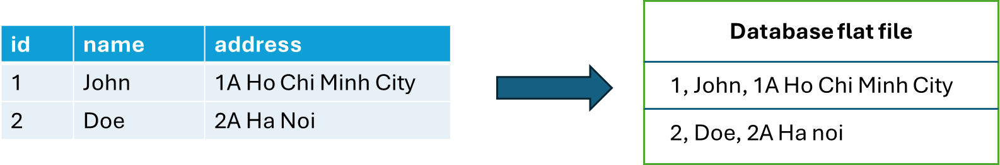
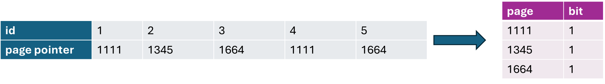
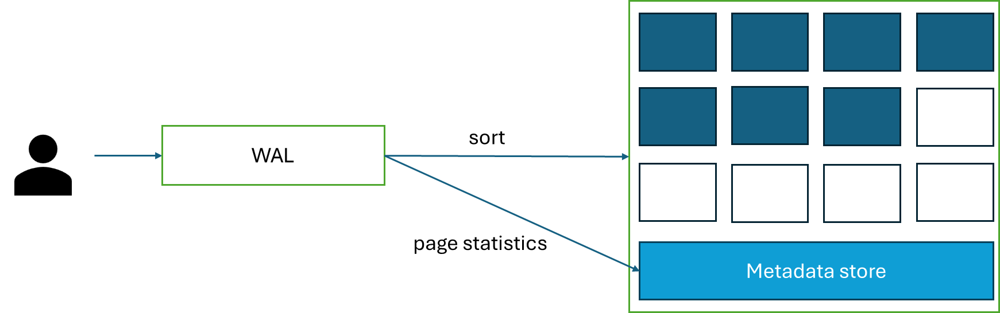

import { Aside } from "@astrojs/starlight/components";


The most antique, foundational and reliable database system in the world!

## Row-based databases

Relational databases are also referred as row-based databases because of how it store data in flat file.

Databases store data in block. Data in databases store as a row in a table, hence the name row-based



When we want to retrieve data, we retrieve them in block. Therefore, we retrieve all the content in a row, before selecting the desired column using `SELECT` statement

## Database Index

To increase the speed of reading, database utilize a datastructure called index to store data. This datastructure is extremely fast for finding a value.

Relational database store index using [B-tree index](/database/database-index/b-tree/)

### Indices and range query

Range query is a query condition using non-collectional value

```sql
WHERE col_a = 1
WHERE col_a BETWEEN 1 AND 2
WHERE col_a > 1
```

Some scenarios for range query:

- The column is index
- A compound index (Index are in column A and B)
- A & B are index separately
- The column are not indexed

#### Range query on index column

Here's a range query on an index column

```sql
CREATE INDEX idx_col_A ON some_table(col_A);

SELECT col_A FROM some_table
WHERE col_A > 1;
```

Since the `SELECT` and `WHERE` statement is only contains indexed column, we only need to scan for the index in the disk. This is called `INDEX ONLY SCAN`.

#### Range query on two index columns

When two columns are index separately, databases like Postgresql performs a `INDEX SCAN`. To join two separate `INDEX SCAN` together, Postgres perform a `Bitmap Intersection`

#### Filter on index column, but select on non-index columns

```sql
CREATE INDEX idx_col_A ON some_table(col_A);

SELECT col_C FROM some_table
WHERE col_A = 1;
```

When this scenario happens, Postgres perform a `Bitmap heap scan`.

Each node in the index is a tuple. The first value in a node is a sorted column's value that stored inside of a B-tree (or LSM tree), while the second value is a pointer that reference the page and the position of the according row in a disk block.

<div class="flex flex-col justify-center items-center mx-auto">
  
  <div class=" text-sm">A bitmap datastructure</div>
</div>

When we perform a `Bitmap heap scan`, there are several processes:

1. Perform an `INDEX ONLY SCAN` on idx_col_A
2. Construct a `bitmap` from the pointers matches the index scan
3. Perform sequential scan on blocks that matches the `bitmap`. This should return the whole row with all the columns
4. Get only the desired column (in this query, it is `col_C`)

#### Range on compound index

A compound index is when we index two columns

```sql
CREATE INDEX idx_compound ON some_table(col_A, col_B);
```

When perform a range query on compound index, there is a difference between `SELECT col_A` and `SELECT col_B`

In a compound index, only the first column in the index `col_A` is `INDEX SCAN`. All other columns when perform `SELECT` will go through `Bitmap heap scan` as non-index column

**Therefore, on a compound query, the order of the index is important**

## Disk block and sequential scan

In disk, data is stored in block, called **disk block** or **page**.
When database perform file reading, it first locates the disk block inside of disk pool, then it reads all the values from the block
So, smaller block size means faster read, while few number of blocks means less block locating.
Postgres set a disk block size of 8KB.

### Write-ahead log (WAL)

This only applied to WAL-available database (like Oracle and Postgresql).

#### WAL insertion

When perform write to database, the data is written inside of a WAL in-memory. This then flushed to a WAL on-disk. WAL is an append-only flat file, so the write speed is O(1).

When the WAL on-disk is fulled, the data is organized (sort) then dump to disk block as flat file format. Upon the dump of data, a metadata is created. It is a small flat file record information about the statistics (min/max/count/...) of a range of disk blocks. This helps with disk accessing. When perform a range query, this metadata is read first, to get the range of pages that belong to the query's range, then the database perform a disk reading for the actual data.



#### WAL deletion

The data when being deleted are remove from a page (disk block). This left with a `VOID` space in the pages. However, since the metadata store has been constructed, new data should not be added into this void.

New data being added as the same fashion as the WAL. They get directly dumped into new page rather than being filled into void spaces from previously deleted records. This helps improve both read and write speed, since we do not need to perform a metadata store update.

When deleted record cummulates, it leads to wasteful spaces. We can reclaim that space by using `VACUMN` operation. The database automatically perform `VACUMN` when the number of pages reaches a certain threshold, or we can do it manually.

<Aside type="caution" title="Watch out!">
  `VACUMN` command has a very high lock order, so they prevent both concurrent
  read and write. Choose an appropriate time to perform manual `VACUMN`.
</Aside>
