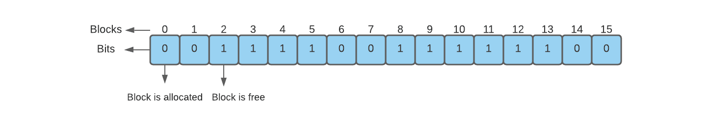
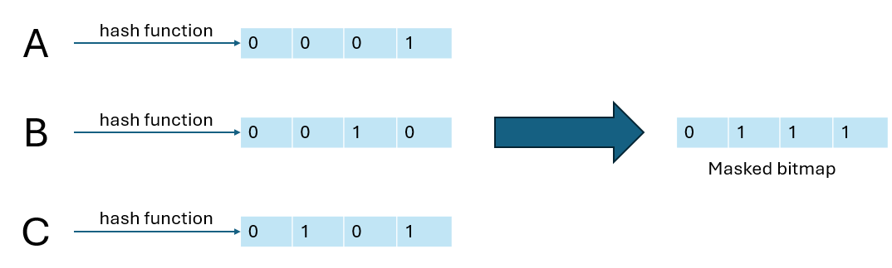
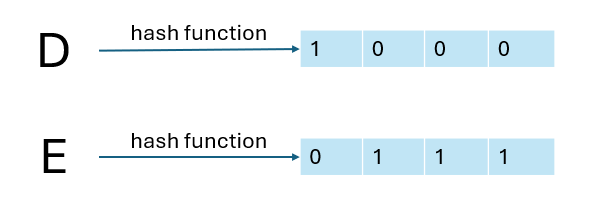

## What is bloom filter?

Bloom filter is a datastructure that is space-efficient for searching. Bloom filter answer the question: **"Is an element existed in a set?"** with a whopping 0% false negative rate (meaning in 100% of the time, it says that A is not in set X and A is actually not in X)

To perform a bloom filter, we need a hash function. The hash function accepts an input, and return some bits in a `bitmap`.  

  

  
Data structure of bitmap

This hash function is consistence, meaning that when we input a value, it will returns an exact hash value of that input.

  

  
Hashing and storing value in a bitmap

The bloom filter works as the diagram above. When the hash function hash to produce the bitmap, where the index is 1, the bloom filter's bitmap is also set to one.

When querying for a database value, the value first processed by the hash function. 

Then we check if the collection of bits are available inside of a bitmap heap, if yes, we continue the search, else, we immediately reject the value. In the figure above, since the 0th index has not been masked, we confidently rejected D (D hasn't been seen before). But with E, we have to go to the database and check, since all the 1 bits in E is masked within bloom filter's bitmap.

Since the bitmap has a space capacity, so the hash function sometimes will hash two inputs with the same output. This is called false positive. False positive is inevitable in bloom filter, but we can reduces the false positive rate by introduce more bitmap capacity (by either increase the size of a bitmap, or add a new bitmap heap that associate with a new hash function).

[More about the bloom filter visit here](https://brilliant.org/wiki/bloom-filter/)