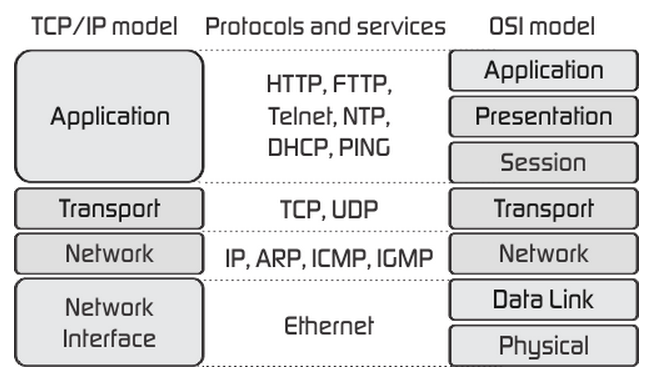
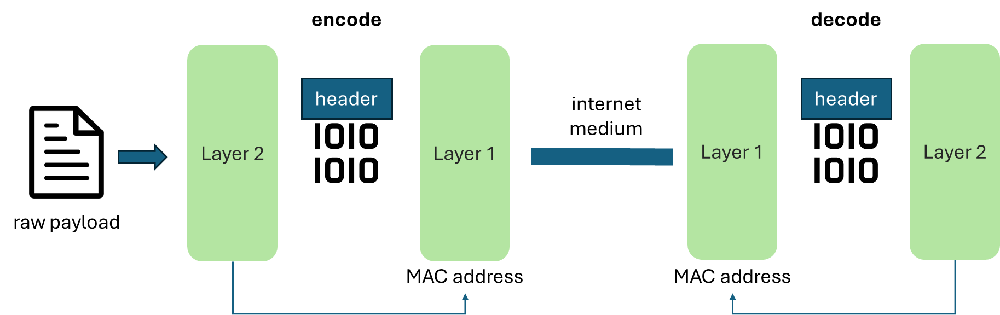
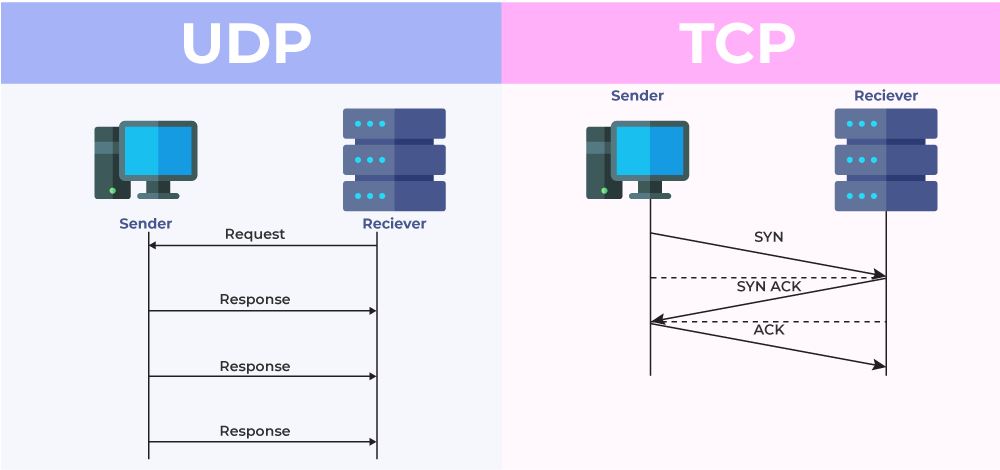

An OSI model define all the protocols two computers must follows to send data over the internet. OSI model has seven layers in an hierarchical order. It means that the protocol from the later layer implements all the technologies from the previous layers.

*For example, IP is OSI model's protocol on Layer 3, TCP is OSI model's protocol on Layer 4.
TCP implements IP protocol. HTTP is OSI model's protocol on Layer 7. If someone says HTTP is implement TCP protocol, it means that it inherently using IP as layer 3.*

When someone talking about protocol at level 7, it means that they are talking about the full OSI stacks. *Like if someone talking about SSH, it means they abstract all the layer from 1 to 6 (SSH use TCP at layer 4, so they use IP as layer 3).*

*But if a person talking about layer 4, like TCP or UDP, it doesn't mean that the protocol ends up at layer 4. But they rather implement the techologies specifically at layer 4, without knowing about the layer above (because the detail of the layer above doesn't matter)*

**Why do learning about these concept important?**. Because at each layer, additional data or transformation is done upon the payload. Addition data added upon the payload is called `Layer Header`. Understand these headers and transformation is crucial for some aspect of networking.

Let's say computer A wants to transfer a file to computer B, using a model in OSI (here we will use the most common model - HTTP). Let's see what header or transformation each layer do

## Layer 1: Physical Layer

Layer one is simple. This layer is pure physics. The file is transformed into physical form (electrical pulse or wavelength) transfered on the wire (or wireless device). At this layer, no information about the computer A or computer B is defined, we only know the origin and destination.

## Layer 2: Data Link Layer

We know (or now you know) that we do not interact directly with a web server immediately, but through sequence of internet devices. Our laptop send data through wavelengths to the Wifi router, where the router is connected to a modem. The modem is connected to the ISP server, and so on and so on. Layer 1 only responsible for the delivery of each device (computer-wifi,wifi-modem, modem-ISP, ...)

At layer 2, we completely understand what is the journey that our file is travelled (how many internet devices that the data is going through, what are the names of these devices). At this layer, the devices are given names (MAC address), which uniquely identify them over the World Wide Web. Data Link provides the most unique capabilities: frame each window of data and transfer them as bits (0s and 1s) over physical layer. Using the Data Link Layer, the stream of continous electrical signal can be recognize, decoded and divided into unit of data (as chunk of bits). [See here for more details](https://en.wikipedia.org/wiki/Data_link_layer#Error_detection_and_correction)

## Layer 3: Network Layer

This is the home of IP address. We will learn about IP address later.

## Layer 4: Transport Layer

This is one of most important layer to learn. This is the home of TCP, which is the foundation layer for most famous internet protocol (HTTP) and other like SSH, SMTP, ...

[Here is the whole article about the TCP protocol](https://www.cloudflare.com/learning/ddos/glossary/tcp-ip/)

This layer also contains UDP, which is more insecure but faster, use for things like DNS lookup.

## Layer 7: Application Layer

The layer 5 and 6 are often neglected. The most important is the Application Layer. Only at this layer, the raw data is hasn't encrypted yet. This means, only at layer 7, we can see the user data at the request level. This not means that anyone can read your data. But at this layer, the server decoded the data already, so they can intercept the data (like cases like a load balancer).

Layer 7 is often called the full model, since they located at the very end of the OSI model.