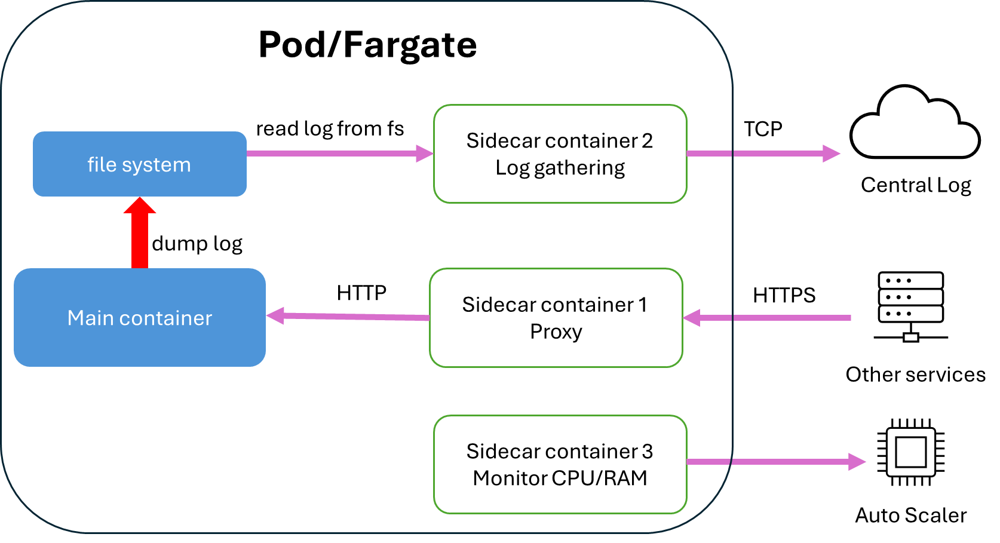
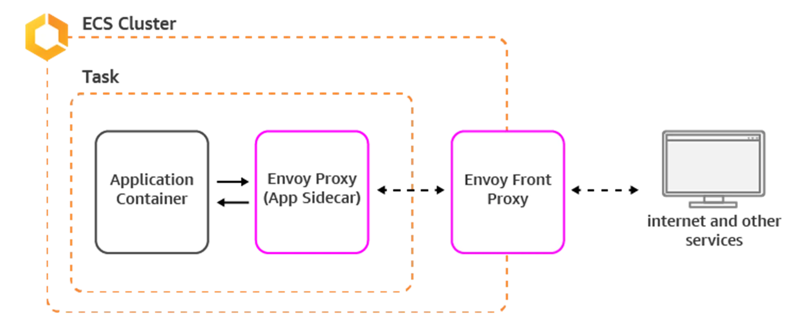
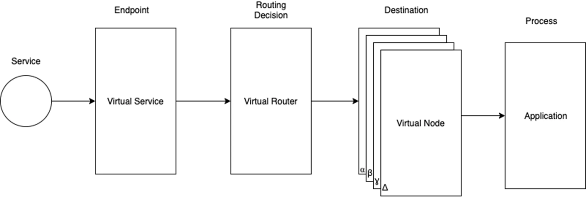

## Communication between microservices

In microservices, each service can be built on diffent frameworks and different languages. To send information between the services, the most easy way is through HTTP. Maybe the task is asynchronous (doesn't need to have wait for the response), then message queue is used. However, when the application is complex enough to reaches "microservice" level, the amount of different payload (in size and schema) post difficulties for developers. To fix that problem, developer use gRPC, a communication method with strong type. 

Inter-connection between microservices is difficult to figuring out, and debug. Normally, the services within a microservice is created inside a VPC, to ensure security. However, if a service is hijacked, it is easy for hacker to send malicious request to other services. 

To solve the problem of crazy inter-service-connection, and develop a secure way to connect microservices, we use service mesh. Service mesh monitor all the connections by a central networking monitor, that gives each service a namespace and monitor each connection (route) between the namespaces

AWS create their own service mesh called `AWS App Mesh`, while Google utilize `Istio`.

We will learn **AWS App Mesh** here.

## Sidecar container

AWS App Mesh utilize Envoy Proxy service. Two main components of the Envoy proxies are: a central monitor called `Front Proxy` and `Envoy Proxies Sidecar` that lives on each Pod/Task of the service.

When creating a service, we create a Deployment/Task Family. This is the blueprint of the Pod/Task, contains the main image, the CPU/RAM requirements, VPC (to automatically assign IP) and the min/max number of Pod/Task. K8s/ECS uses this blueprint to spin up a virtualize machine (VM) from the nodes, install and run Deployment/Task Family. A VM that runs a Deployment/Task Family is called a Pod/Service/Task.

Inside a Pod doesn't run just one container. We can specify multiple images inside Deployment/Task, and they will run in the same pod with each other. This behaviour is exactly what you see when you run a Docker Compose app - with the same network setting and the same volume. Since the containers of the same Deployment run in the same pod, we have two benefits: 

1. The container can directly commnunicate with each other via `localhost`, not goes to the network (no bandwidth). 

2. The access the same file system that the pod can. If one file produce a log at ~/.log, the second container can read that at the exact absolute path

When designing a Service in Microservice architecture, we focus on the implementation of the business logic. A container that runs this logic is called the main container. However, Microservices is complex (as it should be). Not only runs the business logic, the service needs to log (and send log to a central log monitoring), frequent health check, send CPU/RAM statistics for auto scaling, ...Integrating these logic into each services is tiresome, and costly in terms of dev. Sidecar container is the container that is NOT the main container, that takes responsible for the task afforementioned. 

`Envoy Sidecar` is a sidecar container. It is able to do two things: 1) read the IP from the Pod/Fargate, then register this IP to the central hub (Envoy Front Proxy). 2) It is able to make the service a TLS certificate for HTTPS inter connection between services.

## Envoy architecture

Envoy architecture contains many moving parts, that need to configure properly to work. Using a dedicate managed service mesh like AWS App Mesh or Istio will simplify this process.

### Virtual Nodes

